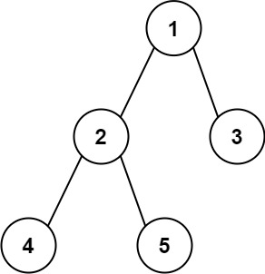

## Longest Substring Without Repeating Characters

**Example 1:**
**Input:** s = "abcabcbb"
**Output:** 3
**Explanation:** The answer is "abc", with the length of 3.

**Example 2:**
**Input:** s = "bbbbb"
**Output:** 1
**Explanation:** The answer is "b", with the length of 1.
```python
class Solution(object):
    def lengthOfLongestSubstring(self, s):
        """
        :type s: str
        :rtype: int
        """
        left_ptr = 0
        char_index_map = {}
        maxlen = 0

        for right_ptr in range(len(s)):
            # If the character is already in the substring, move left_ptr
            if s[right_ptr] in char_index_map and char_index_map[s[right_ptr]] >= left_ptr:
                left_ptr = char_index_map[s[right_ptr]] + 1
            
            # Update the character's index in the map
            char_index_map[s[right_ptr]] = right_ptr
            
            # Calculate the maximum length of the current window
            maxlen = max(maxlen, right_ptr - left_ptr + 1)
        
        return maxlen
```

## Longest Substring with At Most Two Distinct Characters

Given a string `s`, return _the length of the longest_ _substring_ _that contains at most **two distinct characters**_.

**Example 1:**
**Input:** s = "eceba"
**Output:** 3
**Explanation:** The substring is "ece" which its length is 3.

**Example 2:**
**Input:** s = "ccaabbb"
**Output:** 5
**Explanation:** The substring is "aabbb" which its length is 5.


```python
class Solution:
    def lengthOfLongestSubstringTwoDistinct(self, s: str) -> int:
        # Sliding window approach
        n = len(s)
        if n <= 2:
            return n

        # Dictionary to store character frequencies
        char_count = {}
        left_ptr = 0
        maxlen = 0

        for right_ptr in range(n):
            # Add the current character to the window
            char_count[s[right_ptr]] = char_count.get(s[right_ptr], 0) + 1

            # Shrink the window if there are more than 2 distinct characters
            while len(char_count) > 2:
                char_count[s[left_ptr]] -= 1
                if char_count[s[left_ptr]] == 0:
                    del char_count[s[left_ptr]]
                left_ptr += 1

            # Update the maximum length of the substring
            maxlen = max(maxlen, right_ptr - left_ptr + 1)

        return maxlen
```

## 3Sum

**Example 1:**
**Input:** nums = [-1,0,1,2,-1,-4]
**Output:** [[-1,-1,2],[-1,0,1]]
**Explanation:** 
nums[0] + nums[1] + nums[2] = (-1) + 0 + 1 = 0.
nums[1] + nums[2] + nums[4] = 0 + 1 + (-1) = 0.
nums[0] + nums[3] + nums[4] = (-1) + 2 + (-1) = 0.
The distinct triplets are [-1,0,1] and [-1,-1,2].
Notice that the order of the output and the order of the triplets does not matter.

**Example 2:**
**Input:** nums = [0,1,1]
**Output:** []
**Explanation:** The only possible triplet does not sum up to 0.

```python
class Solution(object):
    def threeSum(self, nums):
        """
        :type nums: List[int]
        :rtype: List[List[int]]
        """
    
        # Strategy:
        # Sort
        # Loop over each item
        # For each item do a two pointers approach: sorting was required for this

        output = set()
        nums = sorted(nums)
        for i in range(len(nums)):
                       
            target = -nums[i] # sum of other two numbers
            
            left_ptr = i + 1
            right_ptr = len(nums)-1
            while left_ptr < right_ptr:
                
                sum_lr = nums[left_ptr] + nums[right_ptr]
                if sum_lr < target:
                    left_ptr += 1
                elif sum_lr > target:
                    right_ptr -= 1
                else:
                    output.add((nums[i], nums[left_ptr], nums[right_ptr]))
                    left_ptr += 1
                    right_ptr -= 1
        return [list(o) for o in output]
```


## Multiply Strings

Solution

Given two non-negative integers `num1` and `num2` represented as strings, return the product of `num1` and `num2`, also represented as a string.

**Note:** You must not use any built-in BigInteger library or convert the inputs to integer directly.

**Example 1:**

**Input:** num1 = "2", num2 = "3"
**Output:** "6"

**Example 2:**

**Input:** num1 = "123", num2 = "456"
**Output:** "56088"


```python
class Solution(object):
    def multiply(self, num1, num2):
        """
        :type num1: str
        :type num2: str
        :rtype: str
        """

        if num1 == '0' or num2 == '0':
            return '0'
		## Line not required
        if len(num1) < len(num2):
            num1, num2 = num2, num1
            
        # Reverse the strings to ease multiplication
        num1 = num1[::-1]
        num2 = num2[::-1]
        
        n1 = len(num1)
        n2 = len(num2)
        
        # Initialize the max output size
        output = [0] * (n1 + n2)
        
        for j in range(n2):
            carry = 0
            for i in range(n1):
                tmp_output = int(num1[i]) * int(num2[j]) + carry + output[i + j]
                output[i + j] = tmp_output % 10  # Remainder stays at position
                carry = tmp_output // 10  # Carry for the next position
                
            # Add remaining carry to the next position
            if carry > 0:
                output[j + n1] += carry

        # Remove leading zeros and reverse to form the final result
        while len(output) > 1 and output[-1] == 0:
            output.pop()

        return ''.join(map(str, output[::-1]))

```

## Rotate Image

Solution

You are given an `n x n` 2D `matrix` representing an image, rotate the image by **90** degrees (clockwise).

You have to rotate the image [**in-place**](https://en.wikipedia.org/wiki/In-place_algorithm), which means you have to modify the input 2D matrix directly. **DO NOT** allocate another 2D matrix and do the rotation.

### Solutions: Transpose and reverse rows
```python
class Solution(object):
    def rotate(self, matrix):
        """
        :type matrix: List[List[int]]
        :rtype: None Do not return anything, modify matrix in-place instead.
        """
        
        n = len(matrix)

        # Transpose and reverse might be better
        for i in range(n):
            for j in range(i,n):
                matrix[i][j], matrix[j][i] = matrix[j][i], matrix[i][j]
                
        # Reverse the rows
        for i in range(n):
            matrix[i][:] = matrix[i][::-1]
```

## Minimum Window Substring

Solution

Given two strings `s` and `t` of lengths `m` and `n` respectively, return _the **minimum window**_ **_substring_** _of_ `s` _such that every character in_ `t` _(**including duplicates**) is included in the window_. If there is no such substring, return _the empty string_ `""`.

The testcases will be generated such that the answer is **unique**.

**Example 1:**

**Input:** s = "ADOBECODEBANC", t = "ABC"
**Output:** "BANC"
**Explanation:** The minimum window substring "BANC" includes 'A', 'B', and 'C' from string t.

**Example 2:**

**Input:** s = "a", t = "a"
**Output:** "a"
**Explanation:** The entire string s is the minimum window.

### Two pointer approach
- Start with (0,0) and extend the right pointer to capture all the chars in t
- Then start moving left pointer and keep track of min window size
- Hops between incrementing right and left pointer
- When all chars in t are captured then left pointer moves
- Once chars are missing the right pointer moves until all the chars captured again
```python
from collections import Counter

class Solution:
    def minWindow(self, s: str, t: str) -> str:
        if not s or not t:
            return ''
        
        t_dict = Counter(t)
        s_dict = {}
        
        l_ptr = 0
        minwindow = float('inf')
        minwin_index = (0, 0)
        required = len(t_dict)
        formed = 0
        
        for r_ptr in range(len(s)):
            r_char = s[r_ptr]
            s_dict[r_char] = s_dict.get(r_char, 0) + 1
            
            if r_char in t_dict and s_dict[r_char] == t_dict[r_char]:
                formed += 1
            
            while l_ptr <= r_ptr and formed == required:
                l_char = s[l_ptr]
                
                if (r_ptr - l_ptr + 1) < minwindow:
                    minwindow = r_ptr - l_ptr + 1
                    minwin_index = (l_ptr, r_ptr + 1)
                
                s_dict[l_char] -= 1
                if l_char in t_dict and s_dict[l_char] < t_dict[l_char]:
                    formed -= 1
                
                l_ptr += 1
        
        if minwindow == float('inf'):
            return ''
        else:
            return s[minwin_index[0]:minwin_index[1]]

```

##   Read N Characters Given Read4 II - Call multiple times

**Example 1:**
**Input:** file = "abc", queries = [1,2,1]
**Output:** [1,2,0]
**Explanation:** The test case represents the following scenario:
File file("abc");
Solution sol;
sol.read(buf, 1); // After calling your read method, buf should contain "a". We read a total of 1 character from the file, so return 1.
sol.read(buf, 2); // Now buf should contain "bc". We read a total of 2 characters from the file, so return 2.
sol.read(buf, 1); // We have reached the end of file, no more characters can be read. So return 0.
Assume buf is allocated and guaranteed to have enough space for storing all characters from the file.

```python
# The read4 API is already defined for you.
# def read4(buf4: List[str]) -> int:

class Solution:
    
    def __init__(self):
        self.extra_reads = []
        
    def read(self, buf: List[str], n: int) -> int:
        buf4 = ['']*4
        while (n > len(self.extra_reads)):
            new_reads = read4(buf4)
            self.extra_reads.extend(buf4[:new_reads])
            
            #Indicates EOF
            if new_reads < 4:
                break
        
        return_val = min(len(self.extra_reads), n)
        for ind in range(return_val):
            buf[ind] = self.extra_reads.pop(0)
        return return_val
```


## Given a `time` represented in the format `"HH:MM"`, form the next closest time by reusing the current digits. There is no limit on how many times a digit can be reused.

You may assume the given input string is always valid. For example, `"01:34"`, `"12:09"` are all valid. `"1:34"`, `"12:9"` are all invalid.

**Example 1:**
**Input:** time = "19:34"
**Output:** "19:39"
**Explanation:** The next closest time choosing from digits **1**, **9**, **3**, **4**, is **19:39**, which occurs 5 minutes later.
It is not **19:33**, because this occurs 23 hours and 59 minutes later.

**Example 2:**

**Input:** time = "23:59"
**Output:** "22:22"
**Explanation:** The next closest time choosing from digits **2**, **3**, **5**, **9**, is **22:22**.
It may be assumed that the returned time is next day's time since it is smaller than the input time numerically.


**Brute-force but works on leetcode**
```python
class Solution:
    def nextClosestTime(self, time: str) -> str:
        digits = set()
        for t in time:
            if t == ':':
                continue
            digits.add(t)

        hours = int(time[:2])
        minutes = int(time[3:])

        hrs_counter = hours
        min_counter = minutes + 1
        while True:
            num1 = str(hrs_counter // 10)
            num2 = str(hrs_counter % 10)
            if (num1 in digits) and (num2 in digits):
                for mins in range(min_counter, 60):
                    num3 = str(mins // 10)
                    num4 = str(mins % 10)
                    if (num3 in digits) and (num4 in digits):
                        return num1 + num2 + ':' + num3 + num4

            hrs_counter += 1
            hrs_counter = hrs_counter % 24
            min_counter = 0

```

- Convert to minutes and increment
- Use isdigit for set creations
- Use issubset for checking in one go

```python
class Solution:
    def nextClosestTime(self, time: str) -> str:
        # Extract the digits and convert them to integers
        digits = {int(c) for c in time if c.isdigit()}
        
        # Convert the current time to minutes
        current_minutes = int(time[:2]) * 60 + int(time[3:])
        
        while True:
            # Increment the time by 1 minute
            current_minutes = (current_minutes + 1) % (24 * 60)
            # Convert the time back to hours and minutes
            hours, minutes = divmod(current_minutes, 60)
            # Split the time into individual digits
            next_time_digits = {hours // 10, hours % 10, minutes // 10, minutes % 10}
            # Check if all digits are valid
            if next_time_digits.issubset(digits):
                return f"{hours:02}:{minutes:02}"

```

## Add Two Numbers
You are given two **non-empty** linked lists representing two non-negative integers. The digits are stored in **reverse order**, and each of their nodes contains a single digit. Add the two numbers and return the sum as a linked list.

You may assume the two numbers do not contain any leading zero, except the number 0 itself.

**Example 1:**


**Input:** l1 = [2,4,3], l2 = [5,6,4]
**Output:** [7,0,8]
**Explanation:** 342 + 465 = 807.

**Example 2:**

**Input:** l1 = [0], l2 = [0]
**Output:** [0]

**Example 3:**

**Input:** l1 = [9,9,9,9,9,9,9], l2 = [9,9,9,9]
**Output:** [8,9,9,9,0,0,0,1]


**Original code**
```python
# Definition for singly-linked list.
# class ListNode:
#     def __init__(self, val=0, next=None):
#         self.val = val
#         self.next = next
class Solution:
    def addTwoNumbers(self, l1: Optional[ListNode], l2: Optional[ListNode]) -> Optional[ListNode]:
        
        l1_ptr = l1
        l2_ptr = l2
        l1_l2_head = l1_l2_ptr = ListNode()
        carry = 0
        while (l1_ptr is not None) or (l2_ptr is not None):

            suml1l2 = carry
            
            if l1_ptr is not None:
                suml1l2 += l1_ptr.val
                l1_ptr = l1_ptr.next
                
            if l2_ptr is not None:
                suml1l2 += l2_ptr.val
                l2_ptr = l2_ptr.next
            
            l1_l2_ptr.val = suml1l2%10
            carry = suml1l2//10
            
            if (l1_ptr is not None) or (l2_ptr is not None):
                l1_l2_ptr.next = ListNode()
                l1_l2_ptr = l1_l2_ptr.next
            elif carry > 0:
                l1_l2_ptr.next = ListNode(carry)
                l1_l2_ptr = l1_l2_ptr.next

            
        return l1_l2_head
            
            
```

**Cleaned code**
```python
class Solution:
    def addTwoNumbers(self, l1: Optional[ListNode], l2: Optional[ListNode]) -> Optional[ListNode]:
        # Dummy node to simplify edge cases
        dummy_head = ListNode()
        current = dummy_head
        carry = 0

        # Traverse both lists
        while l1 or l2 or carry:
            # Compute sum for the current digits + carry
            val1 = l1.val if l1 else 0
            val2 = l2.val if l2 else 0
            total = val1 + val2 + carry

            # Update carry and current node
            carry = total // 10
            current.next = ListNode(total % 10)

            # Move pointers forward
            current = current.next
            if l1:
                l1 = l1.next
            if l2:
                l2 = l2.next

        return dummy_head.next

```


## LRU Cache

Solution

Design a data structure that follows the constraints of a **[Least Recently Used (LRU) cache](https://en.wikipedia.org/wiki/Cache_replacement_policies#LRU)**

Implement the `LRUCache` class:

- `LRUCache(int capacity)` Initialize the LRU cache with **positive** size `capacity`.
- `int get(int key)` Return the value of the `key` if the key exists, otherwise return `-1`.
- `void put(int key, int value)` Update the value of the `key` if the `key` exists. Otherwise, add the `key-value` pair to the cache. If the number of keys exceeds the `capacity` from this operation, **evict** the least recently used key.

The functions `get` and `put` must each run in `O(1)` average time complexity.

**Example 1:**

**Input**
["LRUCache", "put", "put", "get", "put", "get", "put", "get", "get", "get"]
[[2], [1, 1], [2, 2], [1], [3, 3], [2], [4, 4], [1], [3], [4]]
**Output**
[null, null, null, 1, null, -1, null, -1, 3, 4]

**Explanation**
LRUCache lRUCache = new LRUCache(2);
lRUCache.put(1, 1); // cache is {1=1}
lRUCache.put(2, 2); // cache is {1=1, 2=2}
lRUCache.get(1);    // return 1
lRUCache.put(3, 3); // LRU key was 2, evicts key 2, cache is {1=1, 3=3}
lRUCache.get(2);    // returns -1 (not found)
lRUCache.put(4, 4); // LRU key was 1, evicts key 1, cache is {4=4, 3=3}
lRUCache.get(1);    // return -1 (not found)
lRUCache.get(3);    // return 3
lRUCache.get(4);    // return 4


**Using OrderedDict**
```python
from collections import OrderedDict

class LRUCache:

    def __init__(self, capacity: int):
        """
        Initialize the LRU Cache with a fixed capacity.
        """
        self.capacity = capacity
        self.cache = OrderedDict()

    def get(self, key: int) -> int:
        """
        Return the value of the key if it exists in the cache.
        Move the accessed key to the end to mark it as recently used.
        """
        if key in self.cache:
            self.cache.move_to_end(key)  # Mark as recently used
            return self.cache[key]
        return -1  # Key not found

    def put(self, key: int, value: int) -> None:
        """
        Add or update a key-value pair in the cache.
        If the cache exceeds its capacity, remove the least recently used item.
        """
        if key in self.cache:
            # Update the value and mark as recently used
            self.cache[key] = value
        else:
            # Evict the least recently used item if capacity is reached
            if len(self.cache) == self.capacity:
                self.cache.popitem(last=False)  # Remove the oldest item
            self.cache[key] = value  # Add the new item
        
        self.cache.move_to_end(key)  # Mark as recently used

        

```

Alternative method: Dictionary + Doubly-linked list
{key} = Node(key,val,prev,next)
LRU->.....Nodes------>MRU
Keep moving to MRU if used and pop LRU to maintain capability


## Median of Two Sorted Arrays

Solution

Given two sorted arrays `nums1` and `nums2` of size `m` and `n` respectively, return **the median** of the two sorted arrays.

The overall run time complexity should be `O(log (m+n))`.

**Example 1:**

**Input:** nums1 = [1,3], nums2 = [2]
**Output:** 2.00000
**Explanation:** merged array = [1,2,3] and median is 2.

**Example 2:**

**Input:** nums1 = [1,2], nums2 = [3,4]
**Output:** 2.50000
**Explanation:** merged array = [1,2,3,4] and median is (2 + 3) / 2 = 2.5.

Brute-force: Two ptr approach walking over the two given arrays
- Time: O(M+N)
- Space: O(1)

```python
class Solution:
    def findMedianSortedArrays(self, nums1: List[int], nums2: List[int]) -> float:
        
        n1 = len(nums1)
        n2 = len(nums2)
        
        if (n1+n2)%2 == 0:
            med_ind1 = (n1+n2)//2 - 1
            med_ind2 = (n1+n2)//2 
        else:
            med_ind1 = med_ind2 = (n1+n2+1)//2 - 1
            
        if n1 == 0:
            return 0.5*(nums2[med_ind1] + nums2[med_ind2])
        if n2 == 0:
            return 0.5*(nums1[med_ind1] + nums1[med_ind2])            
            
            
        result_median = 0    
        
        n1_ptr = 0
        n2_ptr = 0
        n3_ptr = 0
        while (n3_ptr <= med_ind2):
            
            if (n1_ptr < n1) and (n2_ptr < n2):
                if (nums1[n1_ptr] <= nums2[n2_ptr]):
                    current_num = nums1[n1_ptr]
                    n1_ptr += 1
                else:
                    current_num = nums2[n2_ptr]
                    n2_ptr += 1
            elif (n1_ptr < n1):
                current_num = nums1[n1_ptr]
                n1_ptr += 1
            elif (n2_ptr < n2):
                current_num = nums2[n2_ptr]
                n2_ptr += 1
            
            # print(n1_ptr, n2_ptr, current_num)
            if (n1+n2)%2 == 0:
                if (n3_ptr == med_ind1) or (n3_ptr == med_ind2):
                    result_median += 0.5*(current_num)
            else:
                if (n3_ptr == med_ind1):
                    result_median = current_num
                    
            n3_ptr += 1
            
        return result_median
```

**Optimised approach: Binary search O(log(min(m,n)))
- Choose smaller array
- Run binary search on it: low = 0, high = m, i = (low+high)//2,
- j = (m+n+1)//2 - i  (in other array)


```python
class Solution:
    def findMedianSortedArrays(self, nums1: List[int], nums2: List[int]) -> float:
        m = len(nums1)
        n = len(nums2)
        
        # Ensure nums1 is the smaller array
        if m > n:
            nums1, nums2 = nums2, nums1
            m, n = n, m
            
        low = 0
        high = m
        num_half = (m + n + 1) // 2  # The size of the left partition
        
        while low <= high:
            i = (low + high) // 2  # Partition index for nums1
            j = num_half - i      # Partition index for nums2
            
            # Calculate boundary values for the partitions
            maxleft1 = -float('inf') if i == 0 else nums1[i - 1]
            minright1 = float('inf') if i == m else nums1[i]
            maxleft2 = -float('inf') if j == 0 else nums2[j - 1]
            minright2 = float('inf') if j == n else nums2[j]
            
            # Check if the partition is valid
            if maxleft1 <= minright2 and maxleft2 <= minright1:
                # Median calculation
                if (m + n) % 2 == 0:  # Even length
                    return 0.5 * (max(maxleft1, maxleft2) + min(minright1, minright2))
                else:  # Odd length
                    return max(maxleft1, maxleft2)
            
            # Adjust binary search bounds
            if maxleft1 > minright2:
                high = i - 1  # Move left in nums1
            else:
                low = i + 1   # Move right in nums1

```


For dynamic computation of median: Use min and max heap approach
## Binary Tree Maximum Path Sum

Solution

A **path** in a binary tree is a sequence of nodes where each pair of adjacent nodes in the sequence has an edge connecting them. A node can only appear in the sequence **at most once**. Note that the path does not need to pass through the root.

The **path sum** of a path is the sum of the node's values in the path.

Given the `root` of a binary tree, return _the maximum **path sum** of any **non-empty** path_.

**Example 1:**


**Input:** root = [1,2,3]
**Output:** 6
**Explanation:** The optimal path is 2 -> 1 -> 3 with a path sum of 2 + 1 + 3 = 6.

**Example 2:**


**Input:** root = [-10,9,20,null,null,15,7]
**Output:** 42
**Explanation:** The optimal path is 15 -> 20 -> 7 with a path sum of 15 + 20 + 7 = 42.


- Path from a node is: node.val + left_sum + right_sum 
	- Path goes from left branch to right_branch through the node
- Return from function is node.val + max(left_sum, right_sum) 
	- Going either branch but starts above the node
- Note the difference between pathmax computation and the return value
```python
# Definition for a binary tree node.
# class TreeNode:
#     def __init__(self, val=0, left=None, right=None):
#         self.val = val
#         self.left = left
#         self.right = right
class Solution:
    def maxPathSum(self, root: Optional[TreeNode]) -> int:
        # Initialize the maximum path sum as a class attribute
        self.pathmax = float('-inf')
        
        def get_node_lr_sum(node: Optional[TreeNode]) -> int:
            if node is None:
                return 0
            
            # Recurse into left and right subtrees
            left_sum = max(0, get_node_lr_sum(node.left))  # Ignore negative paths
            right_sum = max(0, get_node_lr_sum(node.right))
            
            # Update the global maximum path sum
            self.pathmax = max(self.pathmax, left_sum + right_sum + node.val)
            
            # Return the maximum sum of a path passing through this node
            return node.val + max(left_sum, right_sum)
        
        # Start the recursion
        get_node_lr_sum(root)
        return self.pathmax

```


Poor implementation:
	- Loop over word in wordList and check if next word
		- if yes recurse with next word as the beginWord
	- Some caching related stuff: frozenset etc

```python
from typing import List, Set

class Solution:
    def __init__(self):
        self.cache = {}
        self.cache_larger = {}
    
    def ladderLength(self, beginWord: str, endWord: str, wordList: List[str]) -> int:
        wordSet = set(wordList)  # Convert word list to a set for O(1) lookups
        if endWord not in wordSet:
            return 0

        def is_valid_next_word(current_word: str, target_word: str) -> bool:
            """Check if two words differ by exactly one character."""
            if (current_word, target_word) in self.cache:
                return self.cache[(current_word, target_word)]
            
            char_diff = sum(a != b for a, b in zip(current_word, target_word))
            result = char_diff == 1
            self.cache[(current_word, target_word)] = result
            return result

        def helper(beginWord: str, endWord: str, wordSet: Set[str]) -> int:
            """Recursive helper to find the shortest path."""
            if beginWord == endWord:
                return 1
            if (beginWord, endWord, frozenset(wordSet)) in self.cache_larger:
                return self.cache_larger[(beginWord, endWord, frozenset(wordSet))]
            
            min_length = float('inf')
            for word in list(wordSet):  # Iterate over the current word set
                if is_valid_next_word(beginWord, word):
                    wordSet.remove(word)  # Remove the word from the set
                    result = helper(word, endWord, wordSet)
                    if result != float('inf'):
                        min_length = min(min_length, 1 + result)
                    wordSet.add(word)  # Add the word back to the set
            
            self.cache_larger[(beginWord, endWord, frozenset(wordSet))] = min_length
            return min_length

        # Compute the ladder length
        ladder_length = helper(beginWord, endWord, wordSet)
        return 0 if ladder_length == float('inf') else ladder_length

```

## Word Ladder

Solution

A **transformation sequence** from word `beginWord` to word `endWord` using a dictionary `wordList` is a sequence of words `beginWord -> s1 -> s2 -> ... -> sk` such that:

- Every adjacent pair of words differs by a single letter.
- Every `si` for `1 <= i <= k` is in `wordList`. Note that `beginWord` does not need to be in `wordList`.
- `sk == endWord`

Given two words, `beginWord` and `endWord`, and a dictionary `wordList`, return _the **number of words** in the **shortest transformation sequence** from_ `beginWord` _to_ `endWord`_, or_ `0` _if no such sequence exists._

**Example 1:**

**Input:** beginWord = "hit", endWord = "cog", wordList = ["hot","dot","dog","lot","log","cog"]
**Output:** 5
**Explanation:** One shortest transformation sequence is "hit" -> "hot" -> "dot" -> "dog" -> cog", which is 5 words long.

- **Time Complexity: $O(N*M^2)$**
- **Space Complexity: $O(N*M)$**
- N: number of words, M: length of words

```python
from collections import deque
from typing import List

class Solution:
    def ladderLength(self, beginWord: str, endWord: str, wordList: List[str]) -> int:
        wordSet = set(wordList)  # Convert wordList to a set for quick lookups
        
        # Early exits for invalid cases
        if endWord not in wordSet:
            return 0
        if len(beginWord) != len(endWord):
            return 0
        if len(beginWord) == 1:
            return 2

        # Remove beginWord from the set (if it exists)
        wordSet.discard(beginWord)

        # Create a pattern dictionary for all words in wordSet
        wordlen = len(beginWord)
        pattern_dict = {}
        for word in wordSet:
            for i in range(wordlen):
                pattern = word[:i] + '*' + word[i+1:]
                pattern_dict.setdefault(pattern, []).append(word)

        # Perform BFS for the shortest path
        ladder = deque([(beginWord, 1)])  # (current word, current level)
        visited = set()  # Track visited words to avoid cycles

        while ladder:
            word, level = ladder.popleft()  # Process the front of the deque
            visited.add(word)

            for i in range(wordlen):
                pattern = word[:i] + '*' + word[i+1:]
                
                # Skip patterns not in the dictionary
                if pattern not in pattern_dict:
                    continue

                for neighbor in pattern_dict[pattern]:
                    if neighbor == endWord:
                        return level + 1  # Found the shortest path
                    if neighbor not in visited:
                        ladder.append((neighbor, level + 1))
                        visited.add(neighbor)  # Mark as visited

        return 0  # If no path is found

```

## Word Squares

Solution

Given an array of **unique** strings `words`, return _all the_ **[word squares](https://en.wikipedia.org/wiki/Word_square)** _you can build from_ `words`. The same word from `words` can be used **multiple times**. You can return the answer in **any order**.

A sequence of strings forms a valid **word square** if the `kth` row and column read the same string, where `0 <= k < max(numRows, numColumns)`.

- For example, the word sequence `["ball","area","lead","lady"]` forms a word square because each word reads the same both horizontally and vertically.

**Example 1:**

**Input:** words = ["area","lead","wall","lady","ball"]
**Output:** [["ball","area","lead","lady"],["wall","area","lead","lady"]]
**Explanation:**
The output consists of two word squares. The order of output does not matter (just the order of words in each word square matters).

- Solution: 
	- Create a dict with prefix -> allowed_words
	- Recurse over combinations
- 
	-


```python
from typing import List, Dict
from collections import defaultdict

class Solution:
    def wordSquares(self, words: List[str]) -> List[List[str]]:
        if not words or len(set(len(w) for w in words)) > 1:
            return []
        
        wordlen = len(words[0])
        prefix_dict = defaultdict(list)
        
        for w in words:
            for ind in range(len(w) + 1):
                prefix_dict[w[:ind]].append(w)

        def _backtrack(step: int, current_words: List[str], results: List[List[str]]) -> None:
            if step == wordlen:
                results.append(current_words[:])  # Add a copy of the current words
                return
            
            prefix = ''.join(w[step] for w in current_words)
            for allowed_word in prefix_dict.get(prefix, []):
                _backtrack(step + 1, current_words + [allowed_word], results)
              
        results = []
        for w in words:
            _backtrack(1, [w], results)
        
        return results

```

## Strobogrammatic Number II

Solution

Given an integer `n`, return all the **strobogrammatic numbers** that are of length `n`. You may return the answer in **any order**.

A **strobogrammatic number** is a number that looks the same when rotated `180` degrees (looked at upside down).

**Example 1:**

**Input:** n = 2
**Output:** ["11","69","88","96"]

**Example 2:**

**Input:** n = 1
**Output:** ["0","1","8"]


Solution:
	- start_num + _backtrack + end_num
	- Important line: **if n != total_len:**
```python
from typing import List

class Solution:
    def findStrobogrammatic(self, n: int) -> List[str]:
        def _backtrack(n: int, total_len: int) -> List[str]:
            # Base cases
            if n == 0:
                return [""]
            if n == 1:
                return ["0", "1", "8"]

            # Get strobogrammatic numbers of length n-2
            middle_numbers = _backtrack(n - 2, total_len)
            results = []

            # Add strobogrammatic pairs around the middle numbers
            for mid in middle_numbers:
                # Avoid adding leading zeros for numbers with more than one digit
                if n != total_len:
                    results.append("0" + mid + "0")
                results.append("1" + mid + "1")
                results.append("6" + mid + "9")
                results.append("8" + mid + "8")
                results.append("9" + mid + "6")
            
            return results
        
        return _backtrack(n, n)
```

### **Key Differences**

|Feature|Recursive Approach|Backtracking Approach|
|---|---|---|
|**How recursion is used**|Combines smaller results into bigger results.|Dynamically explores paths, pruning invalid ones.|
|**Construction style**|Generates all solutions in one pass.|Builds solutions step by step, character by character.|
|**Intermediate filtering**|No dynamic filtering, just avoids leading zeroes in results.|Dynamically stops invalid paths (e.g., leading zero).|
|**Focus**|Solve smaller problems and combine solutions.|Explore all possibilities with constraints.|
|**Flexibility**|Less flexible for adding new constraints.|Very flexible and interactive.|


## Min Stack

Solution

Design a stack that supports push, pop, top, and retrieving the minimum element in constant time.

Implement the `MinStack` class:

- `MinStack()` initializes the stack object.
- `void push(int val)` pushes the element `val` onto the stack.
- `void pop()` removes the element on the top of the stack.
- `int top()` gets the top element of the stack.
- `int getMin()` retrieves the minimum element in the stack.

You must implement a solution with `O(1)` time complexity for each function.

```python
class MinStack:
    def __init__(self):
        self.vals = []

    def push(self, val: int) -> None:
        min_val = val if not self.vals else min(val, self.vals[-1][1])
        self.vals.append((val, min_val))

    def pop(self) -> None:
        if self.vals:
            self.vals.pop()

    def top(self) -> int:
        return self.vals[-1][0] if self.vals else None  # Handle empty case

    def getMin(self) -> int:
        return self.vals[-1][1] if self.vals else None  # Handle empty case
```


## Longest Palindromic Substring

Solution

Given a string `s`, return _the longest_ _palindromic_ _substring_ in `s`.

**Example 1:**

**Input:** s = "babad"
**Output:** "bab"
**Explanation:** "aba" is also a valid answer.

**Example 2:**

**Input:** s = "cbbd"
**Output:** "bb"


- Solution: Expand around center for odd and even $O(N^2)$

```python
class Solution:
    def longestPalindrome(self, s: str) -> str:
        if not s:
            return ""

        def expand_around_center(left: int, right: int) -> str:
            while left >= 0 and right < len(s) and s[left] == s[right]:
                left -= 1
                right += 1
            return s[left+1:right]  # Return the valid palindrome

        longest = ""
        for i in range(len(s)):
            # Odd-length palindrome
            odd_palindrome = expand_around_center(i, i)
            # Even-length palindrome
            even_palindrome = expand_around_center(i, i+1)

            # Choose the longer palindrome
            longest = max(longest, odd_palindrome, even_palindrome, key=len)

        return longest

```

- Dynamic programming solution: Time and Space $O(N^2)$
- $dp[i][j] = True$ if $s[i:j+1]$ is palindrome
- $dp[i][i] = True$
- **Time Complexity:** O(n2) due to the nested loops.
- **Space Complexity:** O(n2) due to the DP table.

This method is useful when you need to **retrieve all palindromic substrings**, but **expand-around-center** is usually faster for just finding the longest one.

```python
class Solution:
    def longestPalindrome(self, s: str) -> str:
        n = len(s)
        if n == 0:
            return ""
        
        dp = [[False] * n for _ in range(n)]
        start, max_length = 0, 1  # Store the start index and max length of the palindrome
        
        # Every single character is a palindrome
        for i in range(n):
            dp[i][i] = True
        
        # Check for two-character palindromes
        for i in range(n-1):
            if s[i] == s[i+1]:
                dp[i][i+1] = True
                start, max_length = i, 2
        
        # Fill DP table for substrings of length 3 and more
        for length in range(3, n+1):  # Length of substring
            for i in range(n - length + 1):
                j = i + length - 1  # Ending index
                if s[i] == s[j] and dp[i+1][j-1]:  # Check if inner substring is palindrome
                    dp[i][j] = True
                    start, max_length = i, length
        
        return s[start:start + max_length]

```

## Maximum Product Subarray

Solution

Given an integer array `nums`, find a subarray that has the largest product, and return _the product_.

The test cases are generated so that the answer will fit in a **32-bit** integer.

**Example 1:**

**Input:** nums = [2,3,-2,4]
**Output:** 6
**Explanation:** [2,3] has the largest product 6.

**Example 2:**

**Input:** nums = [-2,0,-1]
**Output:** 0
**Explanation:** The result cannot be 2, because [-2,-1] is not a subarray.

**Constraints:**

- `1 <= nums.length <= 2 * 104`
- `-10 <= nums[i] <= 10`
- The product of any subarray of `nums` is **guaranteed** to fit in a **32-bit** integer.


TIPS:
- Keep track of min and max as negative number can flip.
- Every step we have two options:
	- 1 Continue with running product
	- 2. Start with new num

```python
class Solution:
    def maxProduct(self, nums: List[int]) -> int:
        
        n = len(nums)
        
        min_prod = 1
        max_prod = 1
        result = -float('inf')
        
        for num in nums:
            # If the current number is negative, swap min_prod and max_prod
            if num < 0:
                min_prod, max_prod = max_prod, min_prod
            
            # Update the current min_prod and max_prod
            min_prod = min(num, min_prod * num)
            max_prod = max(num, max_prod * num)
            
            # Update the result
            result = max(result, max_prod)
        
        return result

```

Dynamic programming implementations

```python

    def maxProduct(self, nums: List[int]) -> int:
        
        n = len(nums)
        min_dp = [0]*(n)
        max_dp = [0]*(n)
        
        min_dp[0] = max_dp[0] = result = nums[0]
        
        for i in range(1,n):
            
            max_dp[i] = max(nums[i], max_dp[i-1]*nums[i], min_dp[i-1]*nums[i])
            min_dp[i] = min(nums[i], max_dp[i-1]*nums[i], min_dp[i-1]*nums[i])
            result = max(result, max_dp[i])
        
        return result
        

```


## Design Search Autocomplete System

Solution

Design a search autocomplete system for a search engine. Users may input a sentence (at least one word and end with a special character `'#'`).

You are given a string array `sentences` and an integer array `times` both of length `n` where `sentences[i]` is a previously typed sentence and `times[i]` is the corresponding number of times the sentence was typed. For each input character except `'#'`, return the top `3` historical hot sentences that have the same prefix as the part of the sentence already typed.

Here are the specific rules:

- The hot degree for a sentence is defined as the number of times a user typed the exactly same sentence before.
- The returned top `3` hot sentences should be sorted by hot degree (The first is the hottest one). If several sentences have the same hot degree, use ASCII-code order (smaller one appears first).
- If less than `3` hot sentences exist, return as many as you can.
- When the input is a special character, it means the sentence ends, and in this case, you need to return an empty list.

Implement the `AutocompleteSystem` class:

- `AutocompleteSystem(String[] sentences, int[] times)` Initializes the object with the `sentences` and `times` arrays.
- `List<String> input(char c)` This indicates that the user typed the character `c`.
    - Returns an empty array `[]` if `c == '#'` and stores the inputted sentence in the system.
    - Returns the top `3` historical hot sentences that have the same prefix as the part of the sentence already typed. If there are fewer than `3` matches, return them all.

#### Solution:
- Use trie data structure

```python
from typing import List

class AutocompleteSystem:

    def __init__(self, sentences: List[str], times: List[int]):
        self.trie_struct = self.populate_trie(sentences, times)
        self.running_prefix = ''
        self.running_node = self.trie_struct

    def populate_trie(self, sentences, times):
        root = {}
        for s, t in zip(sentences, times):
            self.add_sentence_to_trie(root, s, t)
        return root

    def add_sentence_to_trie(self, node, s, frequency):
        for i, c in enumerate(s):
            if c not in node:
                node[c] = {}
            node = node[c]
        if '#' in node:
            node['#'] += frequency
        else:
            node['#'] = frequency

    def input(self, c: str) -> List[str]:
        if c == '#':
            self.add_sentence_to_trie(self.trie_struct, self.running_prefix, 1)
            self.running_prefix = ''
            self.running_node = self.trie_struct
            return []

        self.running_prefix += c

        if self.running_node is None or c not in self.running_node:
            self.running_node = None
            return []

        self.running_node = self.running_node[c]

        result = []
        stack = [(self.running_node, self.running_prefix)]

        while stack:
            node, path = stack.pop()
            if '#' in node:
                result.append((path, node['#']))
            for k in node:
                if k != '#':
                    stack.append((node[k], path + k))

        # Sort by frequency desc, then lex order
        result.sort(key=lambda x: (-x[1], x[0]))
        return [s for s, _ in result[:3]]

```


## Word Search II

Solution

Given an `m x n` `board` of characters and a list of strings `words`, return _all words on the board_.

Each word must be constructed from letters of sequentially adjacent cells, where **adjacent cells** are horizontally or vertically neighboring. The same letter cell may not be used more than once in a word.

**Example 1:**


**Input:** board = [["o","a","a","n"],["e","t","a","e"],["i","h","k","r"],["i","f","l","v"]], words = ["oath","pea","eat","rain"]
**Output:** ["eat","oath"]

**Example 2:**


**Input:** board = [["a","b"],["c","d"]], words = ["abcb"]
**Output:** []

#### Solution
- Without Trie but Time Out Error
- Store the words in Trie and use that to traverse the board to not repea
- **Time:** O(m × n × 4^L), where L is the max word length.
	- Starting with any cell on board mxn
	- First char: 1 cell
	- Second char: 4 neighbors
	- Third char onward: 3 neighbors
- **Space:** O(k × L) for the Trie (`k` = number of words).

```python
from typing import List

class TrieNode:
    def __init__(self):
        self.children = {}
        self.word = None  # Store complete word at the end node

class Solution:
    def findWords(self, board: List[List[str]], words: List[str]) -> List[str]:

        # Step 1: Build Trie from the word list
        root = TrieNode()
        for word in words:
            node = root
            for char in word:
                if char not in node.children:
                    node.children[char] = TrieNode()
                node = node.children[char]
            node.word = word  # mark the end of a word

        m, n = len(board), len(board[0])
        res = []
        
        def dfs(i, j, node):
            if i < 0 or i >= m or j < 0 or j >= n:
                return
            char = board[i][j]
            if char not in node.children:
                return

            next_node = node.children[char]
            if next_node.word:
                res.append(next_node.word)
                next_node.word = None  # avoid duplicates

            board[i][j] = "#"  # mark visited
            for dx, dy in [(-1,0),(1,0),(0,-1),(0,1)]:
                dfs(i + dx, j + dy, next_node)
            board[i][j] = char  # backtrack          
        
        # Step 2: Search from every cell
        for i in range(m):
            for j in range(n):
                dfs(i, j, root)

        return res
```


## Generate Parentheses

Solution

Given `n` pairs of parentheses, write a function to _generate all combinations of well-formed parentheses_.

**Example 1:**

**Input:** n = 3
**Output:** ["((()))","(()())","(())()","()(())","()()()"]

**Example 2:**

**Input:** n = 1
**Output:** ["()"]

**Constraints:**

- `1 <= n <= 8`

#### Solution
- Backtrack: This is very generic

```python
class Solution:
    def generateParenthesis(self, n: int) -> List[str]:
        
        res = []
        def helper_func(path, open_count, close_count):
            
            if len(path) == 2*n:
                res.append(''.join(path))
                return
                
            if open_count < n:
                path.append('(')
                helper_func(path, open_count+1, close_count)
                path.pop()
                
            if close_count < open_count:
                path.append(')')
                helper_func(path, open_count, close_count+1)
                path.pop()
               
        helper_func([], 0, 0)  
        return res
```

## Number of Islands

Solution

Given an `m x n` 2D binary grid `grid` which represents a map of `'1'`s (land) and `'0'`s (water), return _the number of islands_.

An **island** is surrounded by water and is formed by connecting adjacent lands horizontally or vertically. You may assume all four edges of the grid are all surrounded by water.

**Example 1:**

**Input:** grid = [
  ["1","1","1","1","0"],
  ["1","1","0","1","0"],
  ["1","1","0","0","0"],
  ["0","0","0","0","0"]
]
**Output:** 1

- Solution: DFS or BFS and mark the visited cell 
- Time: O(m*n)
- Space: O(mn) -> recursion stack


```python
class Solution:
    def numIslands(self, grid: List[List[str]]) -> int:
        m, n = len(grid), len(grid[0])

        def dfs(i, j):
            if i < 0 or i >= m or j < 0 or j >= n or grid[i][j] != '1':
                return
            grid[i][j] = '#'
            for di, dj in [(-1,0), (1,0), (0,-1), (0,1)]:
                dfs(i + di, j + dj)

        count = 0
        for i in range(m):
            for j in range(n):
                if grid[i][j] == '1':
                    dfs(i, j)
                    count += 1
        return count

```


## Course Schedule II

Solution

There are a total of `numCourses` courses you have to take, labeled from `0` to `numCourses - 1`. You are given an array `prerequisites` where `prerequisites[i] = [ai, bi]` indicates that you **must** take course `bi` first if you want to take course `ai`.

- For example, the pair `[0, 1]`, indicates that to take course `0` you have to first take course `1`.

Return _the ordering of courses you should take to finish all courses_. If there are many valid answers, return **any** of them. If it is impossible to finish all courses, return **an empty array**.

**Example 1:**

**Input:** numCourses = 2, prerequisites = [[1,0]]
**Output:** [0,1]
**Explanation:** There are a total of 2 courses to take. To take course 1 you should have finished course 0. So the correct course order is [0,1].

**Example 2:**

**Input:** numCourses = 4, prerequisites = [[1,0],[2,0],[3,1],[3,2]]
**Output:** [0,2,1,3]
**Explanation:** There are a total of 4 courses to take. To take course 3 you should have finished both courses 1 and 2. Both courses 1 and 2 should be taken after you finished course 0.
So one correct course order is [0,1,2,3]. Another correct ordering is [0,2,1,3].


- Solution: preq -> course mapping
	- start with courses with no prepreq, using in_degree
	- do BFS and only adding course when prereq done in_degrees is 0

```python
from collections import defaultdict

class Solution:
    def findOrder(self, numCourses: int, prerequisites: List[List[int]]) -> List[int]:
        
        graph = defaultdict(list)
        in_degree = [0]*numCourses
        for course, prereq in prerequisites:
            graph[prereq].append(course)
            in_degree[course] += 1

        # Start with all courses that have zero prerequisites: Need to have some courses with no in_degree to start
        queue = deque([i for i in range(numCourses) if in_degree[i] == 0])      
        
        order = []
        while queue:
            node = queue.popleft()
            order.append(node)
            
            for neighbor in graph[node]:
                in_degree[neighbor] -= 1
                # Only add if no all prereqs satisfies
                if in_degree[neighbor] == 0:
                    queue.append(neighbor)
                
        # Check if all courses are processed (no cycle)
        return order if len(order) == numCourses else []
        
```

## Count Complete Tree Nodes

Solution

Given the `root` of a **complete** binary tree, return the number of the nodes in the tree.

According to **[Wikipedia](http://en.wikipedia.org/wiki/Binary_tree#Types_of_binary_trees)**, every level, except possibly the last, is completely filled in a complete binary tree, and all nodes in the last level are as far left as possible. It can have between `1` and `2h` nodes inclusive at the last level `h`.

Design an algorithm that runs in less than `O(n)` time complexity.


## 🔢 Given Tree Structure

A complete binary tree built from `[1, 2, 3, 4, 5]` using level-order would look like this:

markdown

CopyEdit

        `1       /   \      2     3     / \       4   5`

- Root = `1`
    
- Left subtree of `1`: rooted at `2`, with children `4` and `5`
    
- Right subtree of `1`: just `3`, with no children
    

---

## 🧮 Let's Step Through `countNodes(root)`

We’ll use the optimized version:

python

CopyEdit

`def countNodes(root):     def get_height(node):         height = 0         while node:             height += 1             node = node.left         return height      if not root:         return 0      left_height = get_height(root.left)     right_height = get_height(root.right)      if left_height == right_height:         return (1 << left_height) + countNodes(root.right)     else:         return (1 << right_height) + countNodes(root.left)`

---

### 🟢 First call: `countNodes(1)`

- `left_height = get_height(2)` → follows `2 → 4 → None` → height = `2`
    
- `right_height = get_height(3)` → follows `3 → None` → height = `1`
    

So `left_height ≠ right_height`  
➡️ Right subtree (3) is a **perfect tree of height 1**

Now apply:

python

CopyEdit

`return (1 << right_height) + countNodes(root.left) = (1 << 1) + countNodes(2) = 2 + ?`

---

### 🟢 Second call: `countNodes(2)`

- `left_height = get_height(4)` → height = 1
    
- `right_height = get_height(5)` → height = 1
    

So `left_height == right_height`  
➡️ Left subtree is perfect.

python

CopyEdit

`return (1 << left_height) + countNodes(root.right) = (1 << 1) + countNodes(5) = 2 + ?`

---

### 🟢 Third call: `countNodes(5)`

- `left = None`, `right = None`
    
- `left_height = 0`, `right_height = 0`
    

They’re equal → it's a leaf:

python

CopyEdit

`return (1 << 0) + countNodes(None) = 1 + 0 = 1`

---

### 🔄 Backtrack:

- `countNodes(2)` → `2 + 1 = 3`
    
- `countNodes(1)` → `2 + 3 = 5`
    

---

## ✅ Final Result:

**Output:** `5`  
Which matches the number of nodes in the tree.

```python
class Solution:
    def countNodes(self, root: Optional[TreeNode]) -> int:
        
        def get_height(node):
            height = 0
            while node:
                height += 1
                node = node.left
            return height

        if root is None:
            return 0
        
        left_height = get_height(root.left)
        right_height = get_height(root.right)
        
        # Left subtree is a perfect tree	2^left_height (left + root)
        if left_height == right_height:
            return (1 << left_height) + self.countNodes(root.right)
        # Right subtree is a perfect tree of smaller height 2^right_height (right + root)
        else:
            return (1 << right_height) + self.countNodes(root.left)
```


## Longest Increasing Path in a Matrix

Solution

Given an `m x n` integers `matrix`, return _the length of the longest increasing path in_ `matrix`.

From each cell, you can either move in four directions: left, right, up, or down. You **may not** move **diagonally** or move **outside the boundary** (i.e., wrap-around is not allowed).

**Example 1:**


**Input:** matrix = [[9,9,4],[6,6,8],[2,1,1]]
**Output:** 4
**Explanation:** The longest increasing path is `[1, 2, 6, 9]`.


-Solution:
	- Required @lru_cache(None)
	- Time: O(mn)
	- Space: O(mn)

```python
from functools import lru_cache

class Solution:
    def longestIncreasingPath(self, matrix: List[List[int]]) -> int:
        if not matrix or not matrix[0]:
            return 0
        
        m, n = len(matrix), len(matrix[0])
        
        @lru_cache(None)
        def dfs(i, j):
            val = matrix[i][j]
            max_len = 1
            for di, dj in [(-1,0),(1,0),(0,-1),(0,1)]:
                ni, nj = i + di, j + dj
                if 0 <= ni < m and 0 <= nj < n and matrix[ni][nj] > val:
                    max_len = max(max_len, 1 + dfs(ni, nj))
            return max_len
        
        return max(dfs(i, j) for i in range(m) for j in range(n))

```

## Decode String

Solution

Given an encoded string, return its decoded string.

The encoding rule is: `k[encoded_string]`, where the `encoded_string` inside the square brackets is being repeated exactly `k` times. Note that `k` is guaranteed to be a positive integer.

You may assume that the input string is always valid; there are no extra white spaces, square brackets are well-formed, etc. Furthermore, you may assume that the original data does not contain any digits and that digits are only for those repeat numbers, `k`. For example, there will not be input like `3a` or `2[4]`.

The test cases are generated so that the length of the output will never exceed `105`.

**Example 1:**

**Input:** s = "3[a]2[bc]"
**Output:** "aaabcbc"

**Example 2:**

**Input:** s = "3[a2[c]]"
**Output:** "accaccacc"

- Solution:
	- num_stack
	- str_stack
	- current_str
- Time: O(n)
- Space: O(n)

```python
from collections import deque

class Solution:
    def decodeString(self, s: str) -> str:
        queue = deque(s)
        num_stack = []
        str_stack = []
        current_str = ''
        
        while queue:
            char = queue.popleft()
            
            if char.isdigit():
                # handle multi-digit numbers
                num = char
                while queue and queue[0].isdigit():
                    num += queue.popleft()
                num_stack.append(int(num))
            
            elif char == '[':
                # push current_str to stack and reset
                str_stack.append(current_str)
                current_str = ''
                
            elif char == ']':
                # build the repeated string
                prev_str = str_stack.pop()
                repeat_count = num_stack.pop()
                current_str = prev_str + current_str * repeat_count
                
            else:
                current_str += char
                            
        return current_str

```


## Evaluate Division

Solution

You are given an array of variable pairs `equations` and an array of real numbers `values`, where `equations[i] = [Ai, Bi]` and `values[i]` represent the equation `Ai / Bi = values[i]`. Each `Ai` or `Bi` is a string that represents a single variable.

You are also given some `queries`, where `queries[j] = [Cj, Dj]` represents the `jth` query where you must find the answer for `Cj / Dj = ?`.

Return _the answers to all queries_. If a single answer cannot be determined, return `-1.0`.

**Note:** The input is always valid. You may assume that evaluating the queries will not result in division by zero and that there is no contradiction.

**Note:** The variables that do not occur in the list of equations are undefined, so the answer cannot be determined for them.

**Example 1:**

**Input:** equations = [["a","b"],["b","c"]], values = [2.0,3.0], queries = [["a","c"],["b","a"],["a","e"],["a","a"],["x","x"]]
**Output:** [6.00000,0.50000,-1.00000,1.00000,-1.00000]
**Explanation:** 
Given: _a / b = 2.0_, _b / c = 3.0_
queries are: _a / c = ?_, _b / a = ?_, _a / e = ?_, _a / a = ?_, _x / x = ?_ 
return: [6.0, 0.5, -1.0, 1.0, -1.0 ]
note: x is undefined => -1.0

- Solution: Create graph and traverse with backtracking
- N: number of equations, M: number of queries
- Time: O(M*N)
- Space: O(N)


```python
from collections import defaultdict
from typing import List

class Solution:
    def calcEquation(
        self, 
        equations: List[List[str]], 
        values: List[float], 
        queries: List[List[str]]
    ) -> List[float]:
        
        graph = defaultdict(dict)
        
        # Build bidirectional graph
        for (a, b), value in zip(equations, values):
            graph[a][b] = value
            graph[b][a] = 1 / value

        def dfs(curr: str, target: str, acc_product: float) -> float:
            if curr == target:
                return acc_product
            
            for neighbor in graph[curr]:
                if (curr, neighbor) not in visited:
                    visited.add((curr, neighbor))
                    result = dfs(neighbor, target, acc_product * graph[curr][neighbor])
                    visited.remove((curr, neighbor))
                    if result != -1:
                        return result

            return -1.0

        results = []
        for start, end in queries:
            if start not in graph or end not in graph:
                results.append(-1.0)
            else:
                visited = set()
                results.append(dfs(start, end, 1.0))
        
        return results
```


## Diameter of Binary Tree

Solution

Given the `root` of a binary tree, return _the length of the **diameter** of the tree_.

The **diameter** of a binary tree is the **length** of the longest path between any two nodes in a tree. This path may or may not pass through the `root`.

The **length** of a path between two nodes is represented by the number of edges between them.

**Example 1:**



**Input:** root = [1,2,3,4,5]
**Output:** 3
**Explanation:** 3 is the length of the path [4,2,1,3] or [5,2,1,3].


- Solution
	- Compute max of left and right
	- nonlocal keep track of max_dia


```python
# Definition for a binary tree node.
# class TreeNode:
#     def __init__(self, val=0, left=None, right=None):
#         self.val = val
#         self.left = left
#         self.right = right

class Solution:
    def diameterOfBinaryTree(self, root: Optional[TreeNode]) -> int:
        max_diameter = 0

        def depth(node: Optional[TreeNode]) -> int:
            nonlocal max_diameter
            if not node:
                return 0
            
            left_depth = depth(node.left)
            right_depth = depth(node.right)
            
            # Update diameter: longest path through this node
            max_diameter = max(max_diameter, left_depth + right_depth)
            
            # Return height of subtree
            return 1 + max(left_depth, right_depth)
        
        depth(root)
        return max_diameter
```


## Most Stones Removed with Same Row or Column

Solution

On a 2D plane, we place `n` stones at some integer coordinate points. Each coordinate point may have at most one stone.

A stone can be removed if it shares either **the same row or the same column** as another stone that has not been removed.

Given an array `stones` of length `n` where `stones[i] = [xi, yi]` represents the location of the `ith` stone, return _the largest possible number of stones that can be removed_.

**Example 1:**

**Input:** stones = [[0,0],[0,1],[1,0],[1,2],[2,1],[2,2]]
**Output:** 5
**Explanation:** One way to remove 5 stones is as follows:
1. Remove stone [2,2] because it shares the same row as [2,1].
2. Remove stone [2,1] because it shares the same column as [0,1].
3. Remove stone [1,2] because it shares the same row as [1,0].
4. Remove stone [1,0] because it shares the same column as [0,0].
5. Remove stone [0,1] because it shares the same row as [0,0].
Stone [0,0] cannot be removed since it does not share a row/column with another stone still on the plane.


Solution:
- Like the connected island problem.
- Count the number of connected components and in each component we will have one stone left.


```python
from collections import defaultdict, deque
from typing import List

class Solution:
    def removeStones(self, stones: List[List[int]]) -> int:
        graph = defaultdict(list)
        for i, j in stones:
            for m, n in stones:
                if (i == m or j == n) and (i != m or j != n):
                    graph[(i, j)].append((m, n))
        
        visited = set()

        def bfs(start):
            queue = deque([start])
            visited.add(start)
            while queue:
                node = queue.popleft()
                for neighbor in graph[node]:
                    if neighbor not in visited:
                        visited.add(neighbor)
                        queue.append(neighbor)

        components = 0
        for stone in stones:
            node = tuple(stone)
            if node not in visited:
                bfs(node)
                components += 1

        return len(stones) - components
```

## Find And Replace in String

You are given a **0-indexed** string `s` that you must perform `k` replacement operations on. The replacement operations are given as three **0-indexed** parallel arrays, `indices`, `sources`, and `targets`, all of length `k`.

To complete the `ith` replacement operation:

1. Check if the **substring** `sources[i]` occurs at index `indices[i]` in the **original string** `s`.
2. If it does not occur, **do nothing**.
3. Otherwise if it does occur, **replace** that substring with `targets[i]`.

For example, if `s = "abcd"`, `indices[i] = 0`, `sources[i] = "ab"`, and `targets[i] = "eee"`, then the result of this replacement will be `"eeecd"`.

All replacement operations must occur **simultaneously**, meaning the replacement operations should not affect the indexing of each other. The testcases will be generated such that the replacements will **not overlap**.

- For example, a testcase with `s = "abc"`, `indices = [0, 1]`, and `sources = ["ab","bc"]` will not be generated because the `"ab"` and `"bc"` replacements overlap.

Return _the **resulting string** after performing all replacement operations on_ `s`.

A **substring** is a contiguous sequence of characters in a string.

**Example 1:**


**Input:** s = "abcd", indices = [0, 2], sources = ["a", "cd"], targets = ["eee", "ffff"]
**Output:** "eeebffff"
**Explanation:**
"a" occurs at index 0 in s, so we replace it with "eee".
"cd" occurs at index 2 in s, so we replace it with "ffff".**
**

Solutions:
- Reverse the ind and start replacing from the back

```python
class Solution:
    def findReplaceString(self, s: str, indices: List[int], sources: List[str], targets: List[str]) -> str:
        
        if len(indices) == 0:
            return s
        
        ist = sorted(zip(indices,sources,targets), reverse=True)
        
        for ind,src,tgt in ist:
            if s[ind:ind+len(src)]==src:
                s = s[:ind] + tgt + s[ind+len(src):]
        
        return s
```

## Merge k Sorted Lists

Solution

You are given an array of `k` linked-lists `lists`, each linked-list is sorted in ascending order.

_Merge all the linked-lists into one sorted linked-list and return it._

**Example 1:**

**Input:** lists = [[1,4,5],[1,3,4],[2,6]]
**Output:** [1,1,2,3,4,4,5,6]
**Explanation:** The linked-lists are:
[
  1->4->5,
  1->3->4,
  2->6
]
merging them into one sorted list:
1->1->2->3->4->4->5->6

- Solution:
	- Poor O (N*k)


```python
# Definition for singly-linked list.
# class ListNode:
#     def __init__(self, val=0, next=None):
#         self.val = val
#         self.next = next
class Solution:
    def mergeKLists(self, lists: List[Optional[ListNode]]) -> Optional[ListNode]:
        
        n = len(lists)
        
        if n == 1:
            return lists[0]
        
        dummy = ListNode()
        current = dummy
        while True:
            
            min_list = -1
            min_val = float('inf')
            for ind in range(n):
                if lists[ind] and (lists[ind].val < min_val):
                    min_val = lists[ind].val
                    min_list = ind
            
            if min_list == -1:
                break
            current.next = lists[min_list]
            current = current.next
            lists[min_list] = lists[min_list].next
        
        return dummy.next
```

Use heaqpq for optimal implementation: $O(N*log(K))$

```python
import heapq
from typing import Optional, List

class Solution:
    def mergeKLists(self, lists: List[Optional[ListNode]]) -> Optional[ListNode]:
        if not lists:
            return None

        heap = []
        for i, node in enumerate(lists):
            if node:
                heapq.heappush(heap, (node.val, i, node))

        dummy = ListNode()
        current = dummy

        while heap:
            val, i, node = heapq.heappop(heap)
            current.next = node
            current = current.next
            if node.next:
                heapq.heappush(heap, (node.next.val, i, node.next))

        return dummy.next
```