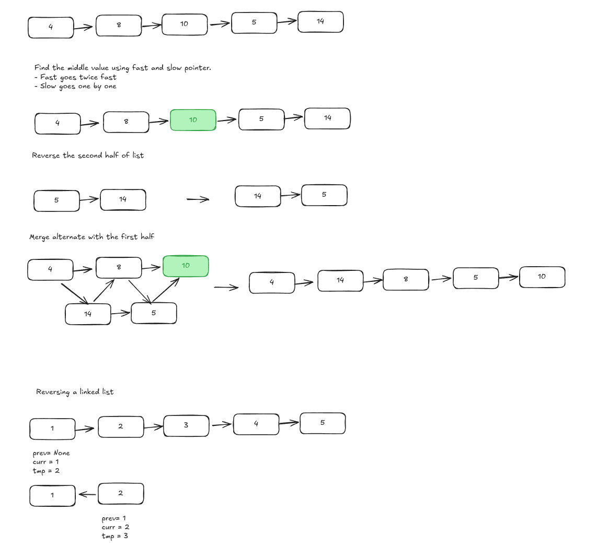
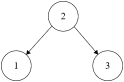
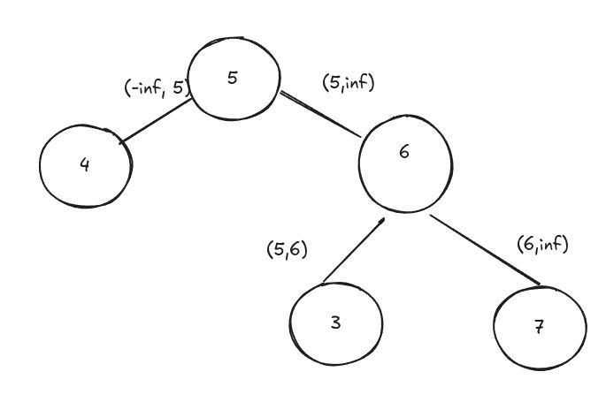
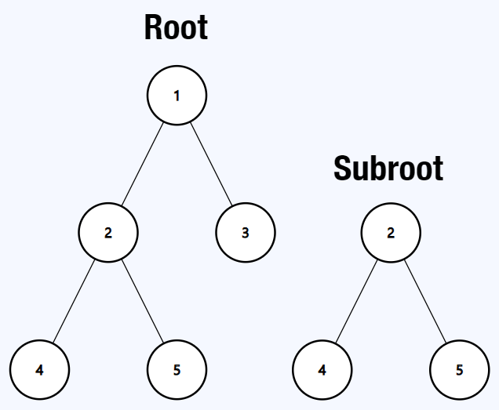
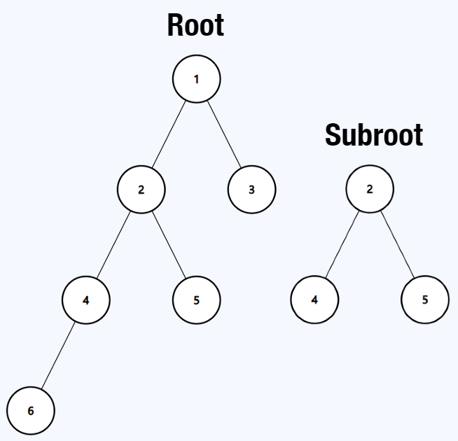
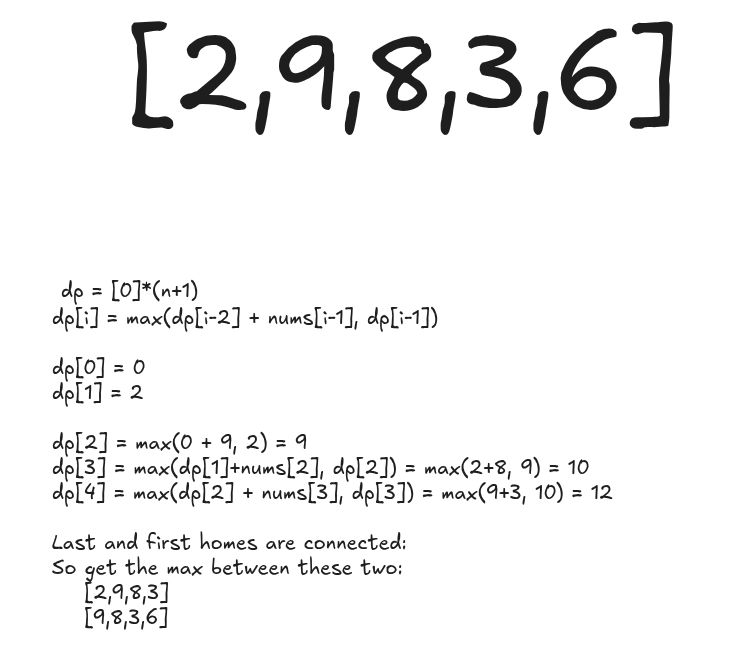

## [143. Reorder List](https://leetcode.com/problems/reorder-list/)

You are given the head of a singly linked-list. The list can be represented as:

L0 → L1 → … → Ln - 1 → Ln

_Reorder the list to be on the following form:_

L0 → Ln → L1 → Ln - 1 → L2 → Ln - 2 → …

You may not modify the values in the list's nodes. Only nodes themselves may be changed.

**Example 1:**


**Input:** head = [1,2,3,4]
**Output:** [1,4,2,3]

## Solution


```python
# Definition for singly-linked list.
# class ListNode:
#     def __init__(self, val=0, next=None):
#         self.val = val
#         self.next = next

class Solution:
    def reorderList(self, head: Optional[ListNode]) -> None:
        """
        Do not return anything, modify head in-place instead.
        """
        if not head or not head.next:
            return

        # Step 1: Find the middle of the list
        slow_ptr = fast_ptr = head
        while fast_ptr and fast_ptr.next:
            slow_ptr = slow_ptr.next
            fast_ptr = fast_ptr.next.next

        # Step 2: Reverse the second half
        prev, curr = None, slow_ptr.next
        slow_ptr.next = None  # Split the list
        while curr:
            tmp = curr.next
            curr.next = prev
            prev = curr
            curr = tmp

        # Step 3: Merge two halves
        first, second = head, prev
        while second:
            tmp1, tmp2 = first.next, second.next
            first.next = second
            second.next = tmp1
            first, second = tmp1, tmp2
```

## Sum of Two Integers

Medium

Given two integers `a` and `b`, return the sum of the two integers without using the `+` and `-` operators.

**Example 1:**

```java
Input: a = 1, b = 1

Output: 2
```


### Step 1: Sum without carry = XOR (`a ^ b`)

Example:

makefile

CopyEdit

`a = 5 (0101) b = 3 (0011) a ^ b = 6 (0110)  # sum bits without carry`

---

### Step 2: Calculate carry = AND (`a & b`), then shift left (`<< 1`)

makefile

CopyEdit

`a = 5 (0101) b = 3 (0011) a & b = 1 (0001) carry = 1 << 1 = 2 (0010)  # carry bits to add in the next step`

---

### Step 3: Repeat the addition with sum and carry

Now add:

- `sum_without_carry = a ^ b`
    
- `carry` (shifted AND)
    

Apply again:

- `a = sum_without_carry`
    
- `b = carry`
    

Repeat the process until carry (`b`) becomes zero.


```python
def getSum(a, b):
    while b != 0:
        carry = (a & b) << 1   # calculate carry
        a = a ^ b              # sum without carry
        b = carry              # prepare next carry

    return a

```


## Valid Binary Search Tree

Solved 

Medium

Given the `root` of a binary tree, return `true` if it is a **valid binary search tree**, otherwise return `false`.

A **valid binary search tree** satisfies the following constraints:

- The left subtree of every node contains only nodes with keys **less than** the node's key.
- The right subtree of every node contains only nodes with keys **greater than** the node's key.
- Both the left and right subtrees are also binary search trees.

**Example 1:**



```java
Input: root = [2,1,3]

Output: true
```

### Solution



```python
class Solution:
    def isValidBST(self, root: Optional[TreeNode]) -> bool:
        def helper(node, minval, maxval):
            if not node:
                return True
            if not (minval < node.val < maxval):
                return False
            return (
                helper(node.left, minval, node.val) and
                helper(node.right, node.val, maxval)
            )
        return helper(root, -float('inf'), float('inf'))

```


## Encode and Decode Strings

Medium

Design an algorithm to encode a list of strings to a single string. The encoded string is then decoded back to the original list of strings.

Please implement `encode` and `decode`

**Example 1:**

```java
Input: ["neet","code","love","you"]

Output:["neet","code","love","you"]
```

### Solution
- Append len(strs) in the string with ':' for identification
	- 4:code
	- : helps with > 1 digit lengths
- During decode:
	- loop over all string i
	- use j to extract strings


```python
class Codec:

    def encode(self, strs: List[str]) -> str:
        # Use length + ':' + string as the encoding format
        return ''.join(f'{len(s)}:{s}' for s in strs)

    def decode(self, s: str) -> List[str]:
        res = []
        i = 0
        while i < len(s):
            # Find the colon separator to extract the length
            j = i
            while s[j] != ':':
                j += 1
            length = int(s[i:j])
            j += 1  # move past ':'
            res.append(s[j:j+length])
            i = j + length
        return res

```


## Kth Smallest Integer in BST

Solved 

Medium

Given the `root` of a binary search tree, and an integer `k`, return the `kth` smallest value (**1-indexed**) in the tree.

A **binary search tree** satisfies the following constraints:

- The left subtree of every node contains only nodes with keys **less than** the node's key.
- The right subtree of every node contains only nodes with keys **greater than** the node's key.
- Both the left and right subtrees are also binary search trees.

**Example 1:**


### Solution:
- BST is sorted so start from the left and keep the count


```python
class Solution:
    def kthSmallest(self, root: Optional[TreeNode], k: int) -> int:
        self.count = 0
        self.result = None
        
        def inorder(node):
            if not node or self.result is not None:
                return
            inorder(node.left)
            self.count += 1
            if self.count == k:
                self.result = node.val
                return
            inorder(node.right)
        
        inorder(root)
        return self.result
```

## Subtree of Another Tree

Solved 

Easy

Given the roots of two binary trees `root` and `subRoot`, return `true` if there is a subtree of `root` with the same structure and node values of `subRoot` and `false` otherwise.

A subtree of a binary tree `tree` is a tree that consists of a node in `tree` and all of this node's descendants. The tree `tree` could also be considered as a subtree of itself.

**Example 1:**



```java
Input: root = [1,2,3,4,5], subRoot = [2,4,5]

Output: true
```

Copy

**Example 2:**



```java
Input: root = [1,2,3,4,5,null,null,6], subRoot = [2,4,5]

Output: false
```

### Solution:
- Pay attention to the second example False. It has to match exactly

```python
class Solution:   
    def isSubtree(self, root: Optional[TreeNode], subRoot: Optional[TreeNode]) -> bool:
        if not root:
            return False

        if self.isequal(root, subRoot):
            return True

        return self.isSubtree(root.left, subRoot) or self.isSubtree(root.right, subRoot)
    
    def isequal(self, root1, root2):
        if not root1 and not root2:
            return True
        if not root1 or not root2:
            return False

        return (root1.val == root2.val and 
                self.isequal(root1.left, root2.left) and 
                self.isequal(root1.right, root2.right))
```


# # House Robber II

Solved 

Medium

You are given an integer array `nums` where `nums[i]` represents the amount of money the `i`th house has. The houses are arranged in a circle, i.e. the first house and the last house are neighbors.

You are planning to rob money from the houses, but you cannot rob **two adjacent houses** because the security system will automatically alert the police if two adjacent houses were _both_ broken into.

Return the _maximum_ amount of money you can rob **without** alerting the police.

**Example 1:**

```java
Input: nums = [3,4,3]

Output: 4
```

Copy

Explanation: You cannot rob `nums[0] + nums[2] = 6` because `nums[0]` and `nums[2]` are adjacent houses. The maximum you can rob is `nums[1] = 4`.

**Example 2:**

```java
Input: nums = [2,9,8,3,6]

Output: 15
```

### Solution


