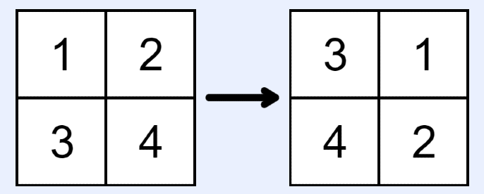
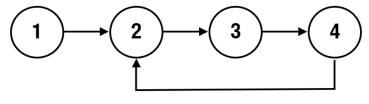

## [143. Reorder List](https://leetcode.com/problems/reorder-list/)

You are given the head of a singly linked-list. The list can be represented as:

L0 → L1 → … → Ln - 1 → Ln

_Reorder the list to be on the following form:_

L0 → Ln → L1 → Ln - 1 → L2 → Ln - 2 → …

You may not modify the values in the list's nodes. Only nodes themselves may be changed.

**Example 1:**


**Input:** head = [1,2,3,4]
**Output:** [1,4,2,3]

## Solution


```python
# Definition for singly-linked list.
# class ListNode:
#     def __init__(self, val=0, next=None):
#         self.val = val
#         self.next = next

class Solution:
    def reorderList(self, head: Optional[ListNode]) -> None:
        """
        Do not return anything, modify head in-place instead.
        """
        if not head or not head.next:
            return

        # Step 1: Find the middle of the list
        slow_ptr = fast_ptr = head
        while fast_ptr and fast_ptr.next:
            slow_ptr = slow_ptr.next
            fast_ptr = fast_ptr.next.next

        # Step 2: Reverse the second half
        prev, curr = None, slow_ptr.next
        slow_ptr.next = None  # Split the list
        while curr:
            tmp = curr.next
            curr.next = prev
            prev = curr
            curr = tmp

        # Step 3: Merge two halves
        first, second = head, prev
        while second:
            tmp1, tmp2 = first.next, second.next
            first.next = second
            second.next = tmp1
            first, second = tmp1, tmp2
```

## Sum of Two Integers

Medium

Given two integers `a` and `b`, return the sum of the two integers without using the `+` and `-` operators.

**Example 1:**

```java
Input: a = 1, b = 1

Output: 2
```


### Step 1: Sum without carry = XOR (`a ^ b`)

Example:

makefile

CopyEdit

`a = 5 (0101) b = 3 (0011) a ^ b = 6 (0110)  # sum bits without carry`

---

### Step 2: Calculate carry = AND (`a & b`), then shift left (`<< 1`)

makefile

CopyEdit

`a = 5 (0101) b = 3 (0011) a & b = 1 (0001) carry = 1 << 1 = 2 (0010)  # carry bits to add in the next step`

---

### Step 3: Repeat the addition with sum and carry

Now add:

- `sum_without_carry = a ^ b`
    
- `carry` (shifted AND)
    

Apply again:

- `a = sum_without_carry`
    
- `b = carry`
    

Repeat the process until carry (`b`) becomes zero.


```python
def getSum(a, b):
    while b != 0:
        carry = (a & b) << 1   # calculate carry
        a = a ^ b              # sum without carry
        b = carry              # prepare next carry

    return a

```


## Valid Binary Search Tree

Solved 

Medium

Given the `root` of a binary tree, return `true` if it is a **valid binary search tree**, otherwise return `false`.

A **valid binary search tree** satisfies the following constraints:

- The left subtree of every node contains only nodes with keys **less than** the node's key.
- The right subtree of every node contains only nodes with keys **greater than** the node's key.
- Both the left and right subtrees are also binary search trees.

**Example 1:**


```java
Input: root = [2,1,3]

Output: true
```

### Solution


```python
class Solution:
    def isValidBST(self, root: Optional[TreeNode]) -> bool:
        def helper(node, minval, maxval):
            if not node:
                return True
            if not (minval < node.val < maxval):
                return False
            return (
                helper(node.left, minval, node.val) and
                helper(node.right, node.val, maxval)
            )
        return helper(root, -float('inf'), float('inf'))

```


## Encode and Decode Strings

Medium

Design an algorithm to encode a list of strings to a single string. The encoded string is then decoded back to the original list of strings.

Please implement `encode` and `decode`

**Example 1:**

```java
Input: ["neet","code","love","you"]

Output:["neet","code","love","you"]
```

### Solution
- Append len(strs) in the string with ':' for identification
	- 4:code
	- : helps with > 1 digit lengths
- During decode:
	- loop over all string i
	- use j to extract strings


```python
class Codec:

    def encode(self, strs: List[str]) -> str:
        # Use length + ':' + string as the encoding format
        return ''.join(f'{len(s)}:{s}' for s in strs)

    def decode(self, s: str) -> List[str]:
        res = []
        i = 0
        while i < len(s):
            # Find the colon separator to extract the length
            j = i
            while s[j] != ':':
                j += 1
            length = int(s[i:j])
            j += 1  # move past ':'
            res.append(s[j:j+length])
            i = j + length
        return res

```


## Kth Smallest Integer in BST

Solved 

Medium

Given the `root` of a binary search tree, and an integer `k`, return the `kth` smallest value (**1-indexed**) in the tree.

A **binary search tree** satisfies the following constraints:

- The left subtree of every node contains only nodes with keys **less than** the node's key.
- The right subtree of every node contains only nodes with keys **greater than** the node's key.
- Both the left and right subtrees are also binary search trees.

**Example 1:**


### Solution:
- BST is sorted so start from the left and keep the count


```python
class Solution:
    def kthSmallest(self, root: Optional[TreeNode], k: int) -> int:
        self.count = 0
        self.result = None
        
        def inorder(node):
            if not node or self.result is not None:
                return
            inorder(node.left)
            self.count += 1
            if self.count == k:
                self.result = node.val
                return
            inorder(node.right)
        
        inorder(root)
        return self.result
```

## Subtree of Another Tree

Solved 

Easy

Given the roots of two binary trees `root` and `subRoot`, return `true` if there is a subtree of `root` with the same structure and node values of `subRoot` and `false` otherwise.

A subtree of a binary tree `tree` is a tree that consists of a node in `tree` and all of this node's descendants. The tree `tree` could also be considered as a subtree of itself.

**Example 1:**


```java
Input: root = [1,2,3,4,5], subRoot = [2,4,5]

Output: true
```

Copy

**Example 2:**


```java
Input: root = [1,2,3,4,5,null,null,6], subRoot = [2,4,5]

Output: false
```

### Solution:
- Pay attention to the second example False. It has to match exactly

```python
class Solution:   
    def isSubtree(self, root: Optional[TreeNode], subRoot: Optional[TreeNode]) -> bool:
        if not root:
            return False

        if self.isequal(root, subRoot):
            return True

        return self.isSubtree(root.left, subRoot) or self.isSubtree(root.right, subRoot)
    
    def isequal(self, root1, root2):
        if not root1 and not root2:
            return True
        if not root1 or not root2:
            return False

        return (root1.val == root2.val and 
                self.isequal(root1.left, root2.left) and 
                self.isequal(root1.right, root2.right))
```


# # House Robber II

Solved 

Medium

You are given an integer array `nums` where `nums[i]` represents the amount of money the `i`th house has. The houses are arranged in a circle, i.e. the first house and the last house are neighbors.

You are planning to rob money from the houses, but you cannot rob **two adjacent houses** because the security system will automatically alert the police if two adjacent houses were _both_ broken into.

Return the _maximum_ amount of money you can rob **without** alerting the police.

**Example 1:**

```java
Input: nums = [3,4,3]

Output: 4
```

Copy

Explanation: You cannot rob `nums[0] + nums[2] = 6` because `nums[0]` and `nums[2]` are adjacent houses. The maximum you can rob is `nums[1] = 4`.

**Example 2:**

```java
Input: nums = [2,9,8,3,6]

Output: 15
```

### Solution


# ## Word Break

Solved 

Medium

Given a string `s` and a dictionary of strings `wordDict`, return `true` if `s` can be segmented into a space-separated sequence of dictionary words.

You are allowed to reuse words in the dictionary an unlimited number of times. You may assume all dictionary words are unique.

**Example 1:**

```java
Input: s = "neetcode", wordDict = ["neet","code"]

Output: true
```

Copy

Explanation: Return true because "neetcode" can be split into "neet" and "code".

**Example 2:**

```java
Input: s = "applepenapple", wordDict = ["apple","pen","ape"]

Output: true
```

### Solution
- list to set for efficient lookup
- Complexity:
	- Time: O(m*n*k)
		- sub_str.startswith(word) -> k
		- m -> len(wordDict)
		- n -> len(s)
	- Space: O(n) + O($sum$ len(wordDict))


```python
from functools import lru_cache
from typing import List

class Solution:
    def wordBreak(self, s: str, wordDict: List[str]) -> bool:
        word_set = set(wordDict)

        @lru_cache(maxsize=None)
        def can_break(sub_str: str) -> bool:
            if not sub_str:
                return True

            for word in word_set:
                if sub_str.startswith(word) and can_break(sub_str[len(word):]):
                    return True
            return False

        return can_break(s)

```


#


### Solution
- Without the trie implementation
- Time complexity:
	- W = #words
	- M x N = board size
	- L: maximum lenght of word in words
	- DFS of L: O(4^L)
	- Total complexity: O(W x 4^L X M X N)
- Space complexity:
	- O(MXNXL)

```python
from collections import defaultdict
from typing import List

class Solution:
    def findWords(self, board: List[List[str]], words: List[str]) -> List[str]:
        m, n = len(board), len(board[0])
        words = set(words)

        if m == 0 or n == 0 or not words:
            return []

        def wordExists(word: str, loc: tuple, visited: set) -> bool:
            if not word:
                return True

            i, j = loc
            if board[i][j] != word[0]:
                return False

            if len(word) == 1:
                return True

            for di, dj in [(-1,0), (1,0), (0,-1), (0,1)]:
                ni, nj = i + di, j + dj
                new_loc = (ni, nj)

                if 0 <= ni < m and 0 <= nj < n and new_loc not in visited:
                    visited.add(new_loc)
                    if wordExists(word[1:], new_loc, visited):
                        return True
                    visited.remove(new_loc)

            return False

        board_dict = defaultdict(list)
        for i in range(m):
            for j in range(n):
                board_dict[board[i][j]].append((i, j))

        words_found = []
        for w in words:
            for loc in board_dict[w[0]]:
                visited = set([loc])
                if wordExists(w, loc, visited):
                    words_found.append(w)
                    break

        return words_found

```

### Trie implementation

- Complexity:
	- Time: O(WXL +MXNX4^L)
	- Space: O(WXL + T + M X N)

```python
from functools import lru_cache
from typing import List

class Solution:
    def findWords(self, board: List[List[str]], words: List[str]) -> List[str]:
        
        m = len(board)
        n = len(board[0])
        words = set(words)

        if m == 0 or n == 0 or len(words) == 0:
            return []

        # Create a trie data structure
        head = {}
        for w in words:
            node = head
            for c in w:
                if c not in node:
                    node[c] = {}
                node = node[c]
            node['end'] = True

        res = set()

        def dfs(i, j, node, path, visited):
            if 'end' in node:
                res.add(path)
            
            visited.add((i, j))

            for di, dj in [(-1, 0), (1, 0), (0, -1), (0, 1)]:
                ni, nj = i + di, j + dj

                if 0 <= ni < m and 0 <= nj < n and (ni, nj) not in visited:
                    c = board[ni][nj]
                    if c in node:
                        dfs(ni, nj, node[c], path + c, visited)
            
            visited.remove((i, j))

        for i in range(m):
            for j in range(n):
                c = board[i][j]
                if c in head:
                    dfs(i, j, head[c], c, set([(i, j)]))
        
        return list(res)

```


## Find Median From Data Stream

Solved 

Hard

The **[median](https://en.wikipedia.org/wiki/Median)** is the middle value in a sorted list of integers. For lists of _even_ length, there is no middle value, so the median is the [mean](https://en.wikipedia.org/wiki/Mean) of the two middle values.

For example:

- For `arr = [1,2,3]`, the median is `2`.
- For `arr = [1,2]`, the median is `(1 + 2) / 2 = 1.5`

### Solved
- Use two min heap

```python
import heapq

class MedianFinder:

    def __init__(self):
        # Lower half (max-heap via negation) and upper half (min-heap)
        self.nums_lower_half = []
        self.nums_upper_half = []
        self.total_length = 0

    def addNum(self, num: int) -> None:
        # Decide which heap to push into
        if self.total_length == 0 or num >= self.nums_upper_half[0]:
            heapq.heappush(self.nums_upper_half, num)
        else:
            heapq.heappush(self.nums_lower_half, -num)

        self.total_length += 1

        # Balance the heaps to maintain invariant:
        # len(lower) == len(upper) or len(lower) == len(upper) + 1
        while len(self.nums_lower_half) > self.total_length // 2:
            heapq.heappush(self.nums_upper_half, -heapq.heappop(self.nums_lower_half))
        while len(self.nums_lower_half) < self.total_length // 2:
            heapq.heappush(self.nums_lower_half, -heapq.heappop(self.nums_upper_half))

    def findMedian(self) -> float:
        if self.total_length % 2 == 0:
            return 0.5 * (-self.nums_lower_half[0] + self.nums_upper_half[0])
        else:
            return self.nums_upper_half[0]

```

### Cleaner version
- Always push on the lower and keep lower larger

```python
import heapq

class MedianFinder:

    def __init__(self):
        # Max-heap for the lower half (stored as negated values)
        self.lower = []
        # Min-heap for the upper half
        self.upper = []

    def addNum(self, num: int) -> None:
        # Always push to lower first (as max-heap)
        heapq.heappush(self.lower, -num)

        # Balance: move the max of lower to upper
        heapq.heappush(self.upper, -heapq.heappop(self.lower))

        # Maintain size invariant: lower can have one more element than upper
        if len(self.upper) > len(self.lower):
            heapq.heappush(self.lower, -heapq.heappop(self.upper))

    def findMedian(self) -> float:
        if len(self.lower) > len(self.upper):
            return -self.lower[0]
        else:
            return (-self.lower[0] + self.upper[0]) / 2

```

## [Design Add and Search Words Data Structure](https://leetcode.com/problems/design-add-and-search-words-data-structure/)

Design a data structure that supports adding new words and finding if a string matches any previously added string.

Implement the `WordDictionary` class:

- `WordDictionary()` Initializes the object.
- `void addWord(word)` Adds `word` to the data structure, it can be matched later.
- `bool search(word)` Returns `true` if there is any string in the data structure that matches `word` or `false` otherwise. `word` may contain dots `'.'` where dots can be matched with any letter.

**Example:**

**Input**
["WordDictionary","addWord","addWord","addWord","search","search","search","search"]
[[],["bad"],["dad"],["mad"],["pad"],["bad"],[".ad"],["b.."]]
**Output**
[null,null,null,null,false,true,true,true] 

### Solution
- Trie data structure
### ✅ Summary Table

|Operation|Time Complexity|Space Complexity|
|---|---|---|
|`addWord(L)`|O(L)|O(L) per new word|
|`search(L)`|O(26^d) worst, O(L) best|O(N) for memoization|

```python
class WordDictionary:

    def __init__(self):
        self.trie_struct = {}   
        self.memory = {}  

    def addWord(self, word: str) -> None:
        node = self.trie_struct
        for c in word:
            if c not in node:
                node[c] = {}
            node = node[c]    
        node['end'] = True
        self.memory = {}

    def search(self, word: str) -> bool:

        def word_exists(node, ind: int) -> bool:
            if not node or node is True: #when node['end'] comes in
                return False

            if ind == len(word):
                return 'end' in node

            if word[ind] in node:
                return word_exists(node[word[ind]], ind + 1)
            
            if word[ind] == '.':
                return any(word_exists(node[c], ind + 1) for c in node)

            return False

        if word in self.memory:
            return self.memory[word]
        else:
            self.memory[word] = word_exists(self.trie_struct, 0)
            return self.memory[word]

```


## Invert Binary tree

### Solution: 
- return node in the end
- Time: O(N)
- Space: Stack O(h)
	- h: height of tree
		- worst case: O(n)
		- average: O(log n)

```python
# Definition for a binary tree node.
# class TreeNode:
#     def __init__(self, val=0, left=None, right=None):
#         self.val = val
#         self.left = left
#         self.right = right

class Solution:
    def invertTree(self, root: Optional[TreeNode]) -> Optional[TreeNode]:
        
        def invert(node):
            if not node:
                return None
            node.left, node.right = invert(node.right), invert(node.left)
            return node

        return invert(root)
```

# Rotate Image

Solved 

Medium

Given a square `n x n` matrix of integers `matrix`, rotate it by 90 degrees _clockwise_.

You must rotate the matrix _in-place_. Do not allocate another 2D matrix and do the rotation.

**Example 1:**




### Solution:
- Rotation clockwise spirally: start with top and keep going down. The number of elements will decrease as we go down

```python
class Solution:
    def rotate(self, matrix: List[List[int]]) -> None:
        n = len(matrix)

        for depth in range(n // 2):
            for i in range(n - 1 - 2 * depth):
                tmp, matrix[i+depth][n-1-depth] = matrix[i+depth][n-1-depth], matrix[depth][i+depth]
                tmp, matrix[n-1-depth][n-1-i-depth] = matrix[n-1-depth][n-1-i-depth], tmp
                tmp, matrix[n-1-i-depth][depth] = matrix[n-1-i-depth][depth], tmp
                matrix[depth][i+depth] = tmp
```


## # Number of Islands

Solved 

Medium

Given a 2D grid `grid` where `'1'` represents land and `'0'` represents water, count and return the number of islands.

An **island** is formed by connecting adjacent lands horizontally or vertically and is surrounded by water. You may assume water is surrounding the grid (i.e., all the edges are water).

### Solution:
- Option1: Keep track using visited and traverse
- Option2: Update grid itself


```python
from typing import List

class Solution:
    def numIslands(self, grid: List[List[str]]) -> int:
        m = len(grid)
        n = len(grid[0])

        def traverse_island(i: int, j: int):
            for di, dj in [(-1, 0), (1, 0), (0, -1), (0, 1)]:
                ni, nj = i + di, j + dj
                if 0 <= ni < m and 0 <= nj < n and grid[ni][nj] == '1':
                    grid[ni][nj] = '0'
                    traverse_island(ni, nj)

        num_islands = 0
        for i in range(m):
            for j in range(n):
                if grid[i][j] == '1':
                    grid[i][j] = '0'
                    traverse_island(i, j)
                    num_islands += 1

        return num_islands

```

```python
from typing import List, Set, Tuple

class Solution:
    def numIslands(self, grid: List[List[str]]) -> int:
        m = len(grid)
        n = len(grid[0])

        def traverse_island(i: int, j: int, visited: Set[Tuple[int, int]]):
            for di, dj in [(-1, 0), (1, 0), (0, -1), (0, 1)]:
                ni, nj = i + di, j + dj
                if (
                    0 <= ni < m and
                    0 <= nj < n and
                    (ni, nj) not in visited and
                    grid[ni][nj] == '1'
                ):
                    visited.add((ni, nj))
                    traverse_island(ni, nj, visited)

        num_islands = 0
        visited = set()

        for i in range(m):
            for j in range(n):
                if grid[i][j] == '1' and (i, j) not in visited:
                    visited.add((i, j))
                    traverse_island(i, j, visited)
                    num_islands += 1

        return num_islands

```


```python [stack approach]
from typing import List

class Solution:
    def numIslands(self, grid: List[List[str]]) -> int:
        m = len(grid)
        n = len(grid[0])

        def traverse_island(i: int, j: int):
            stack = [(i, j)]
            while stack:
                ci, cj = stack.pop()
                for di, dj in [(-1, 0), (1, 0), (0, -1), (0, 1)]:
                    ni, nj = ci + di, cj + dj
                    if 0 <= ni < m and 0 <= nj < n and grid[ni][nj] == '1':
                        grid[ni][nj] = '0'
                        stack.append((ni, nj))

        num_islands = 0
        for i in range(m):
            for j in range(n):
                if grid[i][j] == '1':
                    grid[i][j] = '0'
                    traverse_island(i, j)
                    num_islands += 1

        return num_islands

```


## # Graph Valid Tree

Solved 

Medium

Given `n` nodes labeled from `0` to `n - 1` and a list of **undirected** edges (each edge is a pair of nodes), write a function to check whether these edges make up a valid tree.

**Example 1:**

```java
Input:
n = 5
edges = [[0, 1], [0, 2], [0, 3], [1, 4]]

Output:
true
```

Copy

**Example 2:**

```java
Input:
n = 5
edges = [[0, 1], [1, 2], [2, 3], [1, 3], [1, 4]]

Output:
false
```

### Solution:
- n-1 edges for n nodes and all nodes reachable
- No need to check for cycles because of first condition
- Complexity:
	- Time: O(nodes)
	- Space: 
		- adj_matrix: O(edges) ~ O(nodes)
		- queue: O(nodes)

```python
from collections import defaultdict, deque
from typing import List

class Solution:
    def validTree(self, n: int, edges: List[List[int]]) -> bool:
        if len(edges) != n - 1:
            return False

        adj_matrix = defaultdict(list)
        for u, v in edges:
            adj_matrix[u].append(v)
            adj_matrix[v].append(u)

        visited = {0}
        q = deque([0])
        while q:
            node = q.popleft()
            for neighbor in adj_matrix[node]:
                if neighbor not in visited:
                    visited.add(neighbor)
                    q.append(neighbor)

        return len(visited) == n

```


## # Linked List Cycle Detection

Easy

Given the beginning of a linked list `head`, return `true` if there is a cycle in the linked list. Otherwise, return `false`.

There is a cycle in a linked list if at least one node in the list can be visited again by following the `next` pointer.

Internally, `index` determines the index of the beginning of the cycle, if it exists. The tail node of the list will set it's `next` pointer to the `index-th` node. If `index = -1`, then the tail node points to `null` and no cycle exists.

**Note:** `index` is **not** given to you as a parameter.

**Example 1:**



```java
Input: head = [1,2,3,4], index = 1

Output: true
```


## # Meeting Rooms II

Solved 

Medium

Given an array of meeting time interval objects consisting of start and end times `[[start_1,end_1],[start_2,end_2],...] (start_i < end_i)`, find the minimum number of days required to schedule all meetings without any conflicts.

**Note:** (0,8),(8,10) is not considered a conflict at 8.

**Example 1:**

```java
Input: intervals = [(0,40),(5,10),(15,20)]

Output: 2
```

Copy

Explanation:  
day1: (0,40)  
day2: (5,10),(15,20)

**Example 2:**

```java
Input: intervals = [(4,9)]

Output: 1
```


### Solution:
- Iterate through meetings based on starting time and keep a heap of en times.
- Pop the meeting where the new meetings start time is larger than end times of meeting in the heap
- Complexity:
	- Time: Min heap O(Nlog(N)) -- sorting, min-heap push
	- Space: O(N)

```python
import heapq

class Solution:
    def minMeetingRooms(self, intervals: List[Interval]) -> int:
        
        if not intervals:
            return 0

        intervals = sorted(intervals, key=lambda x: x.start)
        queue = []
        min_room = 0

        for interval in intervals:
            st = interval.start
            en = interval.end

            while queue and queue[0] <= st:
                heapq.heappop(queue)

            heapq.heappush(queue, en)
            min_room = max(min_room, len(queue))

        return min_room
```


# Top K Frequent Elements

Solved 

Medium

Given an integer array `nums` and an integer `k`, return the `k` most frequent elements within the array.

The test cases are generated such that the answer is always **unique**.

You may return the output in **any order**.

**Example 1:**

```java
Input: nums = [1,2,2,3,3,3], k = 2

Output: [2,3]
```

### Solutions: Three approaches

Time: O(n log(n))
```python
class Solution:
    def topKFrequent(self, nums: List[int], k: int) -> List[int]:
        count = {}
        for num in nums:
            count[num] = 1 + count.get(num, 0)

        arr = []
        for num, cnt in count.items():
            arr.append([cnt, num])
        arr.sort()

        res = []
        while len(res) < k:
            res.append(arr.pop()[1])
        return res
```

Time: O(n log(k))
```python
class Solution:
    def topKFrequent(self, nums: List[int], k: int) -> List[int]:
        count = {}
        for num in nums:
            count[num] = 1 + count.get(num, 0)

        heap = []
        for num in count.keys():
            heapq.heappush(heap, (count[num], num))
            if len(heap) > k:
                heapq.heappop(heap)

        res = []
        for i in range(k):
            res.append(heapq.heappop(heap)[1])
        return res
```

Time: O(n)
- max_freq = len(nums)
- min_freq = 0
```python
class Solution:
    def topKFrequent(self, nums: List[int], k: int) -> List[int]:
        count = {}
        freq = [[] for i in range(len(nums) + 1)]

        for num in nums:
            count[num] = 1 + count.get(num, 0)
        for num, cnt in count.items():
            freq[cnt].append(num)
        
        res = []
        for i in range(len(freq) - 1, 0, -1):
            for num in freq[i]:
                res.append(num)
                if len(res) == k:
                    return res
```

## # Longest Repeating Character Replacement

Medium

You are given a string `s` consisting of only uppercase english characters and an integer `k`. You can choose up to `k` characters of the string and replace them with any other uppercase English character.

After performing at most `k` replacements, return the length of the longest substring which contains only one distinct character.

**Example 1:**

```java
Input: s = "XYYX", k = 2

Output: 4
```

Copy

Explanation: Either replace the 'X's with 'Y's, or replace the 'Y's with 'X's.

**Example 2:**

```java
Input: s = "AAABABB", k = 1

Output: 5
```

Copy

### Solution
- Sliding window,
- Keep a dict of frequency of chars and if the whole window is valid:
	- K changes will turn it into window with same chars

```python
from collections import defaultdict

class Solution:
    def characterReplacement(self, s: str, k: int) -> int:
        freq_dict = defaultdict(int)
        max_count = 0
        start = 0
        maxwindow = 0

        for end in range(len(s)):
            freq_dict[s[end]] += 1
            max_count = max(max_count, freq_dict[s[end]])

            if end - start + 1 - max_count > k:
                freq_dict[s[start]] -= 1
                start += 1

            maxwindow = max(maxwindow, end - start + 1)

        return maxwindow
```

## Longest common substrig

### **Problem Statement**

Given two strings `text1` and `text2`, find the **length of the longest subsequence** that is **common to both strings**.

- A **subsequence** is a sequence that appears in the same order but **not necessarily contiguously**.
    
- Not to be confused with a **substring**, which must be contiguous.


### Solution
- Basic idea

```
dp[i][j] = length of LCS between text1[0...i-1] and text2[0...j-1] 
```

```python
class Solution:
    def longestCommonSubsequence(self, text1: str, text2: str) -> int:
        if not text1 or not text2:
            return 0

        n1, n2 = len(text1), len(text2)
        dp = [[0] * (n2 + 1) for _ in range(n1 + 1)]

        for i in range(1, n1 + 1):
            for j in range(1, n2 + 1):
                if text1[i - 1] == text2[j - 1]:
                    dp[i][j] = dp[i - 1][j - 1] + 1
                else:
                    dp[i][j] = max(dp[i - 1][j], dp[i][j - 1])

        return dp[n1][n2]
```