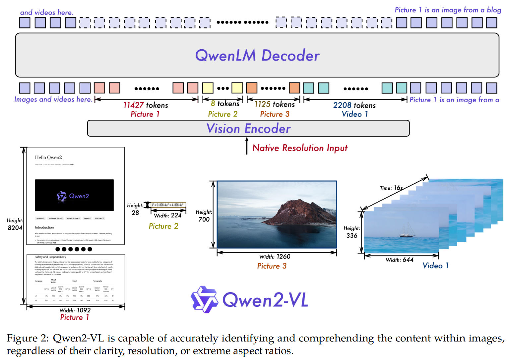

## Summary:

The paper introduces **Qwen2-VL**, an advanced vision-language model series that significantly enhances multimodal understanding by addressing limitations in traditional fixed-resolution visual processing. Key features of Qwen2-VL include:

- **Naive Dynamic Resolution Mechanism**: Dynamically processes images of varying resolutions into a variable number of visual tokens (4–16,384), improving efficiency and accuracy in visual representation.
- **Multimodal Rotary Position Embedding (M-RoPE)**: Captures spatial and temporal information for text, images, and videos, enabling better comprehension of dynamic content like videos.
- **Unified Image and Video Processing**: Employs a single framework for both images and videos, with innovations like 3D convolutions for better video understanding.

The series includes models with 2B, 8B, and 72B parameters, achieving state-of-the-art performance across benchmarks such as DocVQA, MTVQA, and MathVista. The largest model, Qwen2-VL-72B, rivals leading models like GPT-4 in multimodal tasks. It also supports multilingual contexts and extended-duration video comprehension, offering robust capabilities for real-world applications. The code is available on GitHub.

