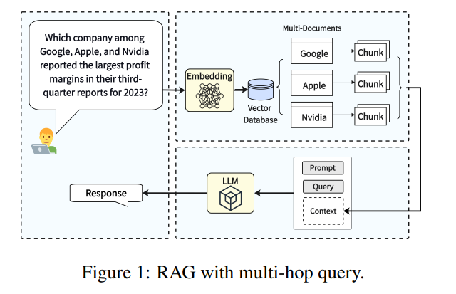
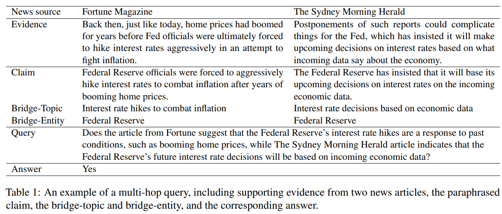

## MultiHop-RAG: Benchmarking Retrieval-Augmented Generation for Multi-Hop Queries

First categorize multi-hop queries into four types: 
1. Inference query
	- Which report discusses the supply chain risk of Apple, the 2019 annual report or the 2020 annual report?
2. Comparison query, 
	- Did Netflix or Google report higher revenue for the year 2023?"
3. Temporal query, and 
	- Did Apple introduce the AirTag tracking device before or after the launch of the 5th generation iPad Pro?
4. Null query: Scenario where query cannot be derived from knowledge base
	- What are the sales of company ABCD as reported in its 2022 and 2023 annual reports?

**Data generation step:**
Using GPT-4 as a data generator, we then take an extensive procedure to construct a diverse set of multi-hop queries, each requiring the retrieval and reasoning over multiple documents

**Evaluation metrics**

**Retrieval evaluation**
- Mean average Precision @ K
- Mean reciprocal rank @ K
- Hit rate @ K

**Response evaluation**
- LLM response vs Ground truth

**Benchmarking RAG systems using MultiHop-RAG**
- Data released
- Talks about how to use this dataset to evaluate RAG pipeline
- **Use of reranker**: bge-reranker-large: Retrieve 20 and select K after re-ranking

**Summary**

- MultiHop-RAG dataset creation
- Reranker used
- Embedding models compared