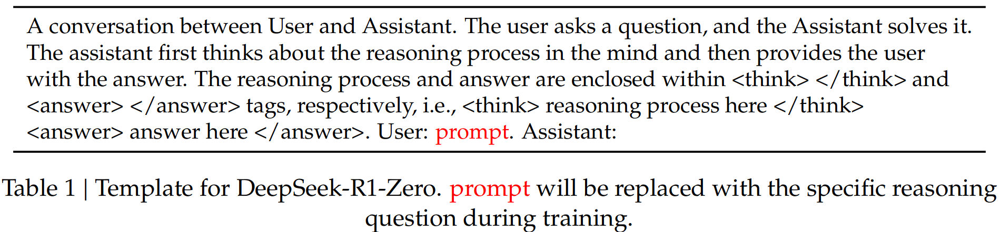

## Summary
- Improving language model reasoning capabilities using pure reinforcement learning (RL)
- We demonstrate that the reasoning patterns of larger models can be distilled into smaller models, resulting in better performance compared to the reasoning patterns discovered through RL on small models.
- We open-source distilled 1.5B, 7B, 8B, 14B, 32B, and 70B checkpoints based on Qwen2.5 and Llama3 series to the community.

