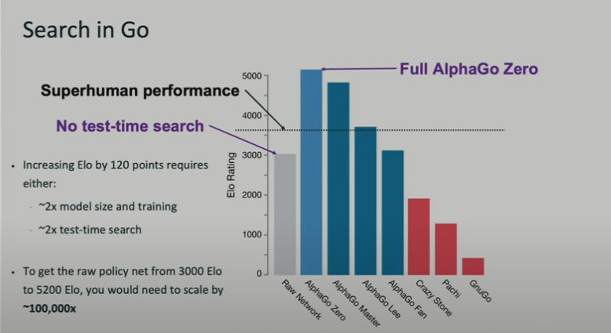
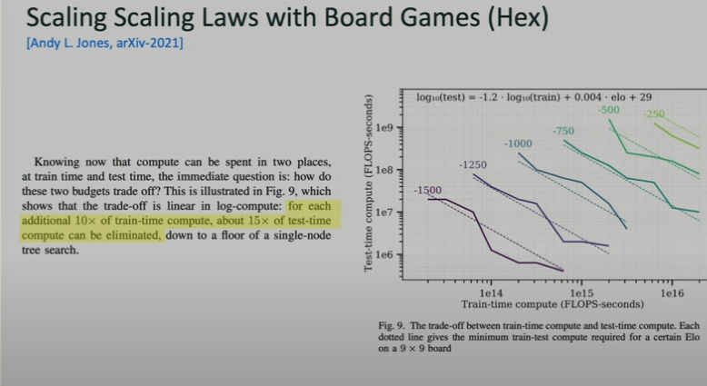
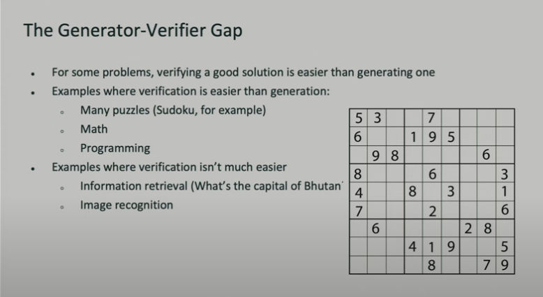
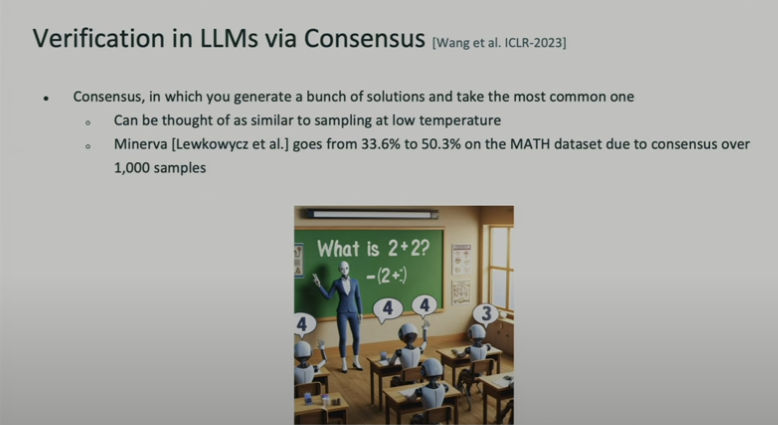
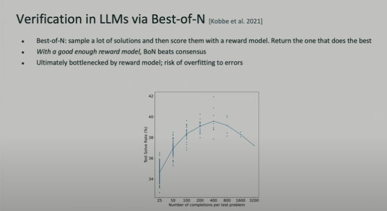
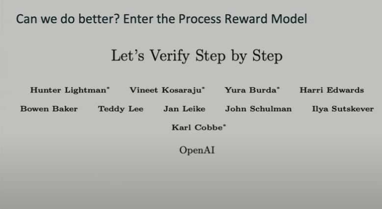
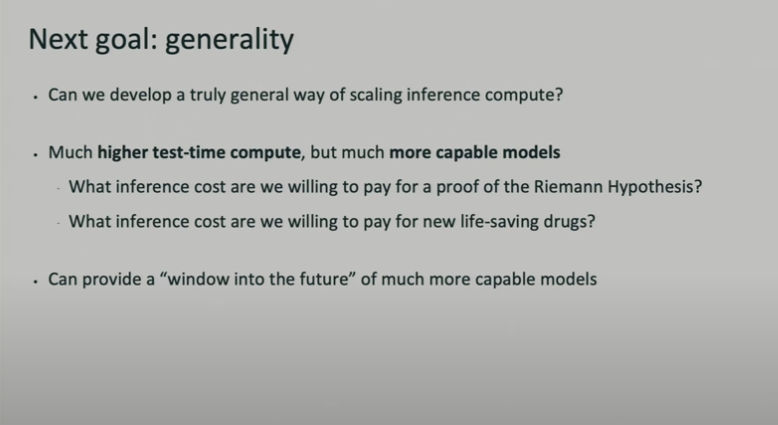
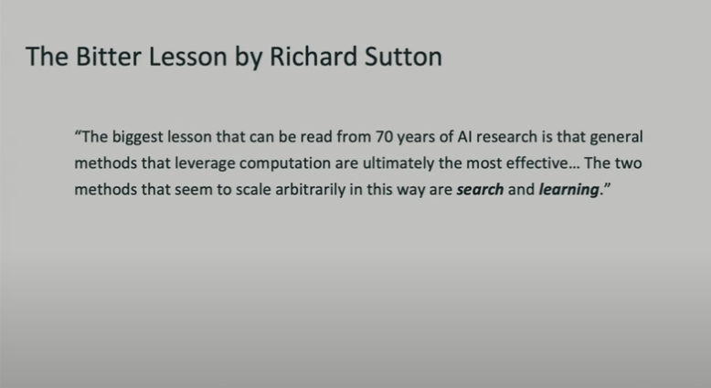

https://github.com/hijkzzz/Awesome-LLM-Strawberry

# Let's verify step by step

We have shown that process supervision can be used to train much more reliable reward models than outcome supervision in the domain of mathematical reasoning.

https://github.com/openai/prm800k

