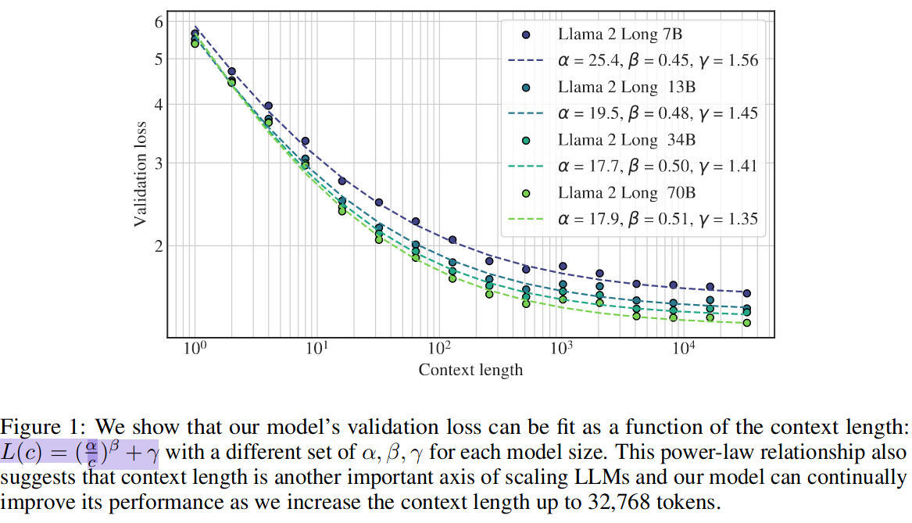
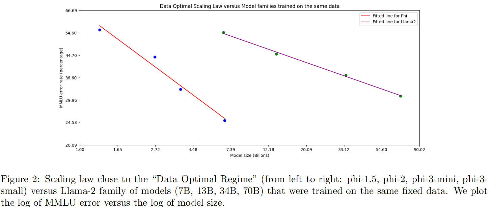

## Effective Long-Context Scaling of Foundation Models

  
Notes

### Key points

- Llama2 models with context windows of up to 32 K tokens
- Ablation experiments conclusions: 
	- Having abundant long texts in the pretrain dataset is **NOT** the key to achieving strong performance
	- Long context continual pretraining is more efficient and similarly effective compared to pretraining from scratch with long sequences
- **power-law scaling**: context length is another important axis of scaling LLMs
	- validation loss decreases with increasing context-length 
- Observe modest improvements on standard short-context tasks, especially on coding, math and knowledge benchmarks, along with significant improvements on long-context tasks

## Phi-3 Technical Report: A Highly Capable Language Model Locally on Your Phone

We introduce phi-3-mini, a 3.8 billion parameter language model trained on 3.3 trillion tokens, whose overall performance, as measured by both academic benchmarks and internal testing, rivals that of models such as Mixtral 8x7B and GPT-3.5.

The innovation lies entirely in our dataset for training, a scaled-up version of the one used for phi-2, composed of heavily filtered web data and synthetic data.

The phi-3-mini model is a transformer decoder architecture [VSP+17], with default context length 4K. We also introduce a long context version via LongRope [DZZ+24] that extends the context length to 128K, called phi-3-mini-128K

To best benefit the open source community, phi-3-mini is built upon a similar block structure as Llama-2 [TLI+23] and uses the same tokenizer with vocabulary size of 320641.

Post-training. Our models went through post-training with both supervised instruction fine-tuning, and preference tuning with DPO.

The model simply does not have the capacity to store too much “factual knowledge”, which can be seen for example with low performance on TriviaQA. However, we believe such weakness can be resolved by augmentation with a search engine.