## Sora: Video generation models as world simulators

  
Notes

  
### Key points
- We explore large-scale training of generative models on video data. 
- Train text-conditional diffusion models jointly on videos and images of variable durations, resolutions and aspect ratios. 
- We leverage a transformer architecture that operates on spacetime patches of video and image latent codes. 
- Our largest model, Sora, is capable of generating a minute of high fidelity video. 
- Our results suggest that scaling video generation models is a promising path towards building general purpose simulators of the physical world.

### Visual data to patches
- Generative modeling of video data historically: recurrent neural networks, generative adversarial networks, auto-regressive transformers
- Tokens (LLM) <-> Patches (Vision)
- Videos -> Lower dimensional latent space -> space time patches

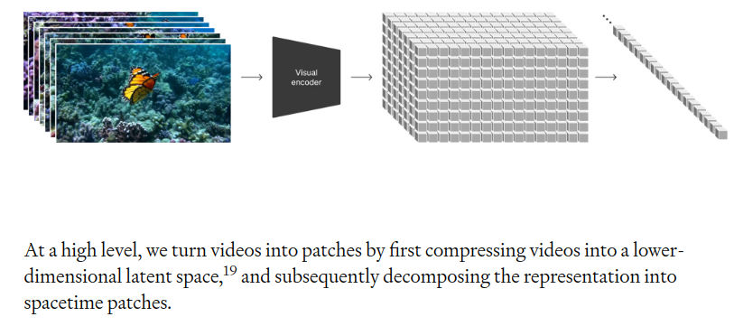

### Video compression network
- Network trained to reduce the dimensionality of the visual data, both spatially and temporally, to map to a compressed latent space
- Sora is trained on and generated videos within this latent space
- Decoder is to used map from latent space to pixel space

### Spacetime latent patches
- Sequence of spacetime patches act as transformer tokens

### Scaling transformers for video generation
- Sora is diffusion model (transformer): Noisy input patches (and conditioning information like text prompts) -> predict original "clean" patches

### Variable durations, resolutions, aspect ratios
- Sampling flexibility (widescree: 1920X1080, vertical: 1080X1920 and everything in between)
- Training on original native aspect ratios vs cropping to fixed ratio generates better videos

### Language understanding
- Requires large amount of videos with corresponding text captions.
- Apply re-captioning technique introduced in DALL-E
- First train a highly descriptive captioner model and then use it to prodicce text captions for all videos in the training dataset.
- Leverage GPT to turn short user prompts into longer detailed captions that are sent to video model

### Prompting with images and videos
- Can be prompted using pre-existing images or videos
- Examples: same ending for different starting videos, animating images, video-to-video editing, image-generation

### Limitations
-  it does not accurately model the physics of many basic interactions, like glass shattering.

## From Concept to Manufacturing: Evaluating Vision-Language Models for Engineering Design

  
Notes

### Key points
- These vision-language models (VLMs) can take images and text as input and generate text as output.

## Engineering design

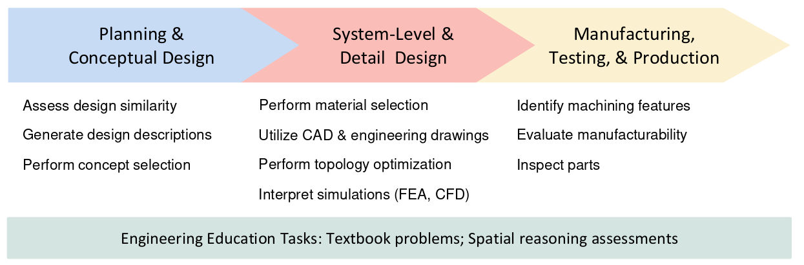

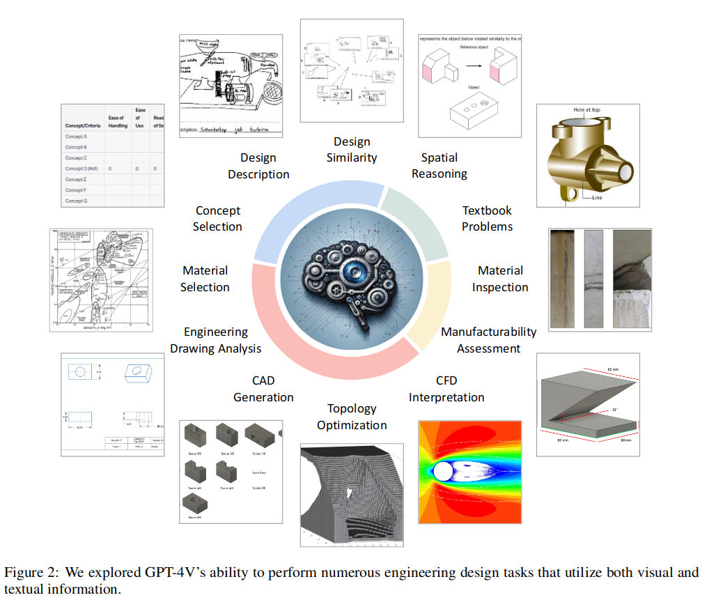

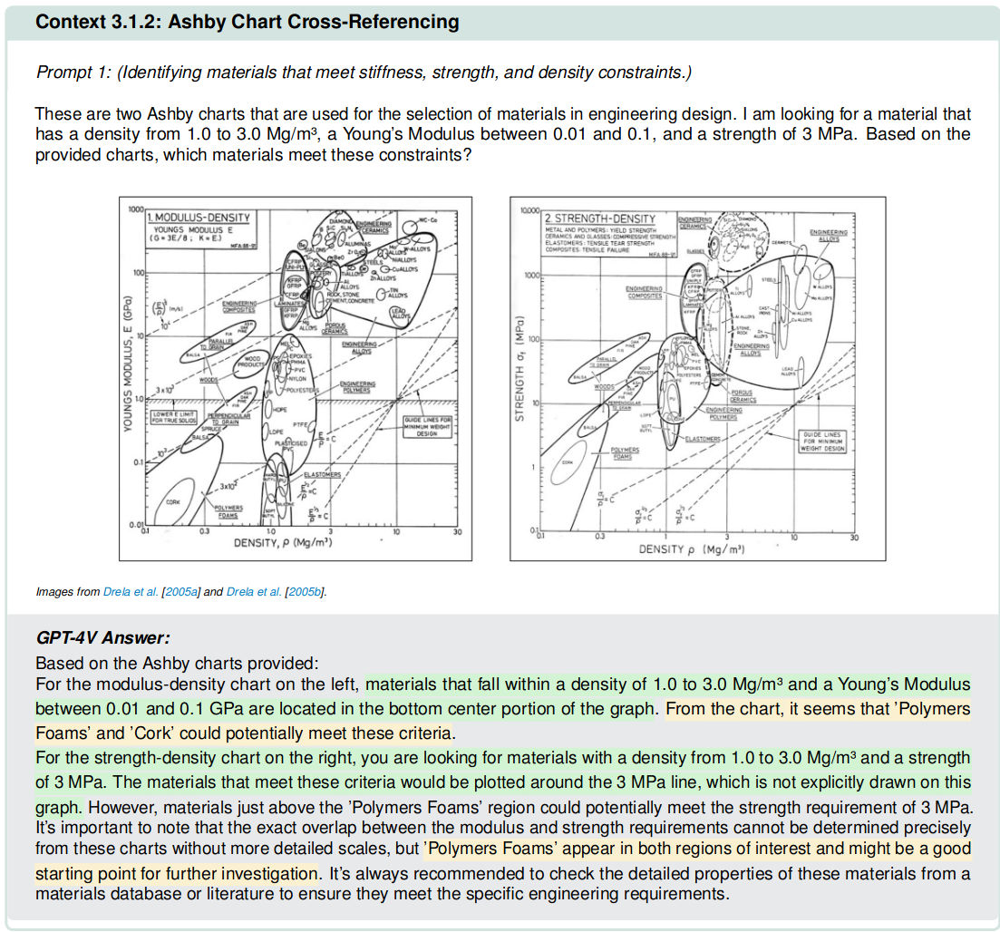

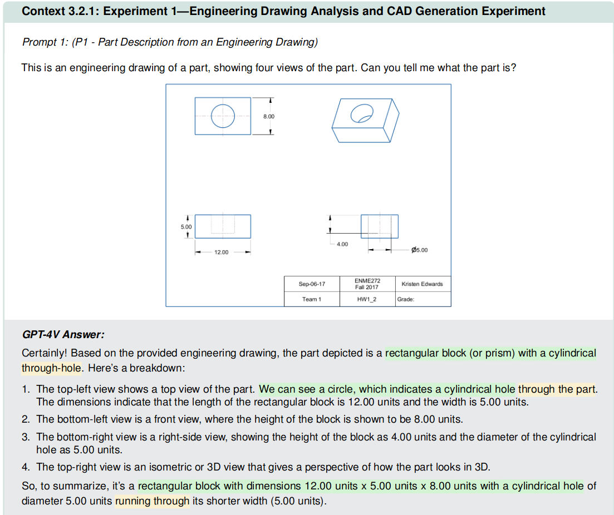

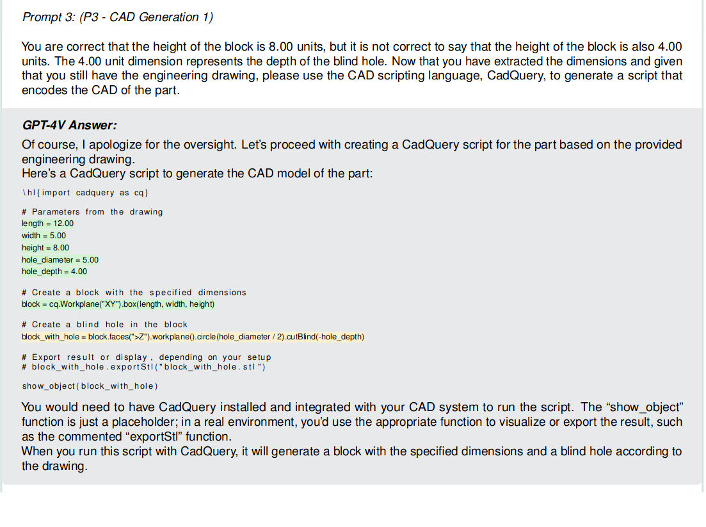

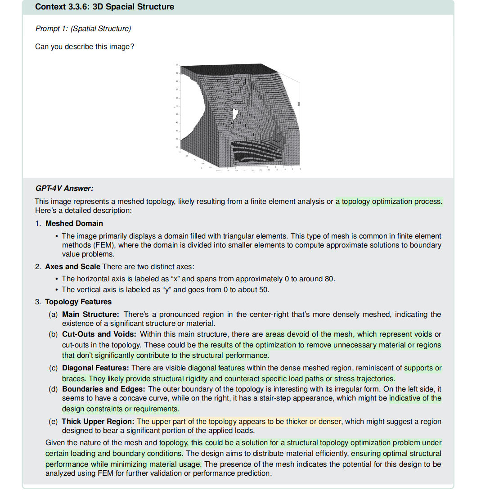

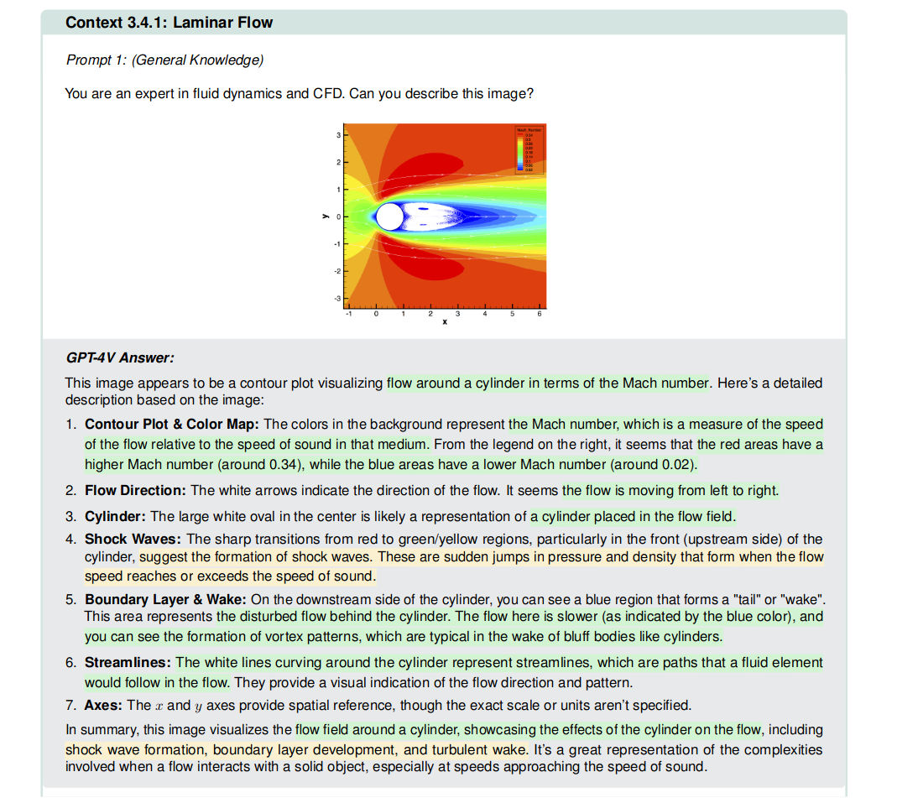

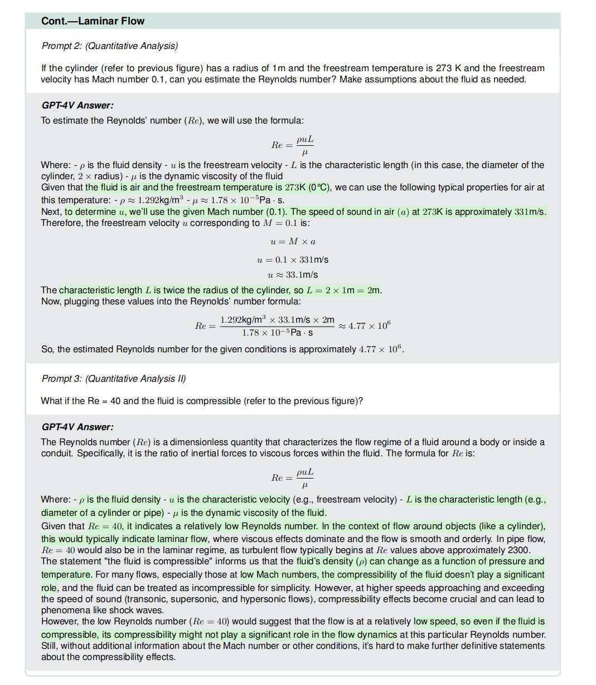

## Engineering Education Task

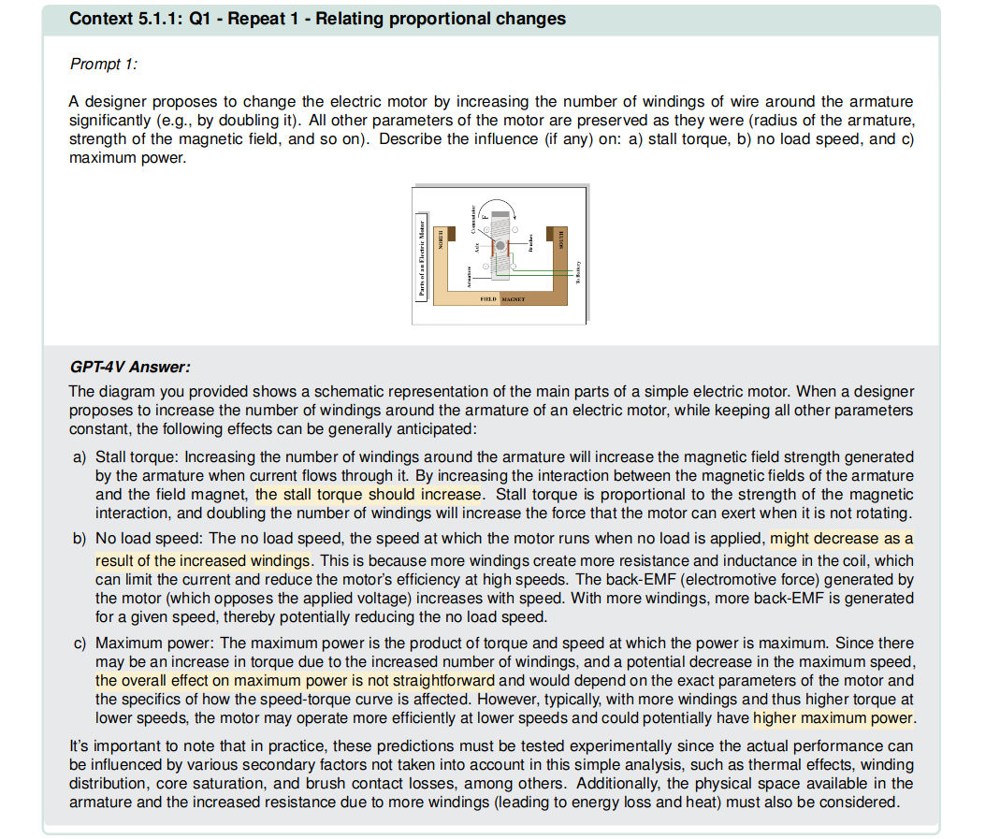

### Kinds of errors

- Reasoning
- Image misinterpretation
- Imprecision

## Qwen-Audio: Advancing Universal Audio Understanding via Unified Large-Scale Audio-Language Models

- [Qwen-Audio](https://github.com/QwenLM/Qwen-Audio) is a multi-task language model conditioning on audio and text inputs, that extends the Qwen-7B language model to effectively perceive audio signals by the connection of a single audio encoder.
- Different from previous works that primarily cater to a single type of audio such as human speech, or focus on specific tasks like speech recognition and captioning, or limit models to a single language (Wang et al., 2023a; Lyu et al., 2023; Wu et al., 2023b; Gong et al., 2023b; Shu et al., 2023), we scale up the training to dozens of datasets covering over 30 tasks, eight languages and various types of audio for advancing universal audio understanding abilities.
- For the audio modality, there have been attempts to utilize well-trained audio foundation models as tools, such as AudioGPT (Huang et al., 2023) and HuggingGPT (Shen et al., 2023), while leveraging LLMs as a versatile interface. These endeavors involve instructing LLMs to generate commands for controlling external tools or transcribing human speech to text before inputting into the LLMs. **However, these approaches lack the inclusion of crucial information like prosody and sentiment in human speech**, and in certain cases, they fail to convert non-textual audio, such as **natural sound**.

### Model Architecture

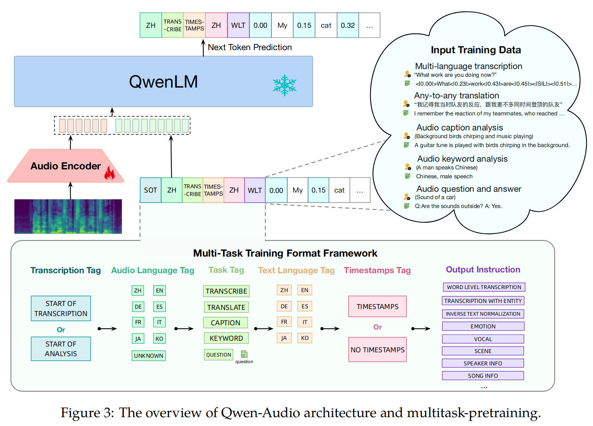

- Audio encoder and a large language model
- Training objective is to maximize the next token probability as 
$P_{\theta}(x_t \mid x_{\lt t}, \text{Encoder}_{\phi}(a))$

#### Encoder
- Whisper-large-v2 model (32-layer transformer model)
- Each frame of the encoder output approximately corresponds to a 40ms segment of the original audio signal.

#### LLM
- Qwen-7B is a 32-layer Transformer decoder model with a hidden size of 4096, encompassing a total of 7.7B parameters.

### Training

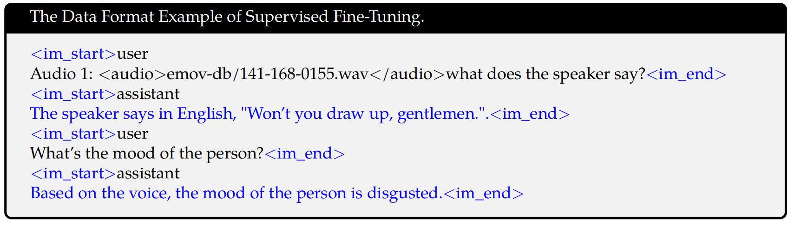

### Experiments

- For multi-task pre-training, we freeze the weights of LLM and only optimize the audio encoder. This trained model is referred to as Qwen-Audio. 
- In the subsequent supervised fine-tuning stage, we fix the weights of the audio encoder and only optimize the LLM. The resulting model is denoted as Qwen-Audio-Chat.

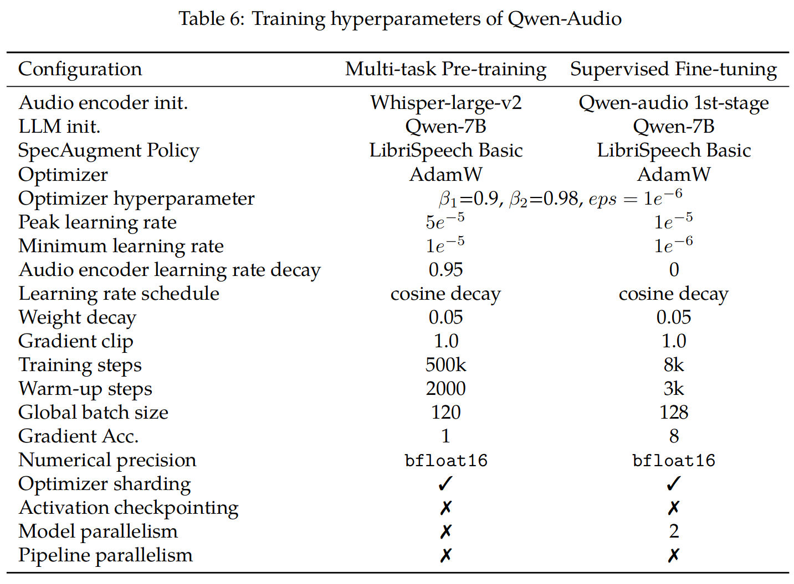

