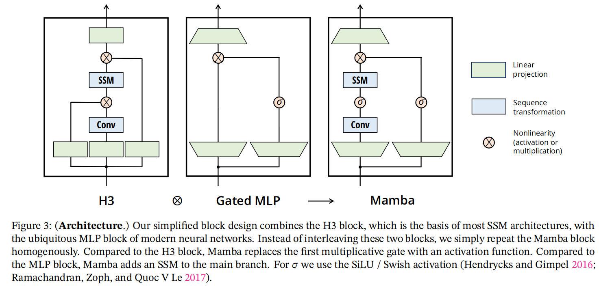
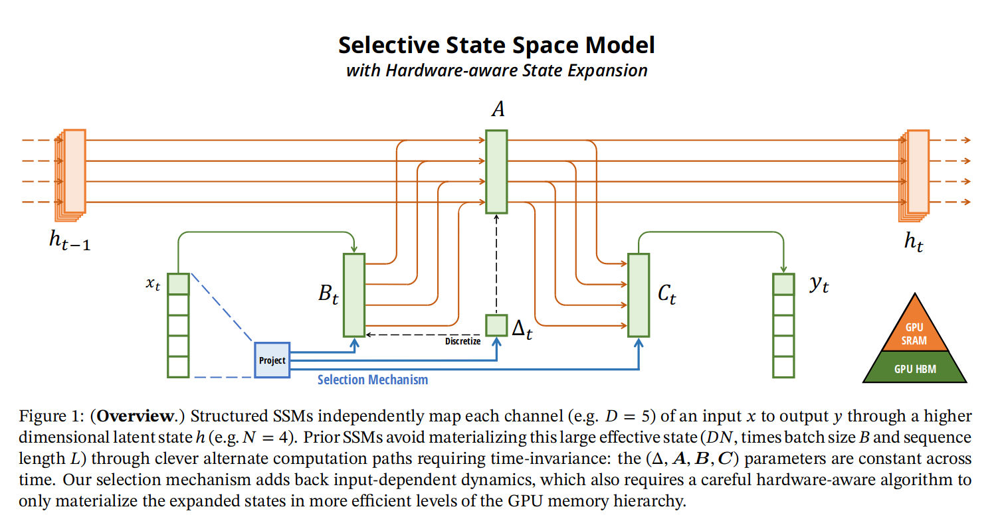

## Mamba: Linear-Time Sequence Modeling with Selective State Spaces

Notes

**Limitations of self-attention**
- The efficacy of self-attention is attributed to its ability to route information densely within a context window, allowing it to model complex data.
- However, this property brings fundamental drawbacks: an inability to model anything outside of a finite window, and quadratic scaling with respect to the window length.

**State space models** 
- These models can be interpreted as a combination of recurrent neural networks (RNNs) and convolutional neural networks (CNNs), with inspiration from classical state space models
- This class of models can be computed very efficiently as either a recurrence or convolution, with linear or near-linear scaling in sequence length.

**We propose a new class of selective state space models, that improves on prior work on several axes to achieve the modeling power of Transformers while scaling linearly in sequence length.**

#### Properties of S4
1. No non-linearity $h_t \rightarrow h_{t+1}$
2. No time-dependent

#### Mamba
1. High quality: selectivity brings strong performance on dense modalities such as language and genomics. 
2. Fast training and inference: computation and memory scales linearly in sequence length during training, and unrolling the model autoregressively during inference requires only constant time per step since it does not require a cache of previous elements. 
3. Long context: the quality and efficiency together yield performance improvements on real data up to sequence length 1M.

#### Equations

**Continuous**
$h'(t) = Ah(t) + Bx(t)$
$y(t) = Cx(t)$

**Discretized**
$h_t = \overline{A}h_{t-1} + \overline{B}x_t$
$y_t = Ch_t$

**Convolution**
$y_t = Ch_t = C(\overline{A}h_{t-1} + \overline{B}x_t) = C\overline{A}h_{t-1} + C\overline{B}x_t$
$\overline{K} = (C\overline{B}, C\overline{AB}, ... C\overline{A^k}\overline{B})$
$y = x* \overline{K}$

## Transformers are RNN

Notes

### Key
- we express the self-attention as a linear dot-product of kernel feature maps and make use of the associativity property of matrix products to reduce the complexity from O (N 2) to O (N ), where N is the sequence length.
- we introduce the linear transformer model that significantly reduces the memory footprint and scales linearly with respect to the context length.

### Linear transformer

- $$T_l(x) = f_l(A_l(x) + x)$$
- $A_l$: self attention function and is the only part of the transformer that acts across sequences.

### Basic idea

