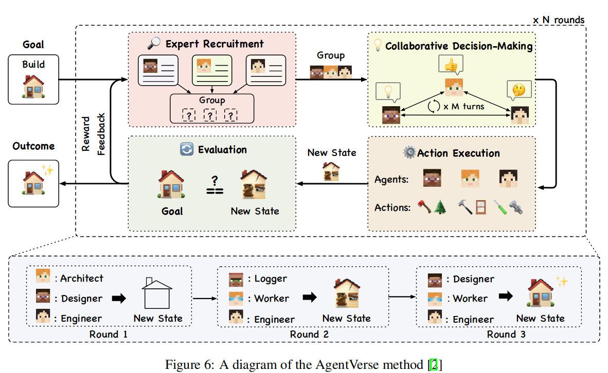

## [The shift from models to compound systems](https://bair.berkeley.edu/blog/2024/02/18/compound-ai-systems/)

- We define a Compound AI System as a system that tackles AI tasks using multiple interacting components, including multiple calls to models, retrievers, or external tools.
	- **Some tasks are easier to improve via system design.**
	- **Systems can be dynamic.**
	- **Improving control and trust is easier with systems.**
	- **Performance goals vary widely.**

## THE LANDSCAPE OF EMERGING AI AGENT ARCHITECTURES FOR REASONING, PLANNING, AND TOOL CALLING: A SURVEY

### Single Agent Architectures

- notable single agent methods such as ReAct, RAISE, Reflexion, AutoGPT + P, and LATS.
- We find that single agent architectures are especially useful when the task requires straightforward function calling and does not need feedback from another agent

#### ReAct. 
- In the ReAct (Reason + Act) method, an agent first writes a thought about the given task. 
- It then performs an action based on that thought, and the output is observed. This cycle can repeat until the task is complete [32]. 
- When applied to a diverse set of language and decision-making tasks, the ReAct method demonstrates improved effectiveness compared to zero-shot prompting on the same tasks.
- It also provides improved human interoperability and trustworthiness because the entire thought process of the model is recorded. 
- When evaluated on the HotpotQA dataset, the ReAct method only hallucinated 6% of the time, compared to 14% using the chain of thought (CoT) method [29, 32].
- Issues: the model can repetitively generate the same thoughts and actions and fail to create new thoughts to provoke finishing the task and exiting the ReAct loop.

**RAISE.** 
- The RAISE method is built upon the ReAct method, with the addition of a memory mechanism that mirrors human short-term and long-term memory [16]. 
- It does this by using a scratchpad for short-term storage and a dataset of similar previous examples for long-term storage. By adding these components, RAISE improves up.
- Issues: First, RAISE struggles to understand complex logic, limiting its usefulness in many scenarios. Additionally, RAISE agents often hallucinated with respect to their roles or knowledge.

**Reflection**
- Reflexion is a single-agent pattern that uses self-reflection through linguistic feedback [23].

**AUTOGPT + P.**
AutoGPT + P (Planning) is a method that addresses reasoning limitations for agents that command robots in natural language

## Multi Agent Architectures

- LLM Agents Learn to Cooperate in Organized Teams, DyLAN, AgentVerse, and MetaGPT.
- Many multi-agent architectures work in stages where teams of agents are created and reorganized dynamically for each planning, execution, and evaluation phase

**DyLAN** 
- The Dynamic LLM-Agent Network (DyLAN) framework creates a dynamic agent structure that focuses on complex tasks like reasoning and code generation [18]. 
- DyLAN has a specific step for determining how much each agent has contributed in the last round of work and only moves top contributors the next round of execution.

**AgentVerse** 
- Multi-agent architectures like AgentVerse demonstrate how distinct phases for group planning can improve an AI agent’s reasoning and problem-solving capabilities
- AgentVerse contains four primary stages for task execution: recruitment, collaborative decision making, independent action execution, and evaluation.

**MetaGPT.** 
Many multi-agent architectures allow agents to converse with one another while collaborating on a common problem.