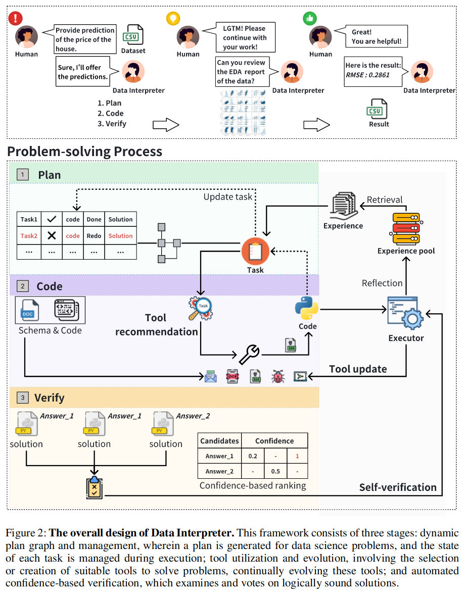
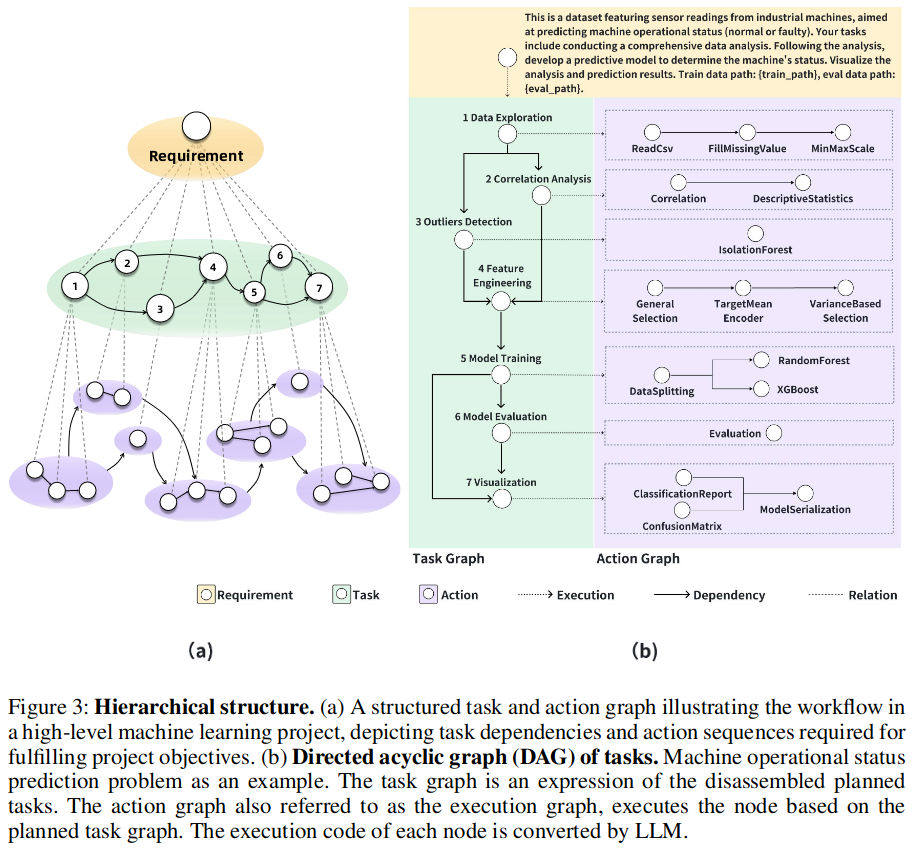
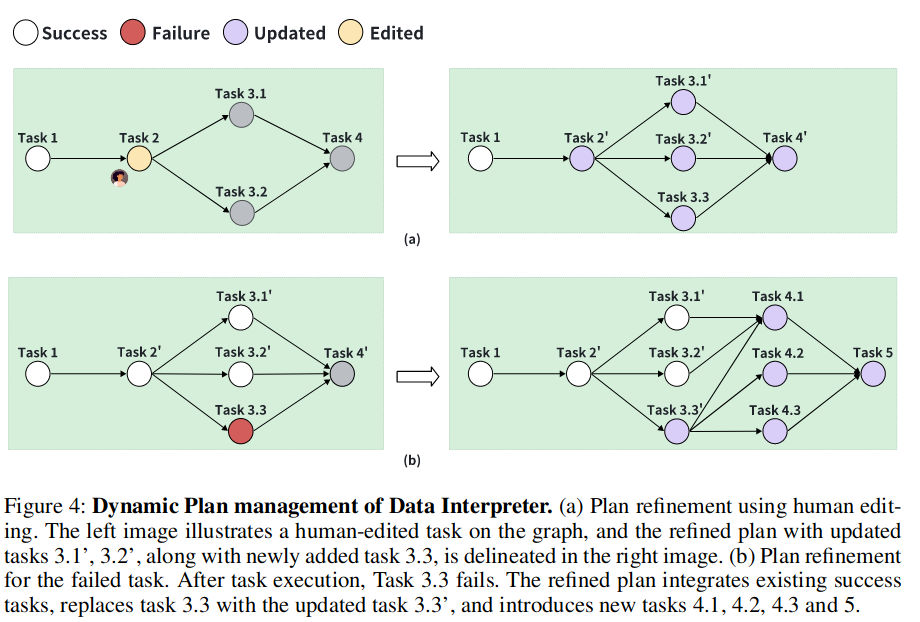
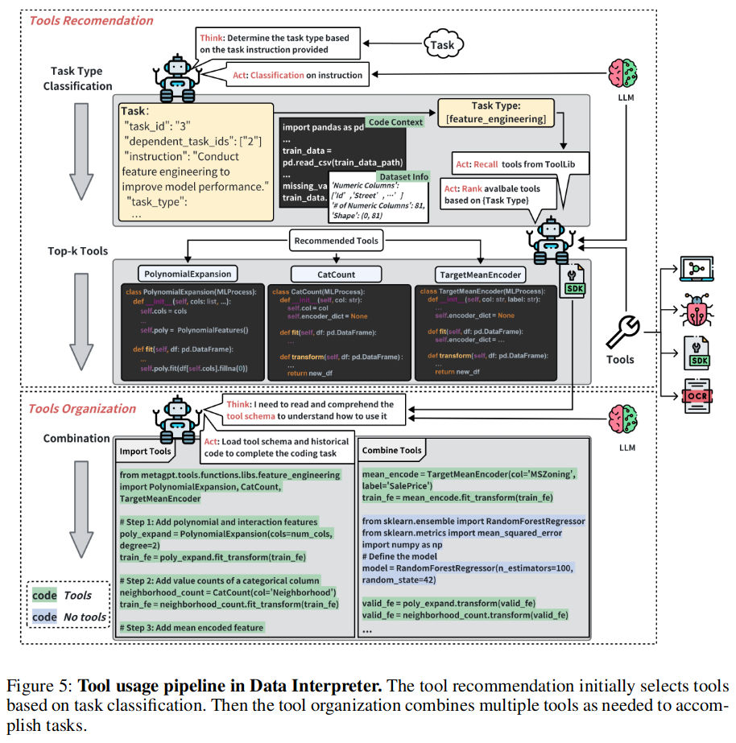

# _01_Agents

## [LUMOS: LEARNING AGENTS WITH UNIFIED DATA, MODULAR DESIGN, AND OPEN-SOURCE LLMS](https://arxiv.org/pdf/2311.05657.pdf)

LUMOS consists of three modules: 
1. a planning module: The planning module dissects a complex task into a sequence of highlevel subgoals. 
2. a grounding module: The grounding module subsequently translates these generated subgoals into a series
of low-level actions
3. an execution module: The execution module, a collection of off-the-shelf tools for problemsolving like calculators and search engines, executes.

Proposed two interaction formulations for implementing language agents:
1. LUMOS-O: is an efficient formulation that generates all the subgoals and executable actions using a single inference call in a one-pass fashion. 
2. LUMOS-I: is an iterative formulation that generates one subgoal at a time based on its previous intermediate execution results and environment updates, thereby creating a more adaptive agent.

- [github repo](https://github.com/allenai/lumos?tab=readme-ov-file)

## DATA INTERPRETER: AN LLM AGENT FOR DATA SCIENCE

### Key points

- [Github link](https://github.com/geekan/MetaGPT)
- LLM-based agent, called the Data Interpreter, designed specifically for the field of data science. This agent follows a plan-code-verify approach to fulfill human requirements by breaking down tasks, executing code, and verifying feedback.
- Dynamic planning workflow
	1. Dynamic planning with hierarchical structure:
	2. Tool utilization and generation:
	3. Enhancing reasoning with logic bug aware

