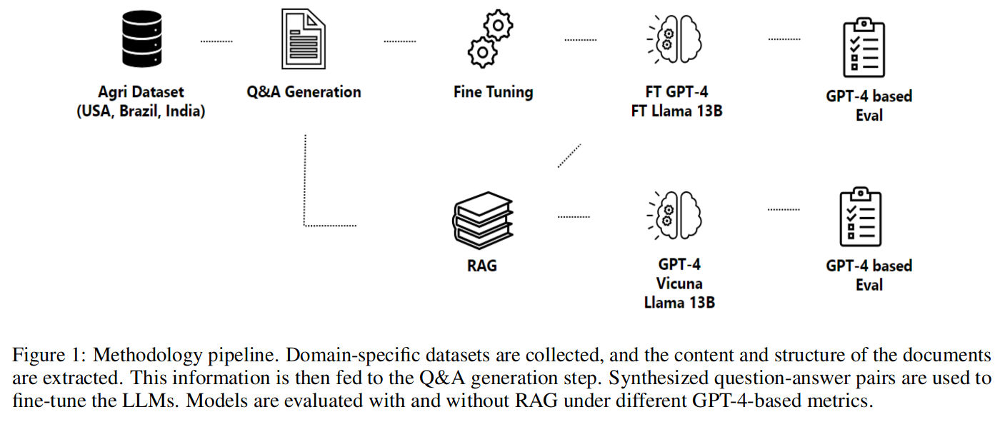
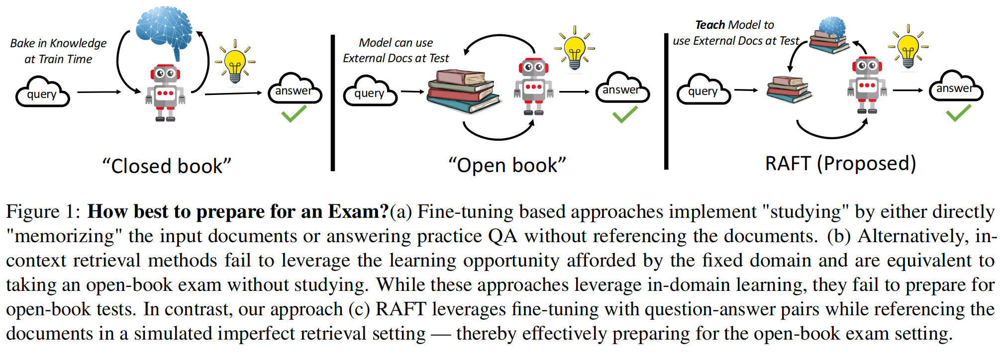
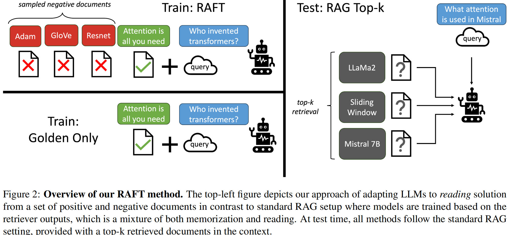
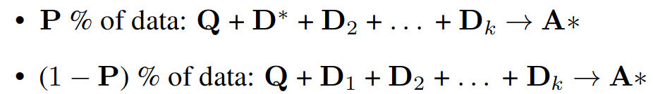
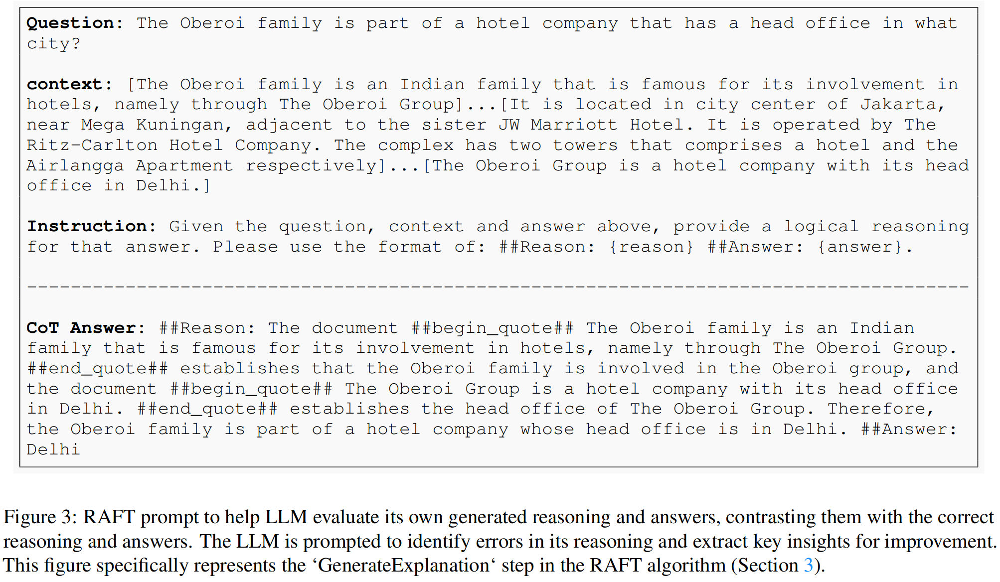
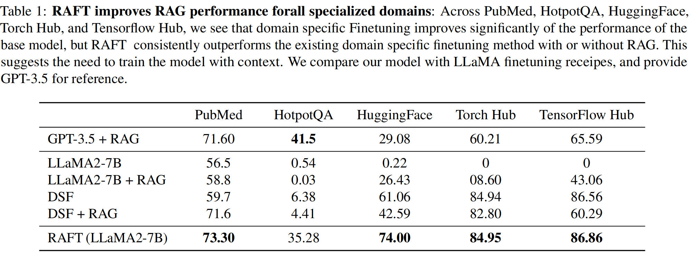
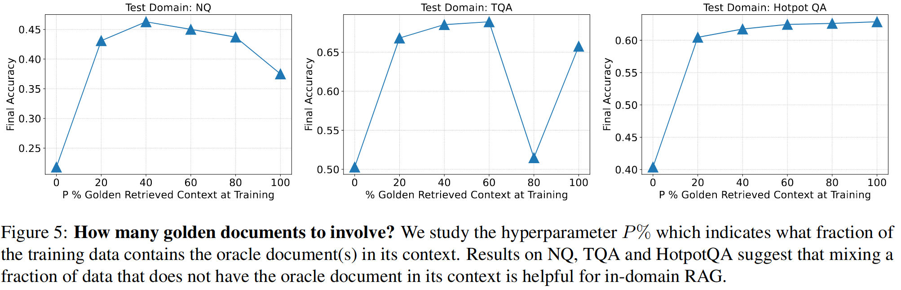
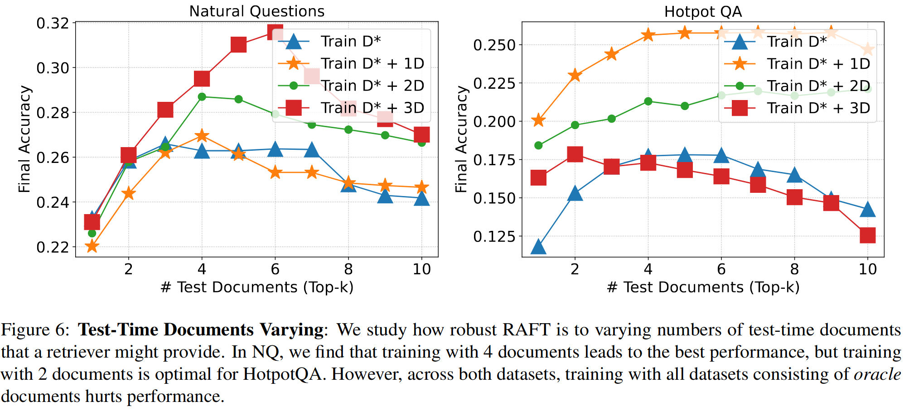

---
---

# _02_RAG

## Overview of RAG Techniques

## Papers

## RAG VS FINE-TUNING: PIPELINES, TRADEOFFS, AND A CASE STUDY ON AGRICULTURE

### Key points
- the creation of AI copilots for industries that require specific contexts and adaptive responses, such as the agriculture industry.
![[]]
### Methodology

- Data extraction (pdf): [GROBID](https://github.com/kermitt2/grobid)
- Question generation: Use of guidance
- Answer generation: Use RAG to create high-quality answers
- Training parameters:
	- 8 H100 GPUs and FSDP
	- Micro-batch of 4 samples and gradient accumulation over 4 micro-batches -> 128 (4x4x8) effective batch size
	- Epochs: 4
	- Precision: Mixed with BFloat16
	- Optimiser: Adam
	- Base learning rate: 2e-5
	- Cosine learning rate scheduler with linear warm-up (4% of total steps)
	- Flash attention
- Metrics: Number of metrics to test against

### RAFT: Adapting Language Model to Domain Specific RAG

#### Key points
- In RAFT, given a question, and a set of retrieved documents, we train the model to ignore those documents that don’t help in answering the question, which we call, distractor documents. 
- RAFT accomplishes this by citing verbatim the right sequence from the relevant document that would help answer the question. 
- This coupled with RAFT’s chain-of-thought style response helps improve the model’s ability to reason. 
- In domain specific RAG, RAFT consistently improves the model’s performance across PubMed, HotpotQA, and Gorilla datasets, presenting a post-training recipe to improve pre-trained LLMs to in-domain RAG.

#### Simple Analogy
- Existing in-context retrieval methods are equivalent to taking open-book exam without studying
- Existing fine-tuning based approaches implement "studying" by either directly "memorizing" the input documents or answering practice questions without referencing the documents.

#### RAFT Training

#### Baselines 
We consider the following baselines for our experiments: 
- LlaMA2-7B-chat model with 0-shot prompting
- LlaMA2-7B-chat model with RAG (Llama2 + RAG)
- domain specific Finetuning with 0-shot prompting (DSF)
- domain specific Finetuning with RAG (DSF + RAG)

#### Results

- [Fine-Tuning or Retrieval? Comparing Knowledge Injection in LLMs](https://arxiv.org/pdf/2312.05934.pdf)
- [Retrieval-Augmented Generation for Large Language Models: A Survey](https://arxiv.org/pdf/2312.10997.pdf)

#### Chain of Thought (CoT)
- Incorporating a reasoning chain that not only guides the model to the answer but also enriches the model’s understanding can improve the overall accuracy.

#### Fraction of data with oracle document

#### Top-K 

## Blogs

- [Fine tuning is for form, not facts](https://www.anyscale.com/blog/fine-tuning-is-for-form-not-facts)
- [Fine-Tuning Your Embedding Model to Maximize Relevance Retrieval in RAG Pipeline](https://betterprogramming.pub/fine-tuning-your-embedding-model-to-maximize-relevance-retrieval-in-rag-pipeline-2ea3fa231149)

## Github repos

- [Workflow automation using LLMs](https://github.com/lucastononro/llm-food-delivery)
