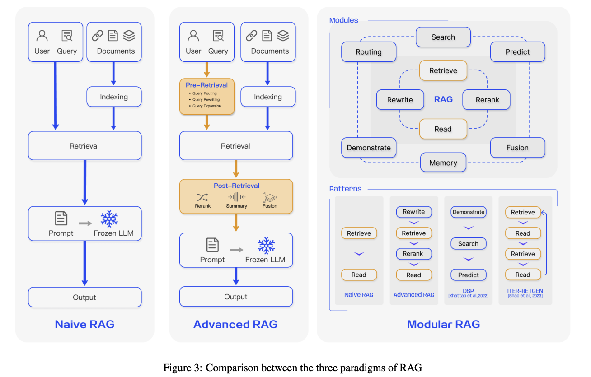
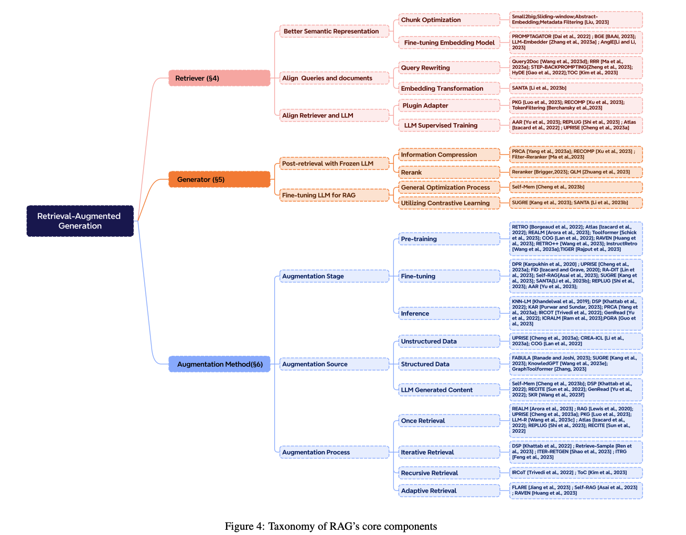
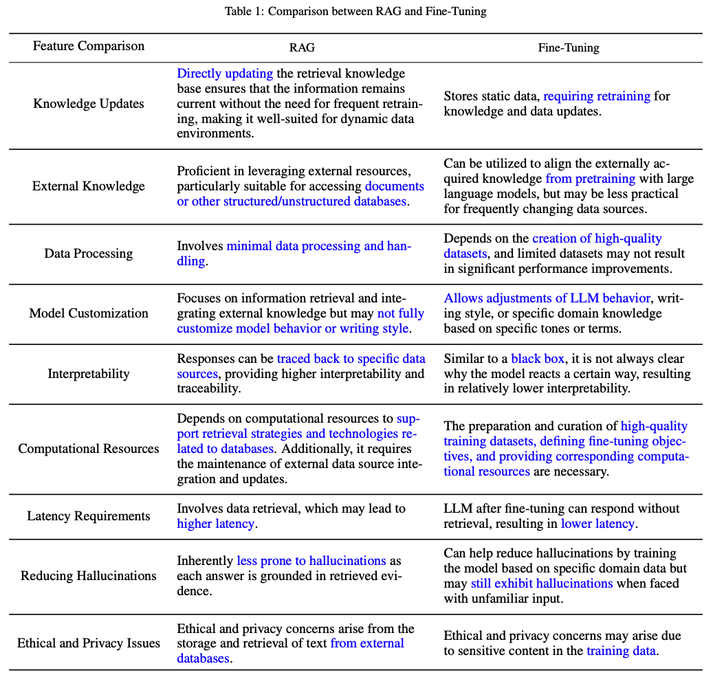
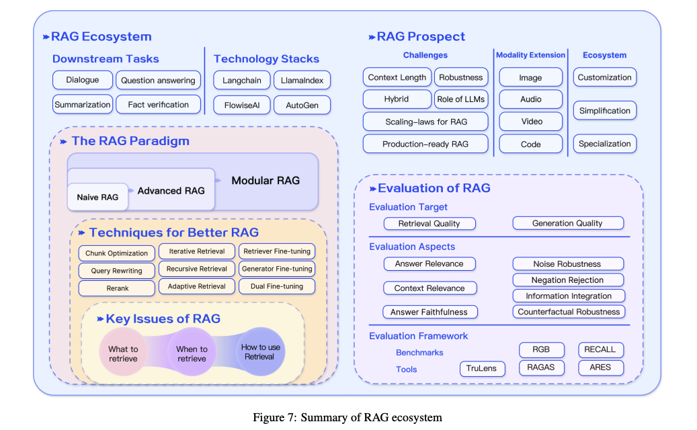

# _02_RAG

## Overview of RAG Techniques

## Papers

## RAG VS FINE-TUNING: PIPELINES, TRADEOFFS, AND A CASE STUDY ON AGRICULTURE

### Key points
- the creation of AI copilots for industries that require specific contexts and adaptive responses, such as the agriculture industry.
![[]]
### Methodology

- Data extraction (pdf): [GROBID](https://github.com/kermitt2/grobid)
- Question generation: Use of guidance
- Answer generation: Use RAG to create high-quality answers
- Training parameters:
	- 8 H100 GPUs and FSDP
	- Micro-batch of 4 samples and gradient accumulation over 4 micro-batches -> 128 (4x4x8) effective batch size
	- Epochs: 4
	- Precision: Mixed with BFloat16
	- Optimiser: Adam
	- Base learning rate: 2e-5
	- Cosine learning rate scheduler with linear warm-up (4% of total steps)
	- Flash attention
- Metrics: Number of metrics to test against

- [Fine-Tuning or Retrieval? Comparing Knowledge Injection in LLMs](https://arxiv.org/pdf/2312.05934.pdf)
- [Retrieval-Augmented Generation for Large Language Models: A Survey](https://arxiv.org/pdf/2312.10997.pdf)

## Blogs

- [Fine tuning is for form, not facts](https://www.anyscale.com/blog/fine-tuning-is-for-form-not-facts)
- [Fine-Tuning Your Embedding Model to Maximize Relevance Retrieval in RAG Pipeline](https://betterprogramming.pub/fine-tuning-your-embedding-model-to-maximize-relevance-retrieval-in-rag-pipeline-2ea3fa231149)

## Github repos

- [Workflow automation using LLMs](https://github.com/lucastononro/llm-food-delivery)
