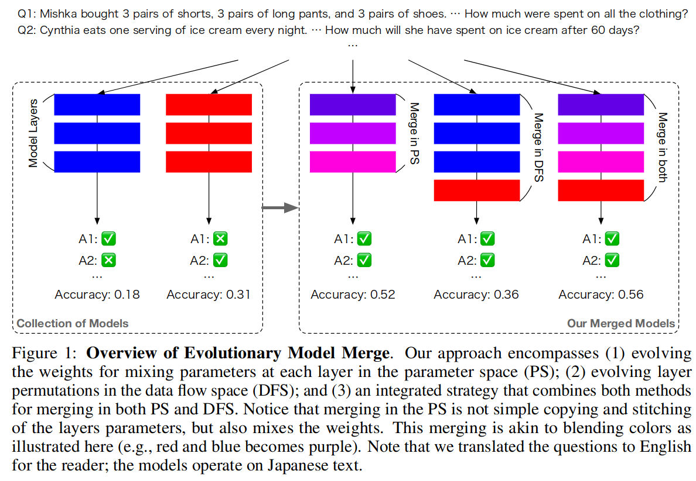
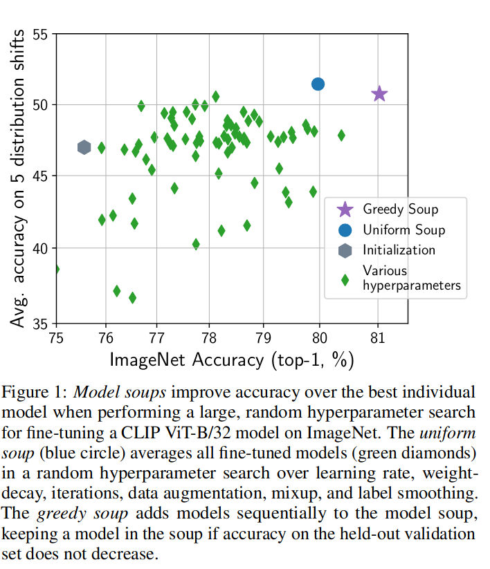

## [HF: Merge models](https://huggingface.co/blog/mlabonne/merge-models)

Model merging is a technique that **combines two or more LLMs** into a single model.

### Algorithms

#### **Spherical Linear Interpolation** (SLERP)

Basic idea: Direction more important than magnitude of vectors in high-dimensional spaces.

SLERP is implemented using the following steps:

1. Normalize the input vectors to unit length, ensuring they represent directions rather than magnitudes
2. Calculate the angle between these vectors using their dot product.
3. If the vectors are nearly collinear, it defaults to linear interpolation for efficiency. Otherwise, SLERP computing scale factors based on the interpolation factor `t` (`t=0` = 100% of the first vector, `t=1` = 100% of model 2) and the angle between the vectors.
4. These factors are used to weigh the original vectors, which are then summed to obtain the interpolated vector.

**SLERP is currently the most popular merging method, but it is limited to combining only two models at a time.**

#### TIES

TIES-Merging is divided into the following three steps:

1. **Trim**: Reduces redundancy in task-specific models by retaining only a fraction the most significant parameters (density parameter) and resetting the rest to zero.
2. **Elect Sign**: Resolves sign conflicts across different models by creating a unified sign vector based on the most dominant direction (positive or negative) in terms of cumulative magnitude.
3. **Disjoint Merge**: Averages parameter values that align with the unified sign vector, excluding zero values.

**Unlike SLERP, TIES can merge multiple models at a time.**

#### DARE

Similar to TIES with couple of differences

- **Pruning**: DARE randomly reset fine-tuned weights to their original values (those of the base model).
- **Rescaling**: DARE rescales the weights to keep the expectations of model outputs approximately unchanged. It adds the rescaled weights of both (or more) models to the weights of the base model with a scale factor.

#### Passthrough

The passthrough method differs significantly from the previous ones. By concatenating layers from different LLMs, it can produce models with an **exotic number of parameters** (e.g., 9B with two 7B parameter models). These models are often referred to as "frankenmerges" or "Frankenstein models" by the community.

## Evolutionary Optimization of Model Merging Recipes

In this work, we present a methodology that leverages evolutionary algorithms to facilitate the merging of foundation models. Our approach is distinguished by its ability to navigate both parameter space (weights) and the data flow space (inference path), proposing a framework that integrates these two dimensions.

- Automated model composition
- Cross-domain merging
- State-of-the-art performance
- High Efficiency and Surprising Generalizability
- Culturally-Aware VLM

### Model merging

- It allows us to combine task-specific models, each potentially fine-tuned for a particular downstream task, into a single unified model.
- A simple method of merging multiple models is to average the weights of multiple models finetuned from the same base initial model.
- Simple weight interpolation works well for merging image generation models that operate in a real valued latent and output space, but to our surprise, they also still work for merging language models under the right conditions, but have performance issues

### Contribution
In this work, we apply evolution to not only automate the optimization of model merging recipes in weight space, confined to a single architecture, but also explore applying evolution to optimize the stacking of layers from different models—a more involved approach that has the potential to create entirely novel neural architectures from existing building blocks. 
Unlike weight merging optimization which confine space of models to be merged together to fine-tuned descendents of the same parent base model, layer stacking optimization has no such constraints. 
Our work systematically explores the application of evolution applied in both parameter and layer space.

#### Merging in parameter space

Model merging in the parameter space (PS) aims to integrate the weights of multiple foundational models into a unified entity with the same neural network architecture, yet outperforming the individual models.

#### Merging in data flow space

Unlike merging in PS, model merging in DFS preserves the original weights of each layer intact. Instead, it optimizes the inference path that tokens follow as they traverse through the neural network. For example, after the i-th layer in model A, a token may be directed to the j-th layer in model B.

Assuming the total number of layers across all models is M , the size of the search space is $(M + 1)^T$ , here the extra one indicates the inclusion of a pass-through layer.

Conceptually, we layout all the layers in sequential order (i.e., all layers in the i-th model followed by those in the i + 1-th model) and repeat them r times, the indicator array then manages the inclusion/exclusion of layers. If $I_i > 0$ we include the layer corresponding to index i in the slots in the merged model, otherwise we exclude it. Consequently, our search space is reduced to $2^T$ , which is still large, but tractable for evolutionary search.

#### Merging in both spaces

it is possible to first apply PS merging to a collection of models, and then put back this merged model in the collection and apply DFS merging from this enlarged collection.

### Limitations

- For instance, we encountered instances where the merged models produced responses that lacked logical coherence. 
- Additionally, this study does not encompass instruction fine-tuning or alignment, raising the potential for the models to yield outputs that may be factually flawed.
### Resources
- [HF: Merge models](https://huggingface.co/blog/mlabonne/merge-models)
- [github: mergekit](https://github.com/arcee-ai/mergekit) 

## [Model soups: averaging weights of multiple fine-tuned models improves accuracy without increasing inference time](https://arxiv.org/pdf/2203.05482.pdf)

### Key points
- We show that averaging the weights of multiple models finetuned with different hyperparameter configurations often improves accuracy and robustness.
- The model soup approach extends to multiple image classification and natural language processing tasks, improves out-of-distribution performance, and improves zero-shot performance on new downstream tasks.

### Notes
Selecting a single model and discarding the rest has several downsides. 
1. For one, ensembling outputs of many models can outperform the best single model, albeit at a high computational cost during inference. 
2. fine-tuning a model on downstream tasks can sometimes reduce out-ofdistribution performance (Radford et al., 2021; Andreassen et al., 2021; Wortsman et al., 2021; Pham et al., 2021), and the best single model on the target distribution may not be the best model on out-of-distribution data.