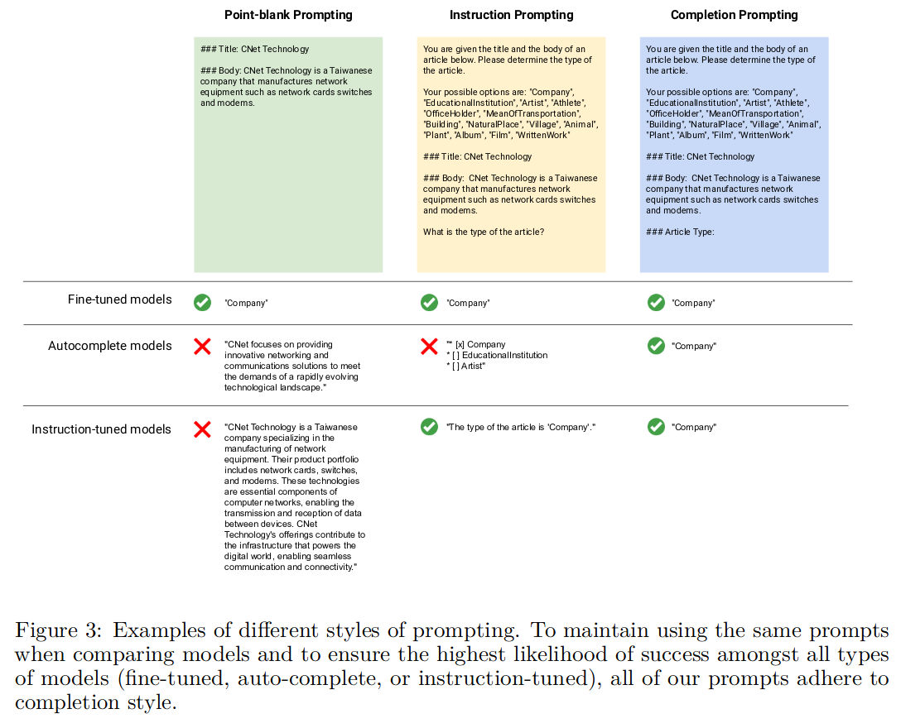
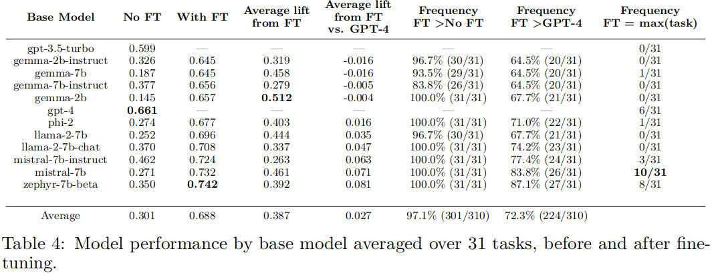
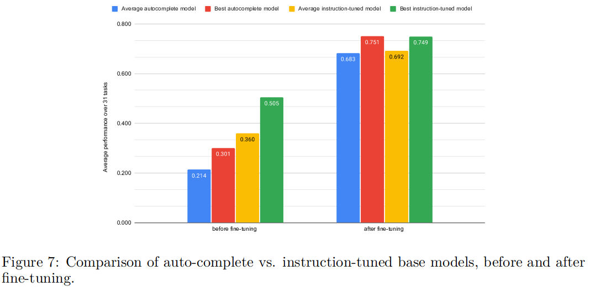

## LoRA Land: 310 Fine-tuned LLMs that Rival GPT-4, A Technical Report

**Which Base Model is the best for LoRA Fine-tuning?**
Mistral-7B and Zephyr-7b-beta emerge as leaders, albeit in different categories.

**Does size matter for LoRA fine-tuning?** 
2B vs. 7B The 2B parameter Phi-2 model, after fine-tuning, outperforms all of the 2B and 7B Gemma models by overall overage, and is only 1.9 points behind the next highest performing 7B model, Llama-2-7b (0.677 vs. 0.696). Despite this, we find that fine-tuned 7B models are almost always better than fine-tuned 2B models (29/31 tasks).

**Is fine-tuning better with Instruction-tuned or Auto-complete models?**

**When does GPT-4 consistently outperform fine-tuned models?** 
We observe a distinct advantage for fine-tuned LLMs on narrowly-scoped tasks, such as those within the GLUE benchmarks. These tasks, primarily classification-oriented, saw fine-tuned LLMs achieve near 90% accuracy, outperforming GPT-4. 
**GPT-4 continues to outperform fine-tuned models in 6 out of 31 tasks, particularly in broader, more complex domains such as Python coding and MMLU.**

### Overall, these observations are consistent with our hypothesis that narrower easier tasks are more likely to see success with fine-tuned adapters.

