[Lectures](https://github.com/cuda-mode/lectures)
- Triton is a DSL and generates a ptx code which is cuda assembly

## Lecture 2 (ch 1-3)

**compiler**
- nvcc (NVIDIA C compiler) is used to compile kernels into PTX
- Parallel Thread Execution (PTX) is a low-level VM & instruction set
- graphics driver translates PTX into executable binary code (SASS)

**CUDA grid**
- 2 level hierarchy: **blocks, threads**


## Lecture 3

1. **Streaming Multiprocessors (SMs):** In NVIDIA GPUs, SMs are the fundamental units of execution. Each SM can execute multiple threads concurrently.

2. **Thread Blocks:** A thread block is a group of threads that can cooperate among themselves through shared memory and synchronization. All threads in a block are executed on the same SM. This means they can share resources such as shared memory and can synchronize their execution with each other.

3. **Shared Memory:** Shared memory is a small memory space on the GPU that is shared among the threads in a block. It is much faster than global memory (the main GPU memory), but it is also limited in size. Threads in the same block can use shared memory to share data with each other efficiently.

- The RTX 3090, based on the Ampere architecture, has 82 SMs.

- Each SM in GA10x GPUs contain 128 CUDA Cores, four third-generation Tensor Cores, a 256 KB Register File, and 128 KB of L1/Shared Memory

- In CUDA, all threads in a block have the potential to run concurrently. However, the actual concurrency depends on the number of CUDA cores per SM and the resources required by the threads.


## Lecture 4: Compute and memory basics


- Threads is a block are executed in parallel on the same SM
- Blocks are completely independent (exceptions in new GPUs)
- Thread block runs on an SM is divided into Warps of 32 threads
	- Each warp run on a fixed of the SMs processing unit (FP32 cores above etc)
	- All warps simultaneously assigned to the processing unit take turns but registers stay


```python
p = torch.cuda.get_device_properties(0)
print(p)
p.regs_per_multiprocessor
p.max_threads_per_multi_processor
```
[output]_CudaDeviceProperties(name='NVIDIA GeForce RTX 3060', major=8, minor=6, total_memory=11938MB, multi_processor_count=28)


### Memory architecture

- Kernel fusion is the key

#### Profiling
```python
with torch.profiler.profile() as prof:
	%timeit -n 1000 gelu(x)

print(prof.key_averages().table(sort_by="self_cuda_time_total", row_limit=10))
```


## Lecture 5


### Numba

- [# Debugging CUDA Python with the the CUDA Simulator](https://numba.pydata.org/numba-doc/dev/cuda/simulator.html#debugging-cuda-python-with-the-the-cuda-simulator "Permalink to this headline")
  - Use to write/debug cuda and then convert to pure Cuda

```python
from numba import cuda
```

## Lecture 6: Optimizing optimizers

- Kernel fusing
- [bitsandbytes](https://github.com/TimDettmers/bitsandbytes), [quanto](https://huggingface.co/blog/quanto-introduction)
- Course: [MIT Efficient ML](https://hanlab.mit.edu/courses/2023-fall-65940)


## Lecture 7: Quantization Cuda vs Triton

- [Torch AO](https://github.com/pytorch/ao)

- Llama inference is not compute bound so need to get weights in as fast as possible so weight only is good. Activation are already in there.
- Better to use weight only quantisation for memory-bound system.

- Segregate quantization based on channel's etc.
- Outliers, non-stationary distribution effect the quantization


## Lecture 8: CUDA Performance Checklist

[Good paper](https://arxiv.org/pdf/1804.06826)


### Performance checklist

- Coalesced Global Memory Access
- Maximize occupancy
- Understand if memory or compute bound
- Minimize control divergence
- Tiling of reused data
- Privatization
- Thread Coarsening
- Rewrite your algorithm using better math

### [Is latency stupid](http://www.stuartcheshire.org/rants/latency.html)

- Throughput is easy, latency is not: “You can get 80 phone lines in parallel, and send one single bit over each phone line, but that 100ms latency is still there.”
- Quantization: “For example, to reduce packet size, wherever possible Bolo uses bytes instead of 16-bit or 32-bit words.”


### Arithmetic intensity
- [Nvidia Doc](https://developer.download.nvidia.com/video/gputechconf/gtc/2019/presentation/s9926-tensor-core-performance-the-ultimate-guide.pdf)

 
### Key takeaways

- **Bandwidth Bound Kernels: Fuse, quantize, compile** 
- **Compute Bound Kernels: Write a better algorithm**

### Privatisation

- Apply partial updates to private copy of data before writing back to global or shared memory. 
- Example: Sliding window algorithm
- 1   2  [3] [4] [5]  6   7
- Higher occupancy
- Higher compute SM throughput
- Lower DRAM throughput


### [Online softmax](https://arxiv.org/pdf/1805.02867)

Flash Attention v1 has 2 tricks: softmax(QK^T) V
- Tile based shared memory attention computation
- Online softmax

## Lecture 9: Reductions

- **Operations that reduce the output size
- Most typical take a vector and produce a scalar
- min, max, argmax, argmin norm, sum, prod, mean, unique**

**


**torch.use_deterministic_algorithms(True)**: Performance penalty


## Lecture 11


**1.6x in practice**

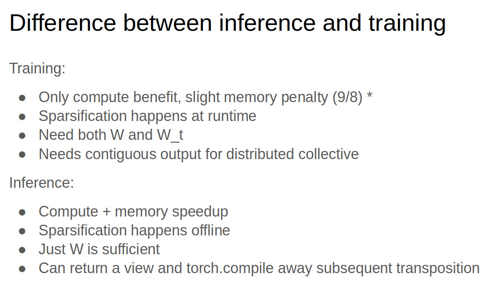

## Lecture 12: Flash attention

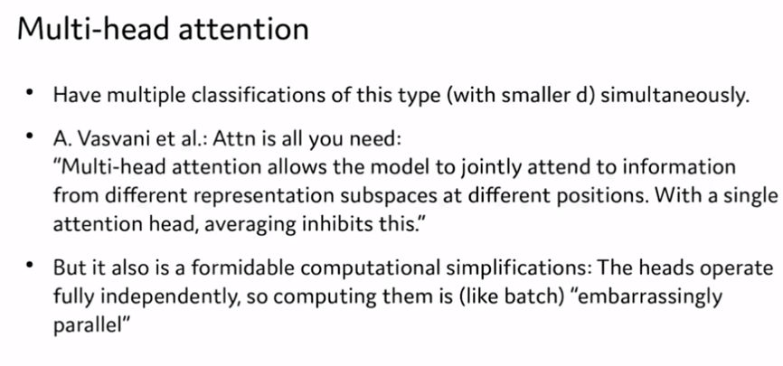
- Typically, 1 head is run on 1 block

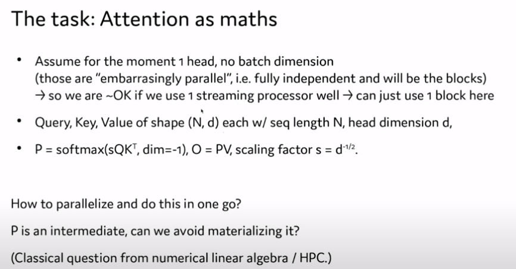

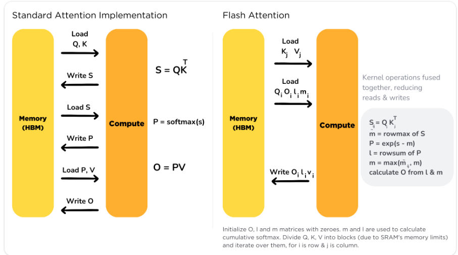
## Lecture 13: Ring Attention


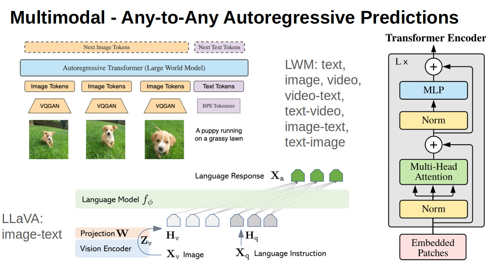


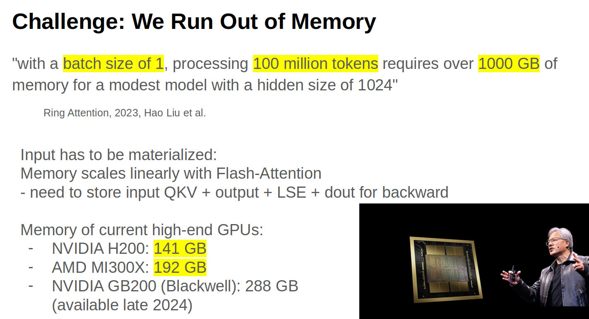
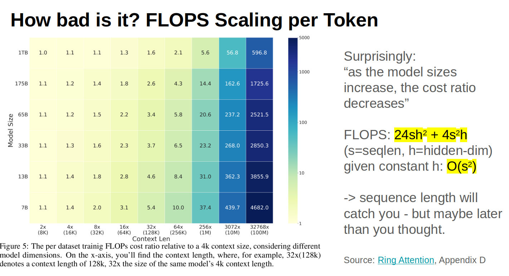

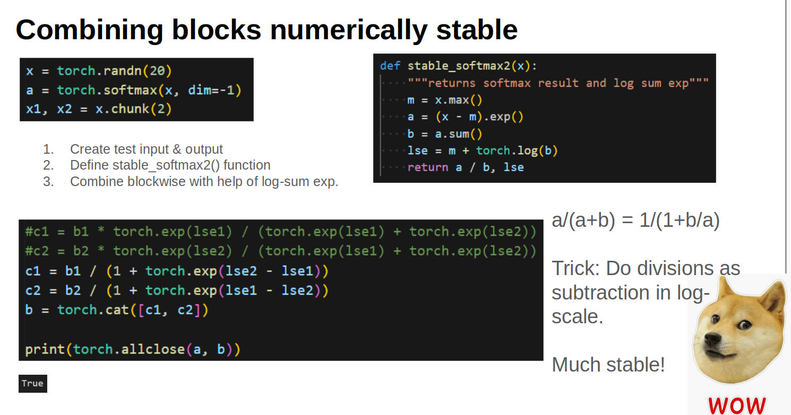

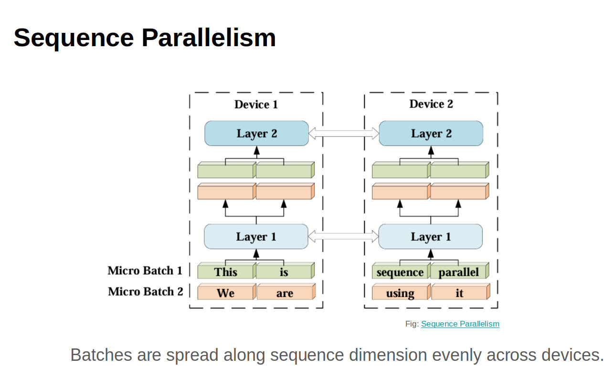
- Split the batch sequence-wise
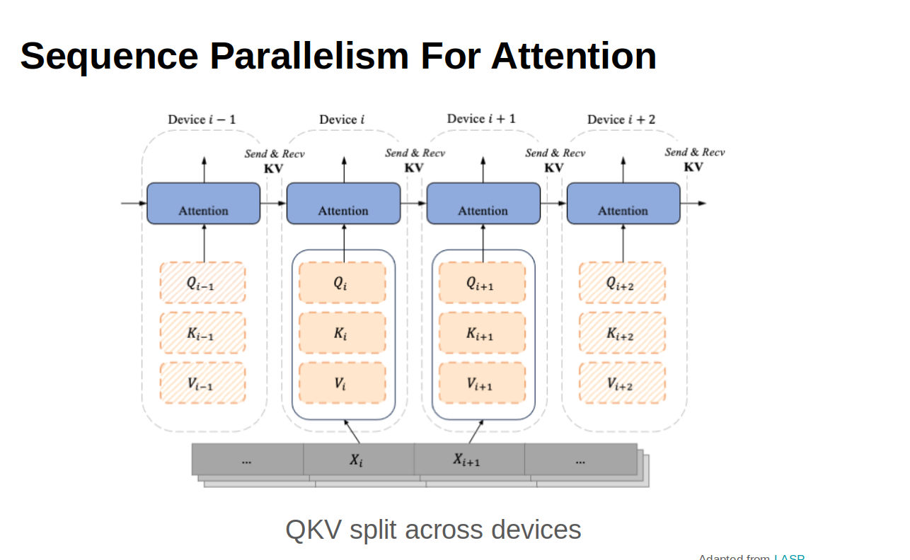
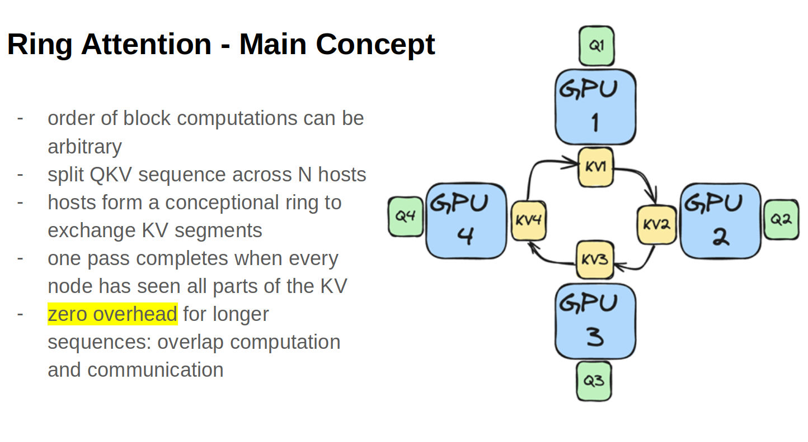
### Issues with Ring attention: idle nodes 

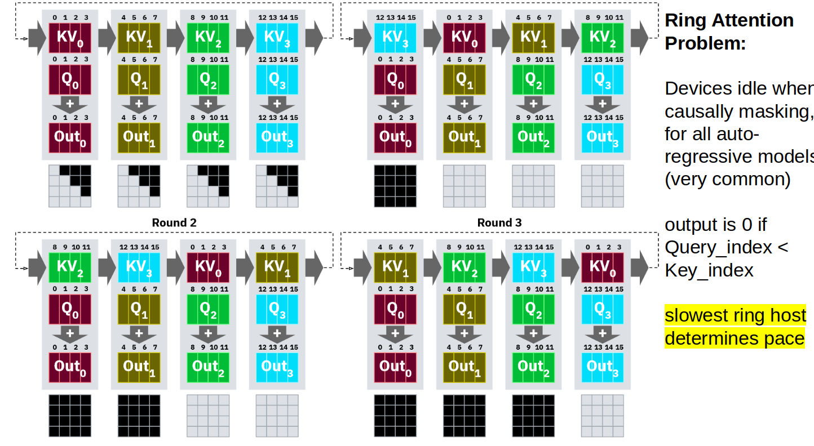


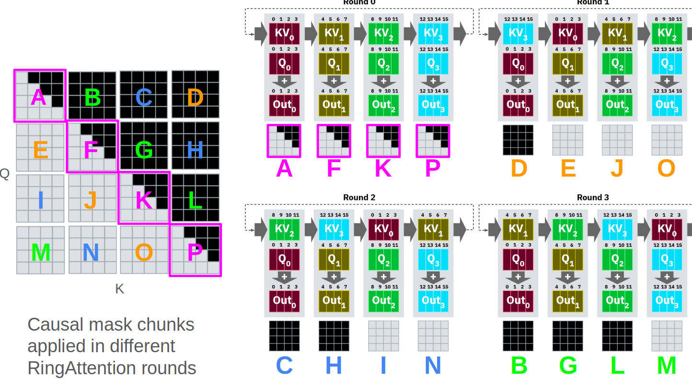

### Solution: Striped attention

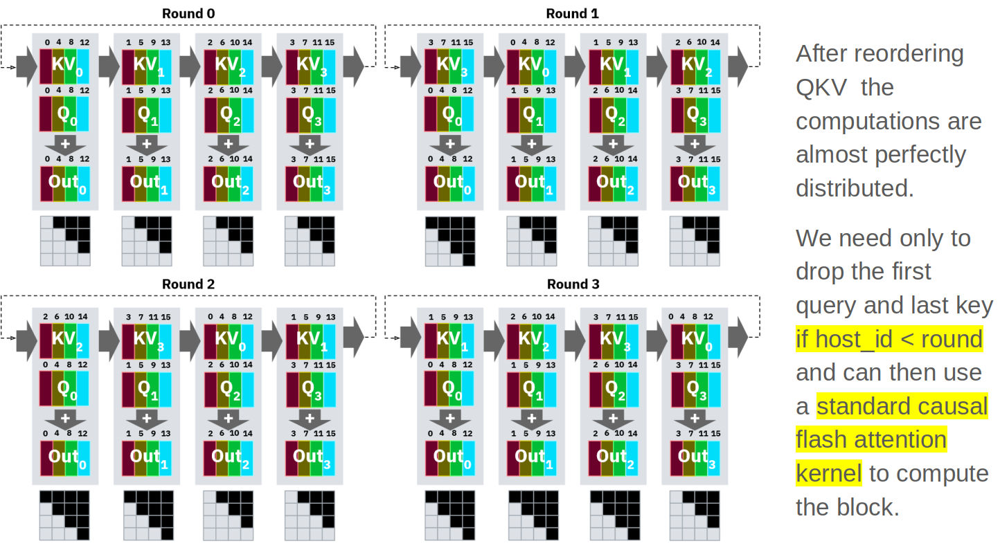

## Lecture 14: Triton

[Notebook](https://github.com/cuda-mode/lectures/blob/main/lecture_014/A_Practitioners_Guide_to_Triton.ipynb)


**What is Triton**
- In short: Triton is a language to program GPUs more conventiently. You write Python-ish code, which is then compiled into ptx code (the same thing cuda code is compiled into).
- During the compilation, the Triton compiler tries to use clever tricks to rearrange the parts of your program (without changing the program's meaning!) to make it run faster.

CUDA is a high-end tool with many settings for the pros.
- full control over everything, so absolute max performance possible
- harder to get decent performance
- way more tedious to write and debug
- more complicated, so harder to learn

Triton is a very good tool for most users
- you can't control everything, as some things are left to automatic optimization; so you probably won't get absolute max performance
- way easier to get good performance
- way easier to write and debug
- easier to learn, as it has a Python-like syntax

**Triton vs torch.compile**

`torch.compile` makes your model faster by trying to use existing kernels more effectively and creating simple new kernels. This may make your model fast enough. If not, you can decide to invest time to write faster Triton kernels.

(These simple new kernels that `torch.compile` creates are actually Triton kernels. So they are a good starting point for your custom kernels. See [Mark Saroufim](https://twitter.com/marksaroufim)'s [lecture 1 of cuda mode](https://www.youtube.com/watch?v=LuhJEEJQgUM&t=2200s) for how.)

**When to use Triton**

You start with your AI model.
1. If it's not fast enough, `torch.compile` it.
2. If it's not fast enough, check if you can rewrite your code to make it more suitable for `torch.compile`.
3. If it's not fast enough, check which parts are slow and write custom Triton kernel(s) for those.
4. If it's not fast enough, check which parts are slow and write custom CUDA kernel(s) for those.

(In the unlikely case you know beforehand that you need absolute max performance, you can decide to directly start with CUDA.)

**How to run Triton**
Unlike with CUDA, we can debug Triton kernels just like any CPU program, if we set the environment variable `TRITON_INTERPRET = 1`.
