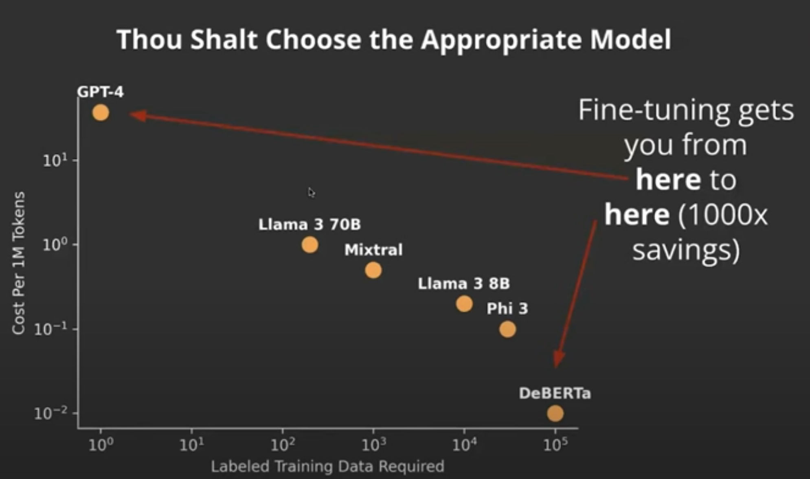
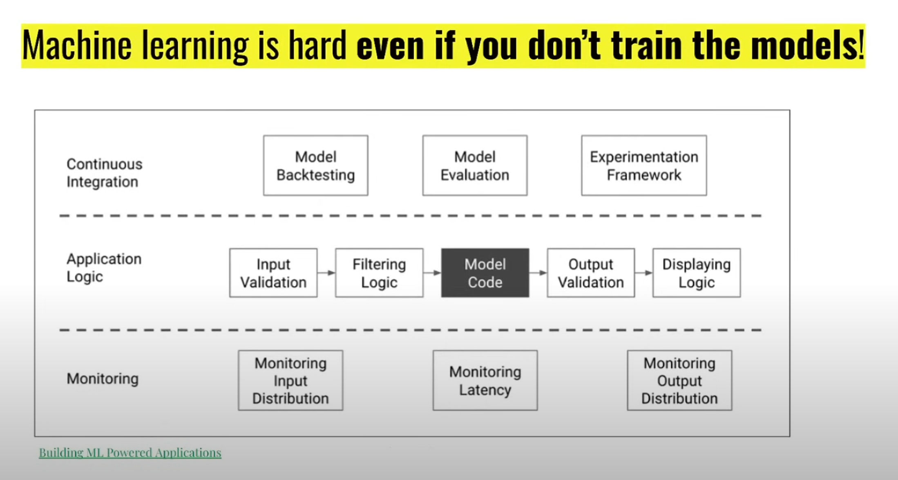
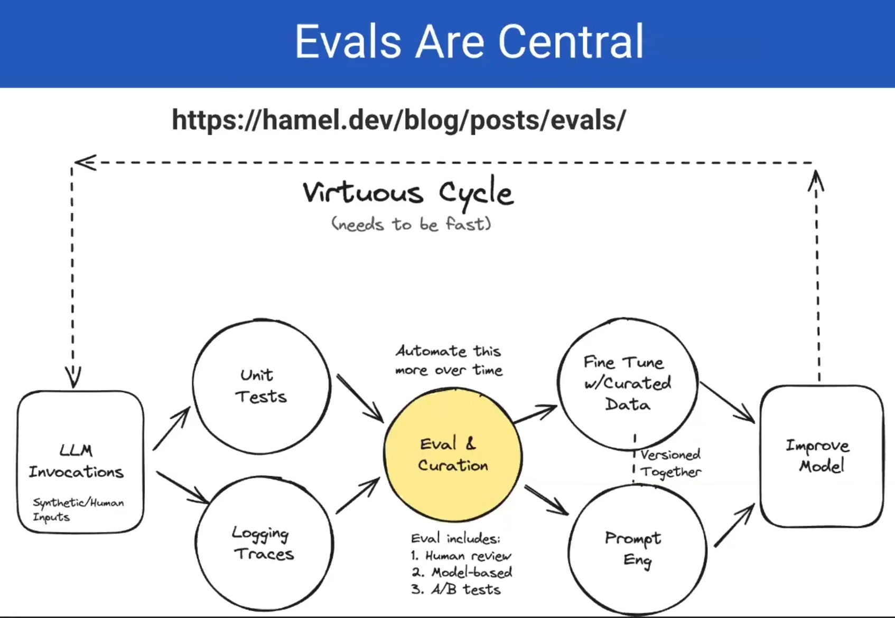
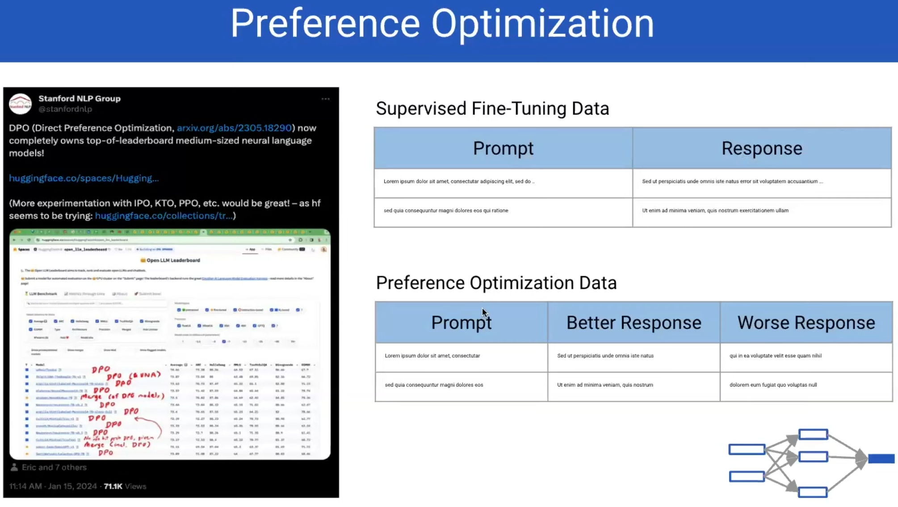
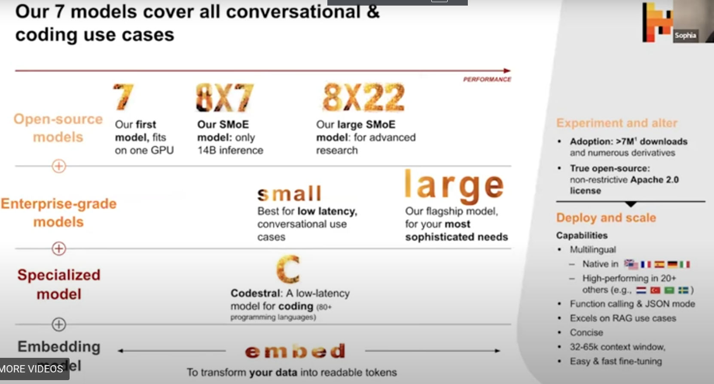
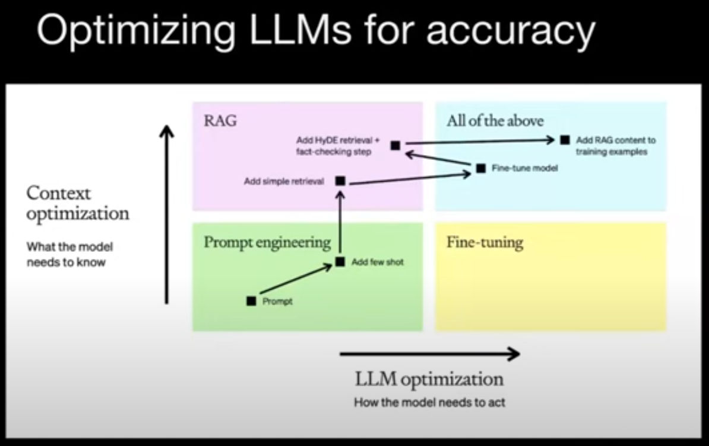
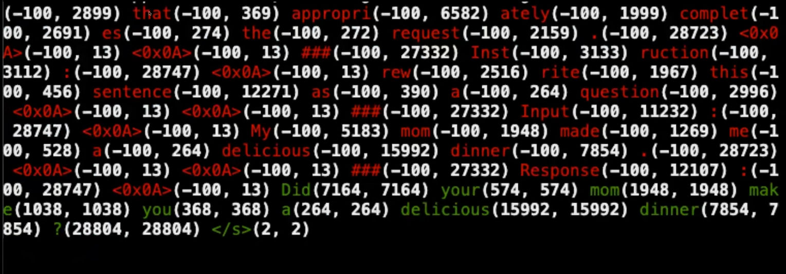

https://parlance-labs.com/education/

## Fine-tuning

**Should not fine-tune if possible**
### When to fine-tune
- Quality target
- Latency target
- **Cost target**

### Choosing appropriate model










### Reasons to fine-tune
 - Data privacy
 - Quality vs latency tradeoff
 - Extremely narrow problem
 - Prompt engineering is impractical

## DPO





## How to fine-tune

### Mistral models



- [Fine-tuning notebook](https://github.com/mistralai/cookbook/blob/main/mistral/fine_tune/mistral_finetune_api.ipynb)
- [Fine-tuning](https://github.com/mistralai/mistral-finetune)


### Huggingface

- https://huggingface.co/autotrain
- [Autotrain github](https://github.com/huggingface/autotrain-advanced?tab=readme-ov-file)


## OpenAI



- **When to fine-tune**:
    - **Good for**:
        - Following a given format or tone for the output
        - Processing the input following specific, complex instructions
        - Improving latency
        - Reducing token usage
    - **Not good for**:
        - Teaching the model new knowledge (Use RAG or custom models instead)
        - Performing well at multiple, unrelated tasks (Do prompt-engineering or create multiple FT models instead)
        - Including up-to-date content in responses (Use RAG instead)

### Dataset For Fine-tuning[](https://parlance-labs.com/education/fine_tuning/steven.html#dataset-for-fine-tuning)

Some guidelines when fine-tuning the data: - Have 50 - 100 examples. There should be at least 10 examples - Ensure that each fine-tuned model is for one task only - Keep system and user prompts similar between training and production

The dataset to be used for finetuning should have the following format:

```
{
  "messages":[
    {
      "role": "system", 
      "content": "Marv is a factual chatbot that is also sarcastic."
    },
    {
      "role": "user", 
      "content": "What's the capital of France?"
    }, 
    {
      "role": "assistant", 
      "content": "Paris, as if everyone doesn't know that already."
    }
  ]
}
```

### Best Practices[](https://parlance-labs.com/education/fine_tuning/steven.html#best-practices)

- **Curate examples carefully:**
    - Datasets can be difficult to build, start small and invest intentionally.
    - Optimize for fewer high-quality training examples.
    - Consider “prompt baking”, or using a basic prompt to generate your initial examples.
    - If your conversations are multi-turn, ensure your examples are representative.
    - Collect examples to target issues detected in evaluation.
    - Consider the balance & diversity of data.
    - Make sure your examples contain all the information needed in the response.
- **Iterate on hyperparameters:**
    - Start with the defaults and adjust based on performance.
    - If the model does not appear to converge, increase the learning rate multiplier.
    - If the model does not follow the training data as much as expected, increase the number of epochs.
    - If the model becomes less diverse than expected, decrease the number of epochs by 1-2.
- **Establish a baseline:**
    - Often users start with a zero-shot or few-shot prompt to build a baseline evaluation before graduating to fine-tuning.
- **Automate your feedback pipeline:**
    - Introduce automated evaluations to highlight potential problem cases to clean up and use as training data.
    - Consider the G-Eval approach of using GPT-4 to perform automated testing using a scorecard.
- **Optimize for latency and token efficiency:**
    - When using GPT-4, once you have a baseline evaluation and training examples, consider fine-tuning 3.5 to get similar performance for less cost and latency.
    - Experiment with reducing or removing system instructions with subsequent fine-tuned model versions.

## Axolotl

### Choosing a Base Model[](https://parlance-labs.com/education/fine_tuning_course/workshop_2.html#choosing-a-base-model)

- For most tasks, a 7-billion parameter model is sufficient and more efficient than a 70-billion parameter model.
- It is recommended to experiment with multiple base models, including the latest and trending ones.

### Low-Rank Adaptation (LoRA)[](https://parlance-labs.com/education/fine_tuning_course/workshop_2.html#low-rank-adaptation-lora)

LoRA is a parameter-efficient fine-tuning technique that focuses on fine-tuning two matrices instead of the entire model. When multiplied, these matrices have the same dimensions as the full weight matrix. This approach significantly reduces the number of weight parameters that need updating, leading to shorter training times and a smaller GPU memory footprint.

### Quantized Low-Rank Adaptation (QLoRA)[](https://parlance-labs.com/education/fine_tuning_course/workshop_2.html#quantized-low-rank-adaptation-qlora)

QLoRA operates on the same principle as LoRA but uses reduced precision, further decreasing GPU VRAM usage. The drawback is that quantization errors can occur when QLoRA matrices, trained on quantized model weights, are merged with the original model, which may be in full or different precision.

### Getting Started with Axolotl[](https://parlance-labs.com/education/fine_tuning_course/workshop_2.html#getting-started-with-axolotl)

**Axolotl is a framework that makes it easier to fine-tune the latest LLMs using different techniques.**

To fine-tune a model using Axolotl, you can modify one of the premade [config files](https://github.com/axolotl-ai-cloud/axolotl/blob/main/examples/mistral/qlora.yml) with your dataset and instructions.

Launch fine-tuning using Axolotl with the following CLI commands:

```
# preprocess datasets - optional but recommended
CUDA_VISIBLE_DEVICES="" python -m axolotl.cli.preprocess examples/openllama-3b/lora.yml

# finetune lora
accelerate launch -m axolotl.cli.train examples/openllama-3b/lora.yml

# inference
accelerate launch -m axolotl.cli.inference examples/openllama-3b/lora.yml \
    --lora_model_dir="./outputs/lora-out"

# gradio
accelerate launch -m axolotl.cli.inference examples/openllama-3b/lora.yml \
    --lora_model_dir="./outputs/lora-out" --gradio

# remote yaml files - the yaml config can be hosted on a public URL
# Note: the yaml config must directly link to the **raw** yaml
accelerate launch -m axolotl.cli.train https://raw.githubusercontent.com/axolotl-ai-cloud/axolotl/main/examples/openllama-3b/lora.yml
```

Axolotl preprocesses the data in Hugging Face datasets format. To view the data after preprocessing it, use the following code snippet:

```
import json, yaml
from transformers import AutoTokenizer
from datasets import load_from_disk

with open('hc.yml', 'r') as f:
    cfg = yaml.safe_load(f)
model_id = cfg['base_model']
tok = AutoTokenizer.from_pretrained(model_id)
ds = load_from_disk('last_run_prepared/22cf9f5f00f9d3b9504fbaf9b68a2f75/')

print(tok.decode(ds['input_ids'][0]))
```

Once the fine-tuned model is uploaded on Hugging Face, local inference can be made to test the model:

```
from peft import AutoPeftModelForCausalLM
from transformers import AutoTokenizer

model_id = 'parlance-labs/hc-mistral-alpaca'  # this will be different for you based on hub_model_id
model = AutoPeftModelForCausalLM.from_pretrained(model_id).cuda()
tokenizer = AutoTokenizer.from_pretrained(model_id)
tokenizer.pad_token = tokenizer.eos_token
```

### Accelerate[](https://parlance-labs.com/education/fine_tuning_course/workshop_2.html#accelerate)

#### Calculating GPU Memory Utilization for Fine-Tuning[](https://parlance-labs.com/education/fine_tuning_course/workshop_2.html#calculating-gpu-memory-utilization-for-fine-tuning)

The following method shows how to approximate the GPU VRAM needed to fine-tune a model using the Adam optimizer and batch size of 1:

- **Model**: bert-base-cased
- **Parameters**: 108M
- **Parameter Size**: 4 bytes
- **Backward Parameters** ~= 2x model size
- **Optimizer Step** ~= 4x model size (1x model, 1x gradients, 2x optimizer)

|dtype|Model|Gradients|Backward pass|Optimizer step|Highest|
|---|---|---|---|---|---|
|float32|413.18 MB|413.18 MB|826.36 MB|1.61 GB|1.61 GB|
|float16|413.18 MB|206.59 MB|413.18 MB|826.36 MB|826.36 MB|

#### Types of Training[](https://parlance-labs.com/education/fine_tuning_course/workshop_2.html#types-of-training)

- Single GPU
    - No distributed training
- Distributed Data Parallelism (DDP)
    - A full copy of the model exists on each device, but the data is chunked
- Fully Sharded Data Parallelism (FSDP) and DeepSpeed (DS)
    - Split chunks of the model and optimizer states across GPUs, allowing for training of bigger models on multiple smaller GPUs.

**FSDP** is a distributed training technique that splits a model into smaller shards across multiple GPUs, managing optimizer states, gradients, and parameters to optimize memory usage and training efficiency. It enables training of a model larger than the VRAM of a single GPU. It involves communication between GPUs to synchronize updates, which can impact performance if not well-configured.

#### Sharding Strategies[](https://parlance-labs.com/education/fine_tuning_course/workshop_2.html#sharding-strategies)

- **FULL SHARD:** Divides all resources, including optimizer states, gradients, and parameters.
- **SHARD GRAD OP:** Divides optimizer states and gradients only.
- **NO SHARD:** Uses standard Distributed Data Parallel (DDP) without sharding.
- **HYBRID SHARD:** Divides optimizer states, gradients, and parameters, but each node retains the full model.

#### Model Splitting Strategies[](https://parlance-labs.com/education/fine_tuning_course/workshop_2.html#model-splitting-strategies)

- **Transformers_Based_Wrap:** Splits the model by the specific layer.
- **Size_Based_Wrap:** Splits the model after a certain amount of parameters. This is simple but can be slower.

#### Integrating Accelerate in Training[](https://parlance-labs.com/education/fine_tuning_course/workshop_2.html#integrating-accelerate-in-training)

Uses accelerate:
- Nearly all of HF
- axolotl
- fastai
- FastChat
- lucidrains
- kornia


Accelerate can be used in the training loop to make the training hardware agnostic. It can be done using the following code:

```
from accelerate import Accelerator
accelerator = Accelerator()
dataloader, model, optimizer, scheduler = (
    accelerator.prepare(
        dataloader, model, optimizer, scheduler
    )
)

for batch in dataloader:
    optimizer.zero_grad()
    inputs, targets = batch
    outputs = model(inputs)
    loss = loss_function(outputs, targets)
    accelerator.backward(loss)  # loss.backward()
    optimizer.step()
    scheduler.step()
```


### Sample input
- Red: do not train or update weights
- Green: used to update weights

## Resources

- [Argilla](https://argilla.io/) is a collaboration platform for AI engineers and domain experts that strive for quality, time-to-value, and ownership.
- https://github.com/dennisbakhuis/pigeonXT: Data annotation
- [Lilac](https://github.com/databricks/lilac): Human annotation
- [Tests and evals](https://hamel.dev/blog/posts/evals/#level-1-unit-tests)
- [Modal](https://modal.com/docs)
- 