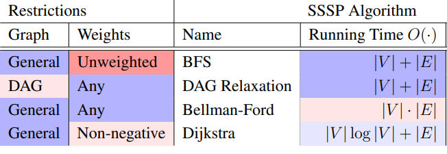

---
---

## Breath first search
- O(|V| + |E|) ---> Linear in vertices and edges
- Shortest path
- Typically BFS follows level-sets

## Depth first search
- O(|V| + |E|)

## Directed Acyclic Graph (DAG)
- Example: Tree

### Topological order
- Not unique
- DFS

### Finishing order
- Reverse of finishing order is a topological order

### Cycle detection
- Full DFS traverse edge v -> ancestor of v

## Weighed shortest paths
- Latency in netoworks
- Social network
- Distance on maps
- Negative weight cycles :(

