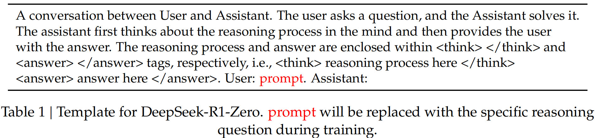
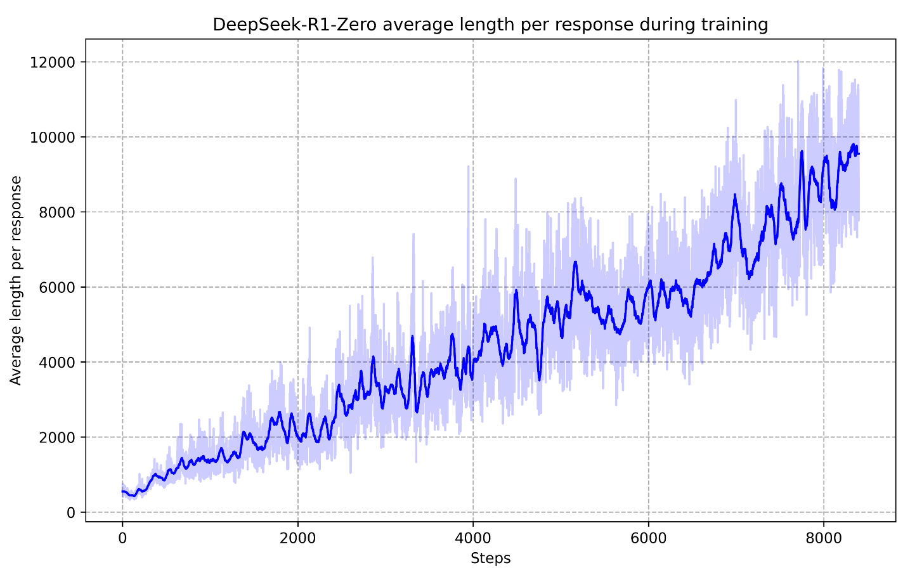

---
---

## Summary
- Improving language model reasoning capabilities using pure reinforcement learning (RL)
- We demonstrate that the reasoning patterns of larger models can be distilled into smaller models, resulting in better performance compared to the reasoning patterns discovered through RL on small models.
- We open-source distilled 1.5B, 7B, 8B, 14B, 32B, and 70B checkpoints based on Qwen2.5 and Llama3 series to the community.

- Dsitilled models: Qwen2.5-Math-1.5B, Qwen2.5-Math-7B, Qwen2.514B, Qwen2.5-32B, Llama-3.1-8B, and Llama-3.3-70B-Instruct.

#### Limitations
- General Capability: Currently, the capabilities of DeepSeek-R1 fall short of DeepSeekV3 in tasks such as function calling, multi-turn, complex role-playing, and json output.
- Prompting Engineering: When evaluating DeepSeek-R1, we observe that it is sensitive to prompts. Few-shot prompting consistently degrades its performance.