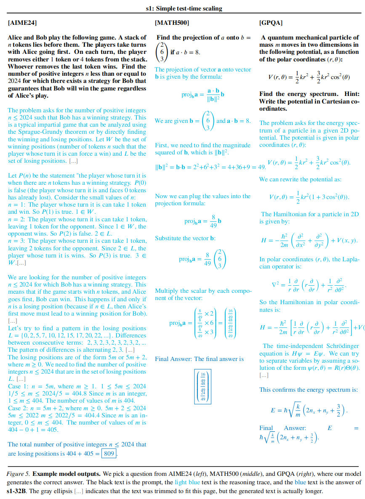

---
---

### Core question
what is the simplest approach to achieve both test-time scaling and strong reasoning performance?

### Notes
We show that SFT on only 1,000 examples suffices to build a competitive reasoning model matching o1-preview and produces a model that lies on the pareto frontier

**Why does supervised finetuning on just 1,000 samples lead to such performance gains?** 
- We hypothesize that the model is already exposed to large amounts of reasoning data during pretraining which spans trillions of tokens. Thus, the ability to perform reasoning is already present in our model. 
- Our sample-efficient finetuning stage just activates it and we scale it further at test time with budget forcing. This is similar to the "Superficial Alignment Hypothesis" presented in LIMA (Zhou et al., 2023), where the authors find that 1,000 examples can be sufficient to align a model to adhere to user preferences.

### Procedure

1. If the model generates more thinking tokens than a desired limit, we forcefully end the thinking process by appending an end-of-thinking token delimiter. Ending the thinking this way makes the model transition to generating its answer. 
2. If we want the model to spend more test-time compute on a problem, we suppress the generation of the end-of-thinking token delimiter and instead append “Wait”

